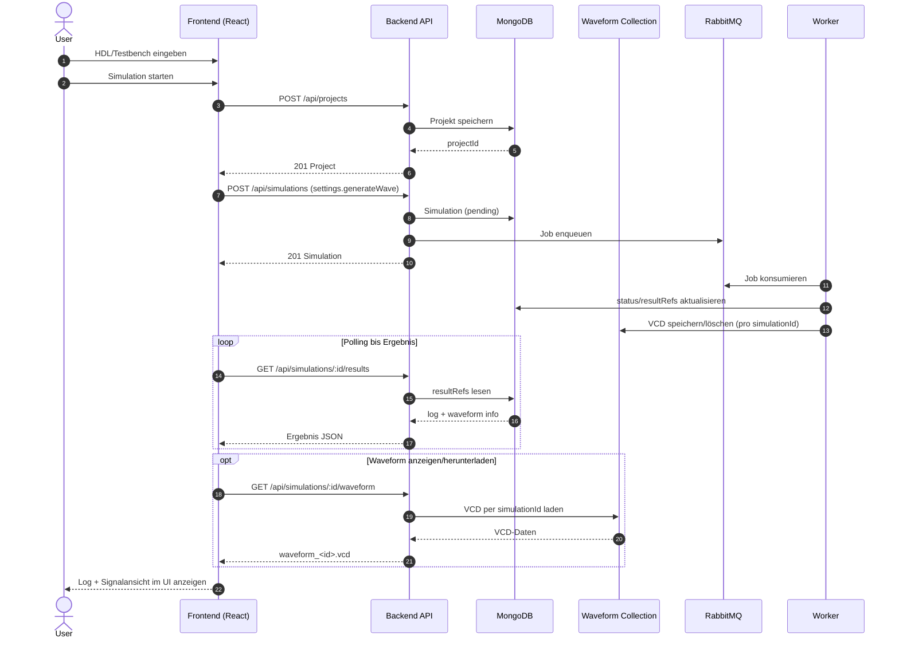
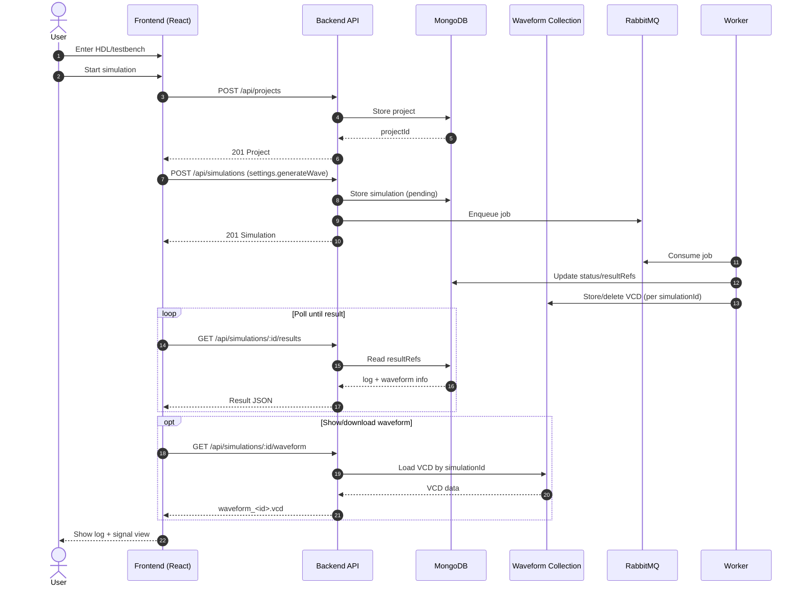

# HDLab Frontend Dokumentation

Diese README dokumentiert das Frontend im Ordner `apps/frontend` im aktuellen Ist-Zustand.

## 1. Zweck des Frontends

Das Frontend ist die Benutzeroberfläche für HDLab und bietet:

- Browserbasiertes Editieren von HDL-Code (Monaco Editor)
- Optionalen Testbench-Editor (SystemVerilog oder Python)
- Starten von Simulationen über die Backend-API
- Anzeige der Simulationslogs mit zwei Ansichten:
	- Kompakt (kurze, relevante Zusammenfassung)
	- Vollständig (Cocotb-Testlauf ohne Build-/Compiler-Noise)
- Upload/Download von Design- und Testbench-Dateien
- Sprachumschaltung der UI (Deutsch/Englisch)
- Erweiterte Cocotb-Beispiele mit ausführlichen Testausgaben (`cocotb.log.info`)

## 2. Tech-Stack

### Sprachen

- JavaScript (React mit JSX)
- CSS

### Frameworks & Libraries

- React 18 (`react`, `react-dom`)
- Vite 5 als Dev-Server und Build-Tool
- `@vitejs/plugin-react-swc` für React + Fast Refresh
- Monaco Editor Integration via `@monaco-editor/react`
- ZIP-Erzeugung via `jszip`

### Build/Lint

- ESLint + React/React Hooks Plugins

## 3. Laufzeitarchitektur

### UML-Sequenzdiagramm (Frontend-Flow)



### Komponentenstruktur

- `src/main.jsx`: App-Bootstrap und Warnung bei fehlendem `VITE_API_URL`
- `src/App.jsx`: Hauptlogik (State, Editoren, Dateioperationen, API-Aufrufe)
- `src/components/Sidebar.jsx`: Optionen, Dateiaktionen, Beispiele
- `src/components/Topbar.jsx`: Topbar-Aktionen und Sprachumschaltung
- `src/App.css`, `src/index.css`: Styling

## 4. API-Nutzung durch das Frontend

Die zentrale Simulationslogik liegt in `runSimulation()` in `src/App.jsx`.

Verwendete Endpunkte:

1. `POST /api/projects`
2. `POST /api/simulations`
3. `GET /api/simulations/:id/results` (Polling, bis zu 30 Versuche mit 1s Intervall)
4. `GET /api/simulations/:id/waveform` (optional, wenn Waveform vorhanden)

Typischer Request für Projektanlage:

```json
{
	"name": "Playground",
	"files": [
		{
			"filename": "main.sv",
			"content": "...",
			"language": "systemverilog"
		},
		{
			"filename": "tb.sv",
			"content": "...",
			"language": "systemverilog"
		}
	]
}
```

Typischer Request für Simulationsstart:

```json
{
	"projectId": "<mongo-object-id>",
	"language": "systemverilog",
	"testbenchType": "systemverilog"
}
```

## 5. Dateifunktionen im Frontend

### Download

- Ohne Testbench: Download als `main.sv`
- Mit Testbench: Download als `hdl_project.zip` mit `main.sv` und `tb.sv` oder `tb.py`

### Upload

- Design-Datei: erlaubt `.sv` oder `.txt`
- Testbench-Datei: erlaubt `.sv`, `.py` oder `.txt`
- Falsche Endungen werden clientseitig blockiert

## 6. Konfiguration und Umgebungsvariablen

### Relevante Variablen

- `FRONTEND_PORT` (Compose Host-Port, Standard 5173)
- `VITE_API_URL` (Warnhinweis in `main.jsx`, aber im Compose-Setup wird primär Proxy genutzt)

### Vite Proxy

In `vite.config.js` ist konfiguriert:

- `/api` -> `http://backend:3001`

Damit können API-Calls im Frontend relativ (`/api/...`) erfolgen.

## 7. Ports

- Frontend Container-Port: `5173` (siehe `apps/frontend/Dockerfile`)
- Compose Mapping: `${FRONTEND_PORT:-5173}:5173`
- Backend-Ziel aus Frontend-Sicht im Compose-Netz: `backend:3001`

## 8. Start und Entwicklung

Im Frontend-Ordner:

```bash
cd apps/frontend
npm install
npm run dev
```

Weitere Scripts:

- `npm run build` (Production Build)
- `npm run preview` (Build Preview)
- `npm run lint` (ESLint)

## 9. Zustandsmodell der UI (vereinfacht)

Wichtige States in `App.jsx`:

- `code`, `testbench`
- `language`, `testbenchLang`
- `testbenchEnabled`
- `loading`
- `logSummary`, `logDetails`, `logRaw`
- `logViewMode` (`compact` | `full`)
- `wave` (Waveform-Erzeugung an/aus für Simulationsanfrage)
- `waveformUrl`, `waveformPreview`, `waveformVisible`, `waveformLoading`
- `waveformViewMode` (`signal` | `raw`)
- `waveZoom`, `selectedWaveSignalIds`
- `helpOpen`, `settingsOpen`, `themeMode`
- `uiLanguage`

Diese States steuern Editorinhalte, API-Payload, Button-Zustand und Loganzeige.

## 10. Neuerungen (April 2026)

- Neue Cocotb-Beispiele in der Sidebar (u. a. ALU, Komparator, synchroner Zähler)
- Verbose Test-Logs in Python-Beispielen für bessere Nachvollziehbarkeit pro Testvektor
- Log-Umschalter in der Ergebnisanzeige: `Kompakt` / `Vollständig`
- Vollständig-Ansicht zeigt nur relevanten Cocotb-Test-Output statt kompletter Build-Ausgabe
- Waveform-Features: Download, Rohansicht und Signalansicht direkt im Frontend
- Signalansicht mit Zoom, Signal-Checkboxen je Spur, Bus-Hex-Labels und farbcodierten Flanken
- Topbar-Hilfe mit Funktionsübersicht und Signal-Farbcode-Legende
- Einstellungen-Dialog mit Light/Dark-Mode inkl. persistenter Speicherung (`localStorage`)

## 11. Bekannte Grenzen (aktueller Stand)

- Polling ist statisch (max. 30 Sekunden) und nicht websocket-basiert
- Fehlerbehandlung der API-Antworten ist bewusst einfach gehalten
- `VITE_API_URL` wird geprüft, aber Standardfluss nutzt den Vite-Proxy auf `/api`

## 12. Relevante Dateien

- `src/main.jsx` - App-Entry
- `src/App.jsx` - Kernlogik, API-Integration, Editor- und Dateiabläufe
- `src/components/Sidebar.jsx` - UI-Controls
- `src/components/Topbar.jsx` - Kopfbereich/UI-Aktionen
- `vite.config.js` - Dev-Proxy zum Backend
- `Dockerfile` - Containerstart für Frontend

---

# English Documentation

This README documents the frontend in `apps/frontend` as it currently exists.

## 1. Frontend Purpose

The frontend is HDLab's user interface and provides:

- Browser-based HDL editing (Monaco Editor)
- Optional testbench editor (SystemVerilog or Python)
- Simulation start through the backend API
- Simulation log display with two modes:
	- Compact (short, relevant summary)
	- Full (Cocotb test output without build/compiler noise)
- Upload/download of design and testbench files
- UI language switch (German/English)
- Extended Cocotb examples with verbose test output (`cocotb.log.info`)

## 2. Tech Stack

### Languages

- JavaScript (React with JSX)
- CSS

### Frameworks & Libraries

- React 18 (`react`, `react-dom`)
- Vite 5 as dev server and build tool
- `@vitejs/plugin-react-swc` for React + Fast Refresh
- Monaco integration via `@monaco-editor/react`
- ZIP generation via `jszip`

### Build/Lint

- ESLint + React/React Hooks plugins

## 3. Runtime Architecture

### UML Sequence Diagram (Frontend Flow)



### Component Structure

- `src/main.jsx`: app bootstrap and warning if `VITE_API_URL` is missing
- `src/App.jsx`: main logic (state, editors, file operations, API calls)
- `src/components/Sidebar.jsx`: options, file actions, examples
- `src/components/Topbar.jsx`: topbar actions and language switching
- `src/App.css`, `src/index.css`: styling

## 4. Frontend API Usage

The core simulation logic lives in `runSimulation()` in `src/App.jsx`.

Used endpoints:

1. `POST /api/projects`
2. `POST /api/simulations`
3. `GET /api/simulations/:id/results` (polling, up to 30 attempts with 1s interval)
4. `GET /api/simulations/:id/waveform` (optional when waveform is available)

Typical project creation payload:

```json
{
	"name": "Playground",
	"files": [
		{
			"filename": "main.sv",
			"content": "...",
			"language": "systemverilog"
		},
		{
			"filename": "tb.sv",
			"content": "...",
			"language": "systemverilog"
		}
	]
}
```

Typical simulation creation payload:

```json
{
	"projectId": "<mongo-object-id>",
	"language": "systemverilog",
	"testbenchType": "systemverilog"
}
```

## 5. Frontend File Features

### Download

- Without testbench: download as `main.sv`
- With testbench: download as `hdl_project.zip` containing `main.sv` and `tb.sv` or `tb.py`

### Upload

- Design file: `.sv` or `.txt`
- Testbench file: `.sv`, `.py`, or `.txt`
- Invalid extensions are blocked client-side

## 6. Configuration and Environment Variables

### Relevant Variables

- `FRONTEND_PORT` (compose host port, default 5173)
- `VITE_API_URL` (checked in `main.jsx`; in compose, proxy is used in most cases)

### Vite Proxy

Configured in `vite.config.js`:

- `/api` -> `http://backend:3001`

This allows relative API calls from frontend (`/api/...`).

## 7. Ports

- Frontend container port: `5173` (see `apps/frontend/Dockerfile`)
- Compose mapping: `${FRONTEND_PORT:-5173}:5173`
- Backend target from frontend in compose network: `backend:3001`

## 8. Start and Development

In frontend folder:

```bash
cd apps/frontend
npm install
npm run dev
```

Additional scripts:

- `npm run build` (production build)
- `npm run preview` (preview build)
- `npm run lint` (ESLint)

## 9. UI State Model (Simplified)

Important states in `App.jsx`:

- `code`, `testbench`
- `language`, `testbenchLang`
- `testbenchEnabled`
- `loading`
- `logSummary`, `logDetails`, `logRaw`
- `logViewMode` (`compact` | `full`)
- `wave` (enable/disable waveform generation per simulation request)
- `waveformUrl`, `waveformPreview`, `waveformVisible`, `waveformLoading`
- `waveformViewMode` (`signal` | `raw`)
- `waveZoom`, `selectedWaveSignalIds`
- `helpOpen`, `settingsOpen`, `themeMode`
- `uiLanguage`

These states drive editor content, API payloads, button states, and log/waveform rendering.

## 10. Updates (April 2026)

- New Cocotb examples in sidebar (e.g., ALU, comparator, synchronous counter)
- Verbose Python test logs for better traceability per test vector
- Result log switch: `Compact` / `Full`
- Full mode shows relevant Cocotb test output instead of complete build output
- Waveform features: download, raw view, and signal view in frontend
- Signal view with zoom, per-row signal checkboxes, inline bus hex labels, color-coded edges
- Topbar help dialog with feature overview and signal color legend
- Settings dialog with light/dark mode and persistent storage (`localStorage`)

## 11. Known Limitations (Current)

- Polling is static (max 30 seconds), not WebSocket-based
- API error handling is intentionally simple
- `VITE_API_URL` is checked, but default flow uses Vite proxy on `/api`

## 12. Relevant Files

- `src/main.jsx` - app entry
- `src/App.jsx` - core logic, API integration, editor and file flows
- `src/components/Sidebar.jsx` - UI controls
- `src/components/Topbar.jsx` - top area/UI actions
- `vite.config.js` - dev proxy to backend
- `Dockerfile` - frontend container startup
