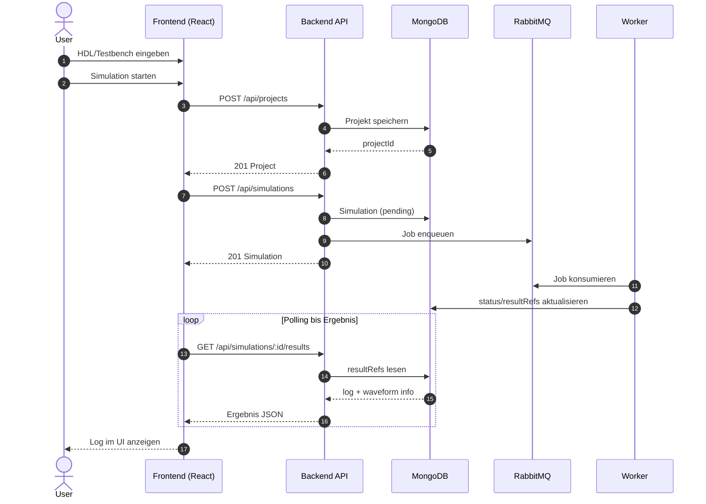

# HDLab Frontend Dokumentation

Diese README dokumentiert das Frontend im Ordner `apps/frontend` im aktuellen Ist-Zustand.

## 1. Zweck des Frontends

Das Frontend ist die Benutzeroberfläche für HDLab und bietet:

- Browserbasiertes Editieren von HDL-Code (Monaco Editor)
- Optionalen Testbench-Editor (SystemVerilog oder Python)
- Starten von Simulationen über die Backend-API
- Anzeige der Simulationslogs
- Upload/Download von Design- und Testbench-Dateien
- Sprachumschaltung der UI (Deutsch/Englisch)

## 2. Tech-Stack

### Sprachen

- JavaScript (React mit JSX)
- CSS

### Frameworks & Libraries

- React 18 (`react`, `react-dom`)
- Vite 5 als Dev-Server und Build-Tool
- `@vitejs/plugin-react-swc` für React + Fast Refresh
- Monaco Editor Integration via `@monaco-editor/react`
- ZIP-Erzeugung via `jszip`

### Build/Lint

- ESLint + React/React Hooks Plugins

## 3. Laufzeitarchitektur

### UML-Sequenzdiagramm (Frontend-Flow)



### Komponentenstruktur

- `src/main.jsx`: App-Bootstrap und Warnung bei fehlendem `VITE_API_URL`
- `src/App.jsx`: Hauptlogik (State, Editoren, Dateioperationen, API-Aufrufe)
- `src/components/Sidebar.jsx`: Optionen, Dateiaktionen, Beispiele
- `src/components/Topbar.jsx`: Topbar-Aktionen und Sprachumschaltung
- `src/App.css`, `src/index.css`: Styling

## 4. API-Nutzung durch das Frontend

Die zentrale Simulationslogik liegt in `runSimulation()` in `src/App.jsx`.

Verwendete Endpunkte:

1. `POST /api/projects`
2. `POST /api/simulations`
3. `GET /api/simulations/:id/results` (Polling, bis zu 30 Versuche mit 1s Intervall)

Typischer Request für Projektanlage:

```json
{
	"name": "Playground",
	"files": [
		{
			"filename": "main.sv",
			"content": "...",
			"language": "systemverilog"
		},
		{
			"filename": "tb.sv",
			"content": "...",
			"language": "systemverilog"
		}
	]
}
```

Typischer Request für Simulationsstart:

```json
{
	"projectId": "<mongo-object-id>",
	"language": "systemverilog",
	"testbenchType": "systemverilog"
}
```

## 5. Dateifunktionen im Frontend

### Download

- Ohne Testbench: Download als `main.sv`
- Mit Testbench: Download als `hdl_project.zip` mit `main.sv` und `tb.sv` oder `tb.py`

### Upload

- Design-Datei: erlaubt `.sv` oder `.txt`
- Testbench-Datei: erlaubt `.sv`, `.py` oder `.txt`
- Falsche Endungen werden clientseitig blockiert

## 6. Konfiguration und Umgebungsvariablen

### Relevante Variablen

- `FRONTEND_PORT` (Compose Host-Port, Standard 5173)
- `VITE_API_URL` (Warnhinweis in `main.jsx`, aber im Compose-Setup wird primär Proxy genutzt)

### Vite Proxy

In `vite.config.js` ist konfiguriert:

- `/api` -> `http://backend:3001`

Damit können API-Calls im Frontend relativ (`/api/...`) erfolgen.

## 7. Ports

- Frontend Container-Port: `5173` (siehe `apps/frontend/Dockerfile`)
- Compose Mapping: `${FRONTEND_PORT:-5173}:5173`
- Backend-Ziel aus Frontend-Sicht im Compose-Netz: `backend:3001`

## 8. Start und Entwicklung

Im Frontend-Ordner:

```bash
cd apps/frontend
npm install
npm run dev
```

Weitere Scripts:

- `npm run build` (Production Build)
- `npm run preview` (Build Preview)
- `npm run lint` (ESLint)

## 9. Zustandsmodell der UI (vereinfacht)

Wichtige States in `App.jsx`:

- `code`, `testbench`
- `language`, `testbenchLang`
- `testbenchEnabled`
- `loading`
- `log`
- `uiLanguage`

Diese States steuern Editorinhalte, API-Payload, Button-Zustand und Loganzeige.

## 10. Bekannte Grenzen (aktueller Stand)

- Polling ist statisch (max. 30 Sekunden) und nicht websocket-basiert
- Fehlerbehandlung der API-Antworten ist bewusst einfach gehalten
- Option `wave` ist im UI-State vorhanden, aber derzeit nicht in den API-Flow integriert
- `VITE_API_URL` wird geprüft, aber Standardfluss nutzt den Vite-Proxy auf `/api`

## 11. Relevante Dateien

- `src/main.jsx` - App-Entry
- `src/App.jsx` - Kernlogik, API-Integration, Editor- und Dateiabläufe
- `src/components/Sidebar.jsx` - UI-Controls
- `src/components/Topbar.jsx` - Kopfbereich/UI-Aktionen
- `vite.config.js` - Dev-Proxy zum Backend
- `Dockerfile` - Containerstart für Frontend
