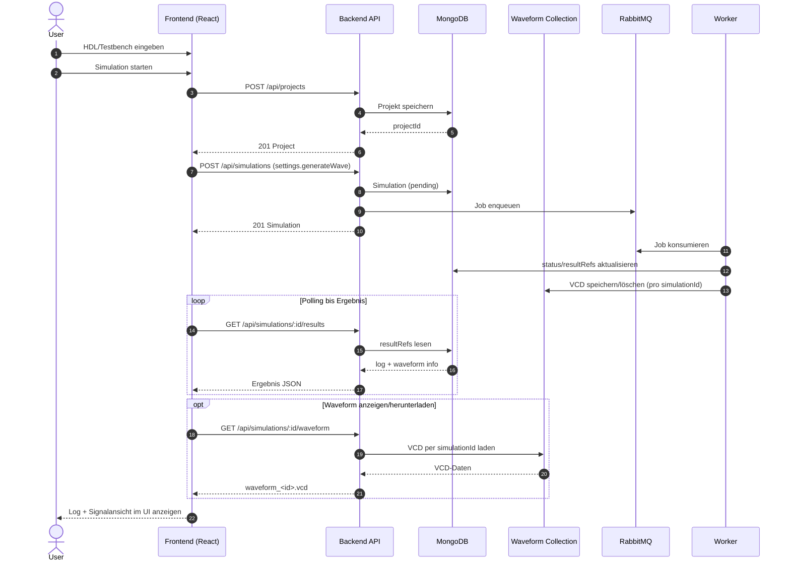
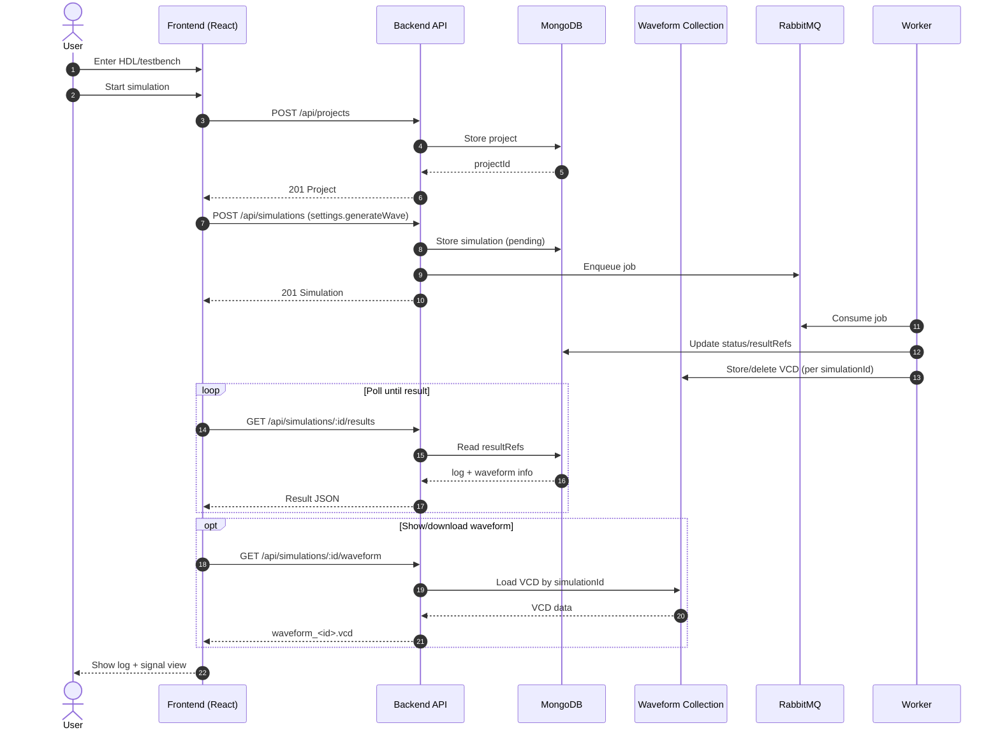

# HDLab Frontend Dokumentation

Diese README dokumentiert das Frontend im Ordner `apps/frontend` im aktuellen Ist-Zustand.

## 1. Zweck des Frontends

Das Frontend ist die Benutzeroberfläche für HDLab und bietet:

- Browserbasiertes Editieren von HDL-Code (Monaco Editor)
- Optionalen Testbench-Editor (SystemVerilog oder Python)
- Starten von Simulationen über die Backend-API
- Anzeige der Simulationslogs mit zwei Ansichten:
	- Kompakt (kurze, relevante Zusammenfassung)
	- Vollständig (Cocotb-Testlauf ohne Build-/Compiler-Noise)
- Upload/Download von Design- und Testbench-Dateien
- Sprachumschaltung der UI (Deutsch/Englisch)
- Erweiterte Cocotb-Beispiele mit ausführlichen Testausgaben (`cocotb.log.info`)

## 2. Tech-Stack

### Sprachen

- JavaScript (React mit JSX)
- CSS

### Frameworks & Libraries

- React 18 (`react`, `react-dom`)
- Vite 5 als Dev-Server und Build-Tool
- `@vitejs/plugin-react-swc` für React + Fast Refresh
- Monaco Editor Integration via `@monaco-editor/react`
- ZIP-Erzeugung via `jszip`

### Build/Lint

- ESLint + React/React Hooks Plugins

## 3. Laufzeitarchitektur

### UML-Sequenzdiagramm (Frontend-Flow)



### Komponentenstruktur

- `src/main.jsx`: App-Bootstrap und Warnung bei fehlendem `VITE_API_URL`
- `src/App.jsx`: Hauptlogik (State, Editoren, Dateioperationen, API-Aufrufe)
- `src/components/Sidebar.jsx`: Optionen, Dateiaktionen, Beispiele
- `src/components/Topbar.jsx`: Topbar-Aktionen und Sprachumschaltung
- `src/App.css`, `src/index.css`: Styling

## 4. API-Nutzung durch das Frontend

Die zentrale Simulationslogik liegt in `runSimulation()` in `src/App.jsx`.

Verwendete Endpunkte:

1. `POST /api/projects`
2. `POST /api/simulations`
3. `GET /api/simulations/:id/results` (Polling, bis zu 30 Versuche mit 1s Intervall)
4. `GET /api/simulations/:id/waveform` (optional, wenn Waveform vorhanden)

Typischer Request für Projektanlage:

```json
{
	"name": "Playground",
	"files": [
		{
			"filename": "main.sv",
			"content": "...",
			"language": "systemverilog"
		},
		{
			"filename": "tb.sv",
			"content": "...",
			"language": "systemverilog"
		}
	]
}
```

Typischer Request für Simulationsstart:

```json
{
	"projectId": "<mongo-object-id>",
	"language": "systemverilog",
	"testbenchType": "systemverilog"
}
```

## 5. Dateifunktionen im Frontend

### Download

- Ohne Testbench: Download als `main.sv`
- Mit Testbench: Download als `hdl_project.zip` mit `main.sv` und `tb.sv` oder `tb.py`

### Upload

- Design-Datei: erlaubt `.sv` oder `.txt`
- Testbench-Datei: erlaubt `.sv`, `.py` oder `.txt`
- Falsche Endungen werden clientseitig blockiert

## 5. Dateifunktionen im Frontend

### Download

- Ohne Testbench: Download als `main.sv`
- Mit Testbench: Download als `hdl_project.zip` mit `main.sv` und `tb.sv` oder `tb.py`

### Upload

- Design-Datei: erlaubt `.sv` oder `.txt`
- Testbench-Datei: erlaubt `.sv`, `.py` oder `.txt`
- Falsche Endungen werden clientseitig blockiert

## 5.1 Tutorial-System

Das Frontend enthält ein umfassendes interaktives Tutorial-System mit 23 progressiven Lektionen zum Erlernen von SystemVerilog.

### Tutorial-Komponenten

**TutorialLesson.jsx** - Hautkomponente für Lektionsabläufe:
- Parst Markdown-basierte Lektionen mit YAML-Metadaten (Schwierigkeit, Dauer, Lektion-Typ)
- Zeigt Markdown-formatierte Erklärungen und Inhalte (via `react-markdown`)
- Unterstützt zwei Lektionstypen:
  - **Theory** (14 Lektionen): Nur Erklärungen und Konzepte
  - **Exercise** (6 Lektionen): Mit Code-Editor, Testbench und Validierung
- Navigation: "Vorherige Lektion" und "Nächste Lektion" Buttons mit intelligenter Deaktivierung
- State-Management: Automatisches Zurücksetzen von Benutzercode und Validierungsstatus beim Lessonenwechsel

**tutorialParser.js** - Utility für Markdown-Parsing:
- `parseTutorialFromMarkdown()`: Line-basierte Iteration über Markdown-Datei
- Extrahiert YAML Frontmatter zwischen `---` Markern
- Extrahiert Lesionsinhalt und Übungstemplate
- `cleanCodeBlock()`: Entfernt Markdown Fence-Marker (```verilog) aus Übungen
- **Wichtig**: Zuverlässiges Parsing aller 23 Lektionen durch safe counter management

**Tutorial.css** - Styling für Tutorial-Komponenten:
- Markdown-Element-Styling: `h1`-`h6`, `code`, `pre`, `ul`/`ol`
- Responsive Layout für Erklärungen
- Code-Block-Styling mit Monospace-Font und dunkler Hintergrund
- Exercise-Container mit Testbench- und Validierungs-UI

### Validierungsabläufe (für Exercise-Lektionen)

Wenn Benutzer „Validieren" drückt:

1. Frontend sammelt: `lessonId`, `moduleCode`, `moduleName`, `testbench`
2. POST an Backend `/api/tutorials/validate`
3. **Polling-Schleife** wartet auf Ergebnis:
   - 200ms Intervall
   - Timeout: 120 Sekunden
   - Zeigt "Validierung läuft..." während Polling
4. Backend queued Job an RabbitMQ, Worker führt Simulation aus
5. Response wird angezeigt:
   - ✓ **SUCCESS**: "Code validated successfully!" + sim.log Output
   - ✗ **FAILURE**: "Validation failed: [error description]" + relevante Log-Zeilen
6. **Error-Handling**: 
   - Netzwerkfehler werden gefangen und angezeigt
   - TimeoutFälle mit Message "Simulation timeout after 120 seconds"

### Bedingte UI-Rendering (lesson.type)

```jsx
// Nur für Exercise-Lektionen sichtbar:
{lesson.type === 'exercise' && (
  <>
    <section className="exercise-container">
      {/* Testbench-Editor */}
      {/* Validierungs-Button */}
      {/* Validierungs-Ergebnisse */}
    </section>
  </>
)}

// Theory-Lektionen zeigen keine Editoren oder Testbench
```

### 23-Lektionen-Struktur

1-14: **Theory Lektionen** (Konzepte wie Gatter, Logik, Speicherelemente)
15-20: **Exercise Lektionen** (Praktische Aufgaben: NAND, NOR, Multiplexer, etc.)
21: **Project Lektion** (Größeres Projekt zum Abschluss)
22-23: **Incomplete Lektionen** (Für zukünftige Erweiterungen)

## 6. Konfiguration und Umgebungsvariablen

### Relevante Variablen

- `FRONTEND_PORT` (Compose Host-Port, Standard 5173)
- `VITE_API_URL` (Warnhinweis in `main.jsx`, aber im Compose-Setup wird primär Proxy genutzt)
- `authToken` in `localStorage` hält die Login-Session zwischen Reloads

### Vite Proxy

In `vite.config.js` ist konfiguriert:

- `/api` -> `http://backend:3001`

Damit können API-Calls im Frontend relativ (`/api/...`) erfolgen.

### Auth Flow Hinweis

- Login und Registrierung speichern den JWT direkt in `localStorage`
- Nach erfolgreichem Login/Register wechselt die App ohne manuellen Reload in den Editor
- Ein weißer Screen nach Login/Logout ist ein Fehler im Render-Flow und kein gewünschtes Verhalten

## 8. Ports

- Frontend Container-Port: `5173` (siehe `apps/frontend/Dockerfile`)
- Compose Mapping: `${FRONTEND_PORT:-5173}:5173`
- Backend-Ziel aus Frontend-Sicht im Compose-Netz: `backend:3001`

## 9. Start und Entwicklung

Im Frontend-Ordner:

```bash
cd apps/frontend
npm install
npm run dev
```

Weitere Scripts:

- `npm run build` (Production Build)
- `npm run preview` (Build Preview)
- `npm run lint` (ESLint)

## 10. Zustandsmodell der UI (vereinfacht)

Wichtige States in `App.jsx`:

- `code`, `testbench`
- `language`, `testbenchLang`
- `testbenchEnabled`
- `loading`
- `logSummary`, `logDetails`, `logRaw`
- `logViewMode` (`compact` | `full`)
- `wave` (Waveform-Erzeugung an/aus für Simulationsanfrage)
- `waveformUrl`, `waveformPreview`, `waveformVisible`, `waveformLoading`
- `waveformViewMode` (`signal` | `raw`)
- `waveZoom`, `selectedWaveSignalIds`
- `helpOpen`, `settingsOpen`, `themeMode`
- `uiLanguage`

Diese States steuern Editorinhalte, API-Payload, Button-Zustand und Loganzeige.

## 11. Neuerungen (April 2026)

- Neue Cocotb-Beispiele in der Sidebar (u. a. ALU, Komparator, synchroner Zähler)
- Verbose Test-Logs in Python-Beispielen für bessere Nachvollziehbarkeit pro Testvektor
- Log-Umschalter in der Ergebnisanzeige: `Kompakt` / `Vollständig`
- Vollständig-Ansicht zeigt nur relevanten Cocotb-Test-Output statt kompletter Build-Ausgabe
- Waveform-Features: Download, Rohansicht und Signalansicht direkt im Frontend
- Signalansicht mit Zoom, Signal-Checkboxen je Spur, Bus-Hex-Labels und farbcodierten Flanken
- Topbar-Hilfe mit Funktionsübersicht und Signal-Farbcode-Legende
- Einstellungen-Dialog mit Light/Dark-Mode inkl. persistenter Speicherung (`localStorage`)
- Tutorial-System mit 23 progressiven Lektionen (14 Theory, 6 Exercise, 1 Project)
- Interaktive Code-Validierung mit automatischer Testbench-Generierung
- Markdown-basierte Lektionen mit react-markdown Rendering
- Bedingte UI für Exercise vs. Theory Lektionen
- State-Reset bei Lektionswechsel (Benutzercode, Validierungsstatus)

## 12. Bekannte Grenzen (aktueller Stand)

- Polling ist statisch (max. 30 Sekunden) und nicht websocket-basiert
- Fehlerbehandlung der API-Antworten ist bewusst einfach gehalten
- `VITE_API_URL` wird geprüft, aber Standardfluss nutzt den Vite-Proxy auf `/api`

## 13. Relevante Dateien

- `src/main.jsx` - App-Entry
- `src/App.jsx` - Kernlogik, API-Integration, Editor- und Dateiabläufe
- `src/components/Sidebar.jsx` - UI-Controls
- `src/components/Topbar.jsx` - Kopfbereich/UI-Aktionen
- `src/components/TutorialLesson.jsx` - Tutorial-Komponente mit Validierung
- `src/utils/tutorialParser.js` - Markdown-Parser für Lektionen
- `src/components/Tutorial.css` - Tutorial und Markdown-Styling
- `vite.config.js` - Dev-Proxy zum Backend
- `Dockerfile` - Containerstart für Frontend

---

# English Documentation

This README documents the frontend in `apps/frontend` as it currently exists.

## 1. Frontend Purpose

The frontend is HDLab's user interface and provides:

- Browser-based HDL editing (Monaco Editor)
- Optional testbench editor (SystemVerilog or Python)
- Simulation start through the backend API
- Simulation log display with two modes:
	- Compact (short, relevant summary)
	- Full (Cocotb test output without build/compiler noise)
- Upload/download of design and testbench files
- UI language switch (German/English)
- Extended Cocotb examples with verbose test output (`cocotb.log.info`)

## 2. Tech Stack

### Languages

- JavaScript (React with JSX)
- CSS

### Frameworks & Libraries

- React 18 (`react`, `react-dom`)
- Vite 5 as dev server and build tool
- `@vitejs/plugin-react-swc` for React + Fast Refresh
- Monaco integration via `@monaco-editor/react`
- ZIP generation via `jszip`

### Build/Lint

- ESLint + React/React Hooks plugins

## 3. Runtime Architecture

### UML Sequence Diagram (Frontend Flow)



### Component Structure

- `src/main.jsx`: app bootstrap and warning if `VITE_API_URL` is missing
- `src/App.jsx`: main logic (state, editors, file operations, API calls)
- `src/components/Sidebar.jsx`: options, file actions, examples
- `src/components/Topbar.jsx`: topbar actions and language switching
- `src/App.css`, `src/index.css`: styling

## 4. Frontend API Usage

The core simulation logic lives in `runSimulation()` in `src/App.jsx`.

Used endpoints:

1. `POST /api/projects`
2. `POST /api/simulations`
3. `GET /api/simulations/:id/results` (polling, up to 30 attempts with 1s interval)
4. `GET /api/simulations/:id/waveform` (optional when waveform is available)

Typical project creation payload:

```json
{
	"name": "Playground",
	"files": [
		{
			"filename": "main.sv",
			"content": "...",
			"language": "systemverilog"
		},
		{
			"filename": "tb.sv",
			"content": "...",
			"language": "systemverilog"
		}
	]
}
```

Typical simulation creation payload:

```json
{
	"projectId": "<mongo-object-id>",
	"language": "systemverilog",
	"testbenchType": "systemverilog"
}
```

## 5. Frontend File Features

### Download

- Without testbench: download as `main.sv`
- With testbench: download as `hdl_project.zip` containing `main.sv` and `tb.sv` or `tb.py`

### Upload

- Design file: `.sv` or `.txt`
- Testbench file: `.sv`, `.py`, or `.txt`
- Invalid extensions are blocked client-side

## 6. Configuration and Environment Variables

### Relevant Variables

- `FRONTEND_PORT` (compose host port, default 5173)
- `VITE_API_URL` (checked in `main.jsx`; in compose, proxy is used in most cases)

### Vite Proxy

Configured in `vite.config.js`:

- `/api` -> `http://backend:3001`

This allows relative API calls from frontend (`/api/...`).

## 7. Ports

- Frontend container port: `5173` (see `apps/frontend/Dockerfile`)
- Compose mapping: `${FRONTEND_PORT:-5173}:5173`
- Backend target from frontend in compose network: `backend:3001`

## 8. Start and Development

In frontend folder:

```bash
cd apps/frontend
npm install
npm run dev
```

Additional scripts:

- `npm run build` (production build)
- `npm run preview` (preview build)
- `npm run lint` (ESLint)

## 9. UI State Model (Simplified)

Important states in `App.jsx`:

- `code`, `testbench`
- `language`, `testbenchLang`
- `testbenchEnabled`
- `loading`
- `logSummary`, `logDetails`, `logRaw`
- `logViewMode` (`compact` | `full`)
- `wave` (enable/disable waveform generation per simulation request)
- `waveformUrl`, `waveformPreview`, `waveformVisible`, `waveformLoading`
- `waveformViewMode` (`signal` | `raw`)
- `waveZoom`, `selectedWaveSignalIds`
- `helpOpen`, `settingsOpen`, `themeMode`
- `uiLanguage`

These states drive editor content, API payloads, button states, and log/waveform rendering.

## 10. Updates (April 2026)

- New Cocotb examples in sidebar (e.g., ALU, comparator, synchronous counter)
- Verbose Python test logs for better traceability per test vector
- Result log switch: `Compact` / `Full`
- Full mode shows relevant Cocotb test output instead of complete build output
- Waveform features: download, raw view, and signal view in frontend
- Signal view with zoom, per-row signal checkboxes, inline bus hex labels, color-coded edges
- Topbar help dialog with feature overview and signal color legend
- Settings dialog with light/dark mode and persistent storage (`localStorage`)

## 11. Known Limitations (Current)

- Polling is static (max 30 seconds), not WebSocket-based
- API error handling is intentionally simple
- `VITE_API_URL` is checked, but default flow uses Vite proxy on `/api`

## 12. Relevant Files

- `src/main.jsx` - app entry
- `src/App.jsx` - core logic, API integration, editor and file flows
- `src/components/Sidebar.jsx` - UI controls
- `src/components/Topbar.jsx` - top area/UI actions
- `vite.config.js` - dev proxy to backend
- `Dockerfile` - frontend container startup

## 13. Authentication (Mai 2026)

Das Frontend implementiert JWT-basierte Authentifizierung mit React Context.

### AuthContext Hook

```javascript
import { useAuth } from './contexts/AuthContext';

function MyComponent() {
  const { user, token, isAuthenticated, login, register, logout, apiCall } = useAuth();
  
  // user: { id, username, email, roles }
  // token: JWT Token (auto in localStorage)
  // isAuthenticated: Boolean
  // apiCall: Helper mit auto-Authorization Header
}
```

### Auth Flow

1. **Unauthenticated Users** sehen Login/Register Page
2. **Registration**:
   - Username, Email, Password eingeben
   - Backend validiert & hasht Passwort
   - Token wird zurückgegeben → localStorage
   - Redirect zu Haupt-App
3. **Login**:
   - Username + Passwort
   - Token wird zurückgegeben → localStorage
   - Session persisted auch nach Browser-Refresh

### Component

`src/components/Auth.jsx` enthält:
- `<LoginPage />` - Login-Formular
- `<RegisterPage />` - Registrierungs-Formular

Beide Komponenten zeigen Validierungsfehler und Lade-Status.

### Topbar Integration

Profile-Dropdown (rechts oben) zeigt:
- Benutzer-Name
- Email
- **Abmelden** Button

---

## 14. Tutorial Progress System (Mai 2026)

Das Frontend speichert automatisch Benutzer-Lösungen beim Bearbeiten von Tutorials.

### TutorialLesson Komponente

```javascript
<TutorialLesson
  lesson={currentLesson}
  lessonId={10}
  allLessonIds={[1, 2, 3, ...]}
  onBack={handleBack}
  onNextLesson={handleNext}
  onPreviousLesson={handlePrev}
  uiLanguage="de"
  editorTheme="vs-light"
/>
```

### Features

#### Auto-Save
- Code wird nach **2 Sekunden** Inaktivität automatisch gespeichert
- Backend speichert in `TutorialProgress` Collection
- Kein weiteres User-Input nötig
- Wenn eine Exercise erfolgreich validiert wird, wird die Lösung zusätzlich als Modul in der Bibliothek gespeichert

#### Manual Save Button
- Blauer "Speichern" Button zum manuellen Speichern
- Status: "Speichert..." | "Speichern"

#### Solution Submission
- Grüner "Lösung einreichen" Button
- Validiert Code via Backend
- Bei erfolgreicher Validierung:
  - Status ändert sich zu "✓ Richtig gelöst!"
  - Lösung wird gespeichert
  - Nächste Lektion wird freigegeben

#### Progress Loading
- Beim Öffnen einer Lektion wird vorheriger Code geladen
- "Lädt vorherigen Fortschritt..." Indicator
- Last Saved Timestamp wird angezeigt

#### Code Templates & Solutions
- Exercise-Template automatisch geladen
- **Lösung anzeigen** Button deckt Lösung im Browser auf
- Lösungs-Code ist read-only

---

## 15. Module Library (Mai 2026)

Rechts neben dem Editor ist eine **Modul-Bibliothek** Sidebar, wo Nutzer Verilog-Module speichern und wiederverwenden können.

### ModuleLibrary Komponente

```javascript
<ModuleLibrary
  currentCode={userCode}
  onInsertModule={(code) => { setUserCode(prev => prev + '\n' + code); }}
  uiLanguage="de"
/>
```

### Features

#### Modul Speichern
- **"💾 Aktuelles Modul speichern"** Button
- Form öffnet sich:
  - **Modulname**: Eindeutiger Name (z.B. "modul_nand")
  - **Beschreibung**: Optional (z.B. "NAND-Gatter")
  - **Tags**: Kommagetrennt (z.B. "grundoperation, logic")
- Backend speichert mit Versionierung
- Im Simulator löst der Nutzer das Speichern bewusst manuell aus
- Im Tutorial wird ein erfolgreich gelöstes Exercise-Modul automatisch zusätzlich gespeichert

#### Module Anzeigen
- Liste aller gespeicherten Module sichtbar
- Pro Modul:
  - Name
  - Beschreibung
  - Tags (farbige Badges)
  - Version
  - ➕ Einfügen Button
  - 🗑️ Löschen Button

#### Modul Einfügen
- ➕ Button fügt Modul-Code am Ende des Editors ein
- Hilfreich um Abhängigkeiten zu nutzen
- z.B. Wenn Modul "modul_addierer" von "modul_nand" abhängt:
  1. modul_nand laden & einfügen
  2. modul_addierer laden & einfügen

#### Modul Löschen
- 🗑️ Button löscht Modul (mit Bestätigung)
- Alle Versionen werden gelöscht

---

## 16. API Integration Example

```javascript
// Use Auth Hook
const { apiCall, isAuthenticated } = useAuth();

// Protected API Call
async function loadTutorialProgress(lessonId) {
  const res = await apiCall(`/tutorial/progress/${lessonId}`);
  if (res.ok) {
    const data = await res.json();
    setUserCode(data.userCode);
  }
}

// Save Code
async function saveCode(lessonId, userCode) {
  const res = await apiCall(`/tutorial/progress/${lessonId}`, {
    method: 'POST',
    body: JSON.stringify({
      userCode,
      solution: '',
      isCompleted: false,
      validationStatus: 'not-started'
    })
  });
  return res.ok;
}

// Load Modules
async function loadModules() {
  const res = await apiCall('/modules');
  if (res.ok) {
    return await res.json();
  }
}
```

---

## 17. Environment & Setup (Mai 2026)

### Frontend Environment

```env
# In .env.local oder .env
VITE_API_URL=/api
```

### Token Management

- **Storage**: `localStorage['authToken']`
- **Auto-Persistence**: Nach Login/Register automatisch gespeichert
- **Auto-Refresh**: Bei Page-Reload wird Token validiert
- **Session-Loss**: Wenn Token abgelaufen → Auto-Logout

### Build & Deploy

```bash
# Development
npm run dev

# Production Build
npm run build

# Deployed App erwartet Backend auf VITE_API_URL
```

---

## 18. Flow Diagrams

### Lektion Bearbeiten

```
User öffnet Lektion
  ↓
TutorialLesson lädt Progress vom Backend
  ↓
Code wird in Editor angezeigt
  ↓
User schreibt Code
  ↓
Auto-Save nach 2s: Code → Backend
  ↓
User klickt "Lösung einreichen"
  ↓
Validation im Backend
  ↓
✓ Passed: Lösung speichern + Success-Status
✗ Failed: Fehler anzeigen, Code bleibt
```

### Modul speichern

```
User schreibt Code im Simulator
	↓
Klickt "Aktuelles Modul speichern"
	↓
Form für Name + Beschreibung + Tags
	↓
Backend speichert neue Modulversion
	↓
Modul erscheint in der Bibliothek
```

### Modul-Workflow

```
User schreibt Code für "modul_addierer"
  ↓
Klickt "Aktuelles Modul speichern"
  ↓
Form für Name + Tags
  ↓
Backend speichert neue Version (v1)
  ↓
---------  später  ---------
  ↓
User öffnet "modul_or" Lektion
  ↓
Klickt "➕" beim modul_addierer
  ↓
Code wird eingefügt:
  module modul_or(...) end
  module modul_addierer(...) end
  ↓
User kann beides zusammen nutzen
```

---

## 19. Key Files (Mai 2026)

- `src/contexts/AuthContext.jsx` - JWT Management
- `src/components/Auth.jsx` - Login/Register UI
- `src/components/TutorialLesson.jsx` - Tutorial mit Auto-Save
- `src/components/ModuleLibrary.jsx` - Modul-Speicherung & Verwaltung
- `src/components/Topbar.jsx` - Profile Dropdown
- `src/App.jsx` - Auth-Check & Route Guard
