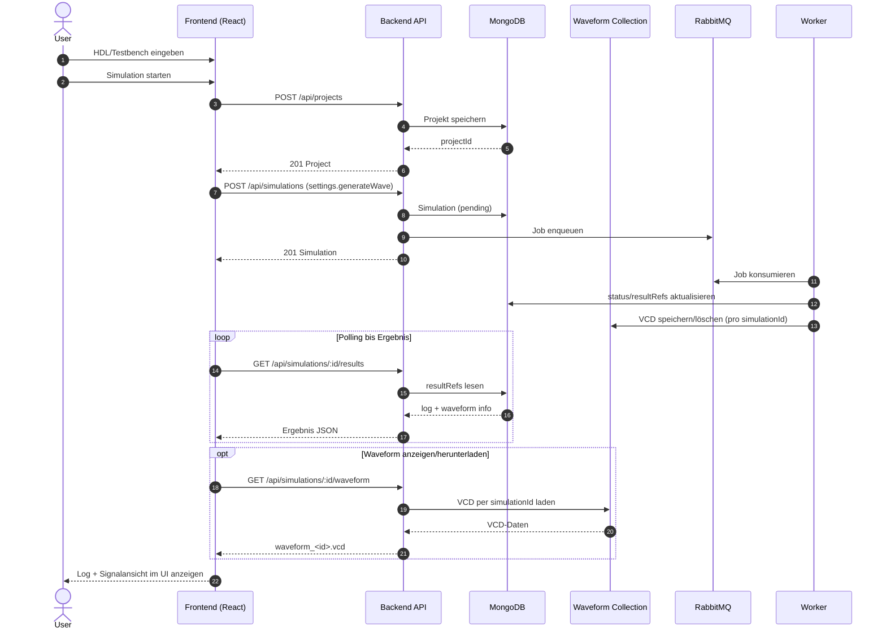
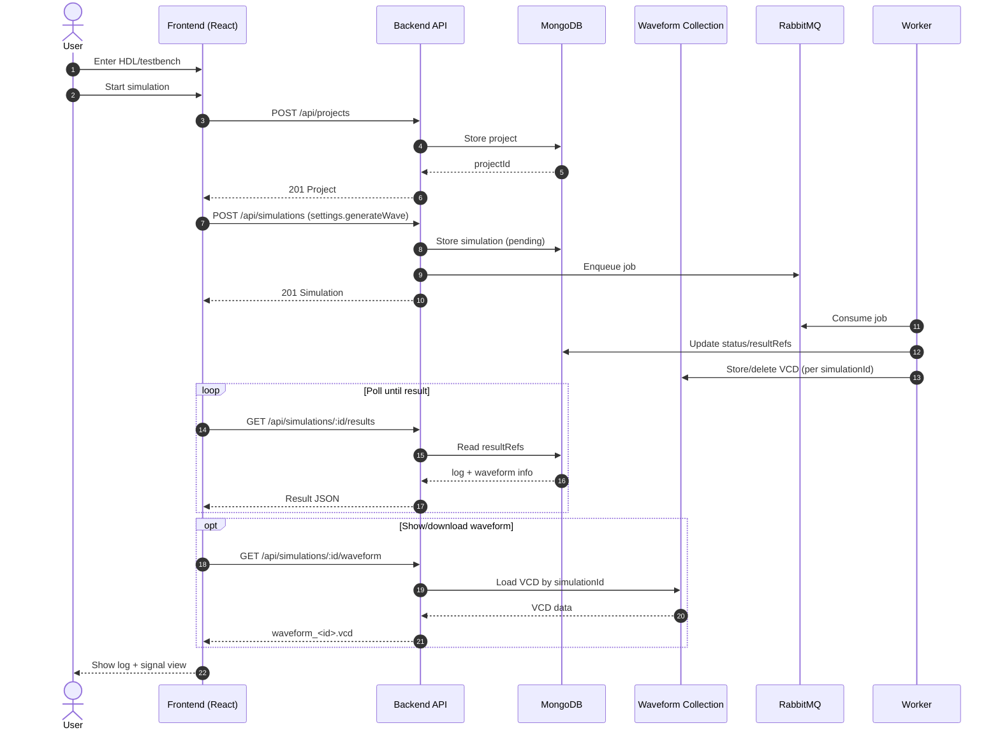

# HDLab Frontend Dokumentation

Diese README dokumentiert das Frontend im Ordner `apps/frontend` im aktuellen Ist-Zustand.

## 1. Zweck des Frontends

Das Frontend ist die Benutzeroberfläche für HDLab und bietet:

- Browserbasiertes Editieren von HDL-Code (Monaco Editor)
- Optionalen Testbench-Editor (SystemVerilog oder Python)
- Starten von Simulationen über die Backend-API
- Anzeige der Simulationslogs mit zwei Ansichten:
	- Kompakt (kurze, relevante Zusammenfassung)
	- Vollständig (Cocotb-Testlauf ohne Build-/Compiler-Noise)
- Upload/Download von Design- und Testbench-Dateien
- Sprachumschaltung der UI (Deutsch/Englisch)
- Erweiterte Cocotb-Beispiele mit ausführlichen Testausgaben (`cocotb.log.info`)

## 2. Tech-Stack

### Sprachen

- JavaScript (React mit JSX)
- CSS

### Frameworks & Libraries

- React 18 (`react`, `react-dom`)
- Vite 5 als Dev-Server und Build-Tool
- `@vitejs/plugin-react-swc` für React + Fast Refresh
- Monaco Editor Integration via `@monaco-editor/react`
- ZIP-Erzeugung via `jszip`

### Build/Lint

- ESLint + React/React Hooks Plugins

## 3. Laufzeitarchitektur

### UML-Sequenzdiagramm (Frontend-Flow)



### Komponentenstruktur

- `src/main.jsx`: App-Bootstrap und Warnung bei fehlendem `VITE_API_URL`
- `src/App.jsx`: Hauptlogik (State, Editoren, Dateioperationen, API-Aufrufe)
- `src/components/Sidebar.jsx`: Optionen, Dateiaktionen, Code-Beispiele (mit Bestätigungsabfrage vor dem Laden)
- `src/components/Topbar.jsx`: Topbar-Aktionen, Sprachumschaltung, Profil-Dropdown
- `src/components/Auth.jsx`: Login/Register-UI
- `src/contexts/AuthContext.jsx`: JWT-Auth-State, `apiCall()`-Helper, `hasRole()`-Gruppenprüfung
- `src/components/ModuleLibrary.jsx`: Modul-Bibliothek-Sidebar
- `src/components/TutorialContainer.jsx`, `TutorialOverview.jsx`, `TutorialLesson.jsx`: Tutorial-System (siehe 5.1)
- `src/utils/tutorialParser.js`, `tutorialLoader.js`: Markdown-Parsing für das Tutorial
- `src/App.css`, `src/index.css`: Styling

## 4. API-Nutzung durch das Frontend

Die zentrale Simulationslogik liegt in `runSimulation()` in `src/App.jsx`.

Verwendete Endpunkte:

1. `POST /api/projects`
2. `POST /api/simulations`
3. `GET /api/simulations/:id/results` (Polling, bis zu 30 Versuche mit 1s Intervall)
4. `GET /api/simulations/:id/waveform` (optional, wenn Waveform vorhanden)

Typischer Request für Projektanlage:

```json
{
	"name": "Playground",
	"files": [
		{
			"filename": "main.sv",
			"content": "...",
			"language": "systemverilog"
		},
		{
			"filename": "tb.sv",
			"content": "...",
			"language": "systemverilog"
		}
	]
}
```

Typischer Request für Simulationsstart:

```json
{
	"projectId": "<mongo-object-id>",
	"language": "systemverilog",
	"testbenchType": "systemverilog"
}
```

## 5. Dateifunktionen im Frontend

### Download

- Ohne Testbench: Download als `main.sv`
- Mit Testbench: Download als `hdl_project.zip` mit `main.sv` und `tb.sv` oder `tb.py`

### Upload

- Design-Datei: erlaubt `.sv` oder `.txt`
- Testbench-Datei: erlaubt `.sv`, `.py` oder `.txt`
- Falsche Endungen werden clientseitig blockiert
- Bei jedem Klick auf ein Code-Beispiel in der Sidebar (unabhängig vom aktuellen Editor-Inhalt) sowie beim Klick auf das HDLab-Logo/Home mit ungespeicherten Änderungen fragt eine `window.confirm()`-Dialog vor dem Überschreiben nach

## 5.1 Tutorial-System

Das Frontend enthält ein umfassendes interaktives Tutorial-System zum Erlernen von (System)Verilog, aktuell knapp 90 Lektionen (Stand: `VerilogTutorialFormatted.md`), organisiert in einer Einführung plus 11 Kapiteln (Kapitel 0 - Kapitel 10), jeweils mit mehreren Unterkapiteln.

### Tutorial-Komponenten

**TutorialContainer.jsx** - Lädt das Tutorial-Markdown (`/Tutorial/VerilogTutorialFormatted.md`, statisch aus `apps/frontend/public/Tutorial/` ausgeliefert) via `parseTutorialFromFile()`, hält den aktuellen Lektions-State und schaltet zwischen `TutorialOverview` und `TutorialLesson` um.

**TutorialOverview.jsx** - Landing Page mit drei umschaltbaren Ansichten (Nach Kapitel / Nach Schwierigkeit / Nach Aufgabentyp):
- **Kapitel-Ansicht** (Standard): Jedes Kapitel (Einführung, Kapitel 0-10) ist ein aufklappbares Dropdown. Pro Kapitel werden maximal 7 Unterkapitel angezeigt, darüber hinaus blendet ein "Mehr anzeigen"-Button die restlichen ein
- Jede Lerneinheit zeigt ein Typ-Badge (📖 Theorie / ✏️ Übung / 🚀 Projekt)
- "Von vorne beginnen"-Button springt zur ersten Lektion

**TutorialLesson.jsx** - Hauptkomponente für einzelne Lektionen:
- Zeigt Markdown-formatierte Erklärungen (via `react-markdown` mit `remark-gfm` und `rehype-raw`, siehe unten)
- Unterstützt drei Lektionstypen: `theory` (nur Erklärung), `exercise` (mit Editor, Testbench, Validierung), `project`
- Code-Editor mit **Reset-Button**: Setzt Editor-Inhalt (Code + Testbench) zurück auf den Ausgangszustand der Übung (mit Bestätigungsabfrage), ohne den Backend-Fortschritt oder Validierungsstatus anzufassen
- **Testbench-Editor ist read-only** (`options={{ readOnly: true }}`) - kann nur angezeigt/ausgeblendet, nicht bearbeitet werden
- **Musterlösung** nur nach Passwortabfrage sichtbar (`window.prompt`, Vergleichswert aus `VITE_TUTORIAL_SOLUTION_PASSWORD`, Fallback `'verilog') - Nutzer mit Rolle `admin` oder `developer` (`hasRole()` aus `AuthContext`) überspringen die Abfrage automatisch. **Kein echter Zugriffsschutz**: Die Lösung ist ohnehin Teil des an jeden eingeloggten Nutzer ausgelieferten Lesson-JSON
- Navigation "Vorherige Lektion" / "Nächste Lektion": **kein Sperren mehr** bei nicht bestandener Übung - stattdessen zeigt ein Status-Marker zwischen den beiden Buttons "✓ Abgeschlossen" oder "○ Nicht abgeschlossen" (nur bei `type === 'exercise'`)

**tutorialParser.js** - Utility für Markdown-Parsing:
- `parseTutorialFromMarkdown()`: Zeilenbasierte Iteration über `<!-- lesson_id: ... -->`-HTML-Kommentarblöcke als Frontmatter
- `parseTutorialFromFile()`: lädt und parst per `fetch()`
- Gibt zurück: `lessons` (Map), `lessonIds` (Dokumentreihenfolge), `byDifficulty`, `bySection`, `byType`, **`byChapter`** (Array `{key, lessonIds}[]`, Gruppierung anhand der Nummerierung im Lektionstitel - `key: 'intro'` für Vorwort/Inhaltsverzeichnis, sonst die Kapitelnummer als String)
- Entfernt die führende Markdown-Überschrift aus der Erklärung (`explanation`/`description`), da der Titel bereits separat über `lesson.title` angezeigt wird

**Tutorial.css** - Styling für Tutorial-Komponenten:
- Markdown-Element-Styling: `h1`-`h6`, `code`, `pre` (heller Codeblock-Hintergrund, passend zum übrigen Light-Mode-Design), `table`/`th`/`td`, `ul`/`ol`
- Status-Marker (`.lesson-status-marker.completed` / `.not-completed`), Reset-Button (`.btn-reset`), Chapter-Dropdown (`.difficulty-group`, wiederverwendet aus der Schwierigkeits-Ansicht)

### HTML- und Tabellen-Rendering im Markdown

`react-markdown` rendert standardmäßig **kein** rohes HTML und **keine** GFM-Tabellen (Pipe-Syntax). Beides ist inzwischen aktiviert:

- `remark-gfm`: aktiviert GitHub-Flavored-Markdown-Tabellen (`| A | B |`)
- `rehype-raw`: aktiviert rohe HTML-Blöcke (z.B. `<div style="display:flex">...</div>`) direkt im Tutorial-Markdown

Beides ist unbedenklich, weil der Markdown-Inhalt aus einer statischen, projekteigenen Datei kommt (kein Nutzer-Input) - `rehype-raw` sollte **nicht** auf nutzergenerierten Inhalt angewendet werden, ohne diesen vorher zu sanitizen.

### Validierungsablauf (für Exercise-Lektionen)

Wenn Benutzer „Lösung einreichen" drückt (`handleValidate()` in `TutorialLesson.jsx`):

1. Frontend sendet `{ lessonId, moduleCode, testbench }` an `POST /api/tutorial/validate` (authentifiziert)
2. Backend instrumentiert die Testbench, legt intern ein Projekt + eine Simulation an und pollt bis zu 30 Sekunden auf ein Ergebnis (Details siehe Backend-README, Abschnitt 8.5)
3. Response wird angezeigt:
   - ✓ **passed**: "✓ Richtig gelöst!" (ggf. + Hinweis, dass die Lösung automatisch als Modul gespeichert wurde)
   - ✗ **failed**: "✗ Nicht korrekt" + relevante Fehlerzeilen aus dem Simulationslog
4. Bei Erfolg wird der Code zusätzlich automatisch in der Modul-Bibliothek gespeichert (siehe Abschnitt 15)

### Bedingte UI-Rendering (lesson.type)

```jsx
// Nur für Exercise-Lektionen sichtbar:
{lesson.type === 'exercise' && (
  <>
    {/* Testbench-Editor (read-only) */}
    {/* Reset-Button */}
    {/* "Lösung einreichen"-Button */}
    {/* Validierungs-Ergebnis + Status-Marker */}
  </>
)}

// Theory-Lektionen zeigen nur die Erklärung, keine Editoren
```

## 6. Konfiguration und Umgebungsvariablen

### Relevante Variablen

- `FRONTEND_PORT` (Compose Host-Port, Standard 5173)
- `VITE_API_URL` (Warnhinweis in `main.jsx`, aber im Compose-Setup wird primär Proxy genutzt)
- `VITE_TUTORIAL_SOLUTION_PASSWORD` (optional, Fallback `'verilog'`) - Passwort für die Musterlösungsanzeige im Tutorial
- `authToken` in `localStorage` hält die Login-Session zwischen Reloads

> **Wichtig:** Der `frontend`-Service in `docker-compose.yml` hat `env_file: .env.runtime`, damit `VITE_*`-Variablen aus der generierten `.env.runtime` (siehe `setup.sh`) in den Vite-Dev-Server-Prozess gelangen (Vite spiegelt `VITE_`-präfixte Prozessvariablen automatisch nach `import.meta.env`). Dabei ist zusätzlich `NODE_ENV=development` explizit als `environment:`-Override gesetzt, der `.env.runtime` überschreibt: Der Frontend-Container läuft **immer** über `npm run dev` (Vite-Dev-Server), nie über einen Production-Build. Würde `NODE_ENV=production` aus `.env.runtime` (Server-Modus) durchschlagen, liefert Reacts `react/jsx-dev-runtime` keine `jsxDEV`-Funktion mehr aus, und die App crasht beim ersten Render mit `TypeError: _jsxDEV is not a function` (weißer Bildschirm). Bei Änderungen an `docker-compose.yml` rund um den `frontend`-Service diesen Override nicht versehentlich entfernen.

### Vite Proxy

In `vite.config.js` ist konfiguriert:

- `/api` -> `http://backend:3001`

Damit können API-Calls im Frontend relativ (`/api/...`) erfolgen.

### Auth Flow Hinweis

- Login und Registrierung speichern den JWT direkt in `localStorage`
- Nach erfolgreichem Login/Register wechselt die App ohne manuellen Reload in den Editor
- Ein weißer Screen nach Login/Logout ist ein Fehler im Render-Flow und kein gewünschtes Verhalten

## 8. Ports

- Frontend Container-Port: `5173` (siehe `apps/frontend/Dockerfile`)
- Compose Mapping: `${FRONTEND_PORT:-5173}:5173`
- Backend-Ziel aus Frontend-Sicht im Compose-Netz: `backend:3001`

## 9. Start und Entwicklung

Im Frontend-Ordner:

```bash
cd apps/frontend
npm install
npm run dev
```

Weitere Scripts:

- `npm run build` (Production Build)
- `npm run preview` (Build Preview)
- `npm run lint` (ESLint)

## 10. Zustandsmodell der UI (vereinfacht)

Wichtige States in `App.jsx`:

- `code`, `testbench`
- `language`, `testbenchLang`
- `testbenchEnabled`
- `loading`
- `logSummary`, `logDetails`, `logRaw`
- `logViewMode` (`compact` | `full`)
- `wave` (Waveform-Erzeugung an/aus für Simulationsanfrage)
- `waveformUrl`, `waveformPreview`, `waveformVisible`, `waveformLoading`
- `waveformViewMode` (`signal` | `raw`)
- `waveZoom`, `selectedWaveSignalIds`
- `helpOpen`, `settingsOpen`, `themeMode`
- `uiLanguage`

Diese States steuern Editorinhalte, API-Payload, Button-Zustand und Loganzeige.

## 11. Neuerungen (April 2026)

- Neue Cocotb-Beispiele in der Sidebar (u. a. ALU, Komparator, synchroner Zähler)
- Verbose Test-Logs in Python-Beispielen für bessere Nachvollziehbarkeit pro Testvektor
- Log-Umschalter in der Ergebnisanzeige: `Kompakt` / `Vollständig`
- Vollständig-Ansicht zeigt nur relevanten Cocotb-Test-Output statt kompletter Build-Ausgabe
- Waveform-Features: Download, Rohansicht und Signalansicht direkt im Frontend
- Signalansicht mit Zoom, Signal-Checkboxen je Spur, Bus-Hex-Labels und farbcodierten Flanken
- Topbar-Hilfe mit Funktionsübersicht und Signal-Farbcode-Legende
- Einstellungen-Dialog mit Light/Dark-Mode inkl. persistenter Speicherung (`localStorage`)
- Tutorial-System mit progressiven Lektionen, damals initial ~23 (Stand April 2026; mittlerweile knapp 90 Lektionen in Kapiteln, siehe Abschnitt 5.1 und "20. Neuerungen (Juli 2026)")
- Interaktive Code-Validierung mit automatischer Testbench-Generierung
- Markdown-basierte Lektionen mit react-markdown Rendering
- Bedingte UI für Exercise vs. Theory Lektionen
- State-Reset bei Lektionswechsel (Benutzercode, Validierungsstatus)

## 12. Bekannte Grenzen (aktueller Stand)

- Polling ist statisch (max. 30 Sekunden) und nicht websocket-basiert
- Fehlerbehandlung der API-Antworten ist bewusst einfach gehalten
- `VITE_API_URL` wird geprüft, aber Standardfluss nutzt den Vite-Proxy auf `/api`

## 13. Relevante Dateien

- `src/main.jsx` - App-Entry
- `src/App.jsx` - Kernlogik, API-Integration, Editor- und Dateiabläufe
- `src/components/Sidebar.jsx` - UI-Controls
- `src/components/Topbar.jsx` - Kopfbereich/UI-Aktionen
- `src/components/TutorialLesson.jsx` - Tutorial-Komponente mit Validierung
- `src/utils/tutorialParser.js` - Markdown-Parser für Lektionen
- `src/components/Tutorial.css` - Tutorial und Markdown-Styling
- `vite.config.js` - Dev-Proxy zum Backend
- `Dockerfile` - Containerstart für Frontend

---

# English Documentation

This README documents the frontend in `apps/frontend` as it currently exists.

## 1. Frontend Purpose

The frontend is HDLab's user interface and provides:

- Browser-based HDL editing (Monaco Editor)
- Optional testbench editor (SystemVerilog or Python)
- Simulation start through the backend API
- Simulation log display with two modes:
	- Compact (short, relevant summary)
	- Full (Cocotb test output without build/compiler noise)
- Upload/download of design and testbench files
- UI language switch (German/English)
- Extended Cocotb examples with verbose test output (`cocotb.log.info`)

## 2. Tech Stack

### Languages

- JavaScript (React with JSX)
- CSS

### Frameworks & Libraries

- React 18 (`react`, `react-dom`)
- Vite 5 as dev server and build tool
- `@vitejs/plugin-react-swc` for React + Fast Refresh
- Monaco integration via `@monaco-editor/react`
- ZIP generation via `jszip`

### Build/Lint

- ESLint + React/React Hooks plugins

## 3. Runtime Architecture

### UML Sequence Diagram (Frontend Flow)



### Component Structure

- `src/main.jsx`: app bootstrap and warning if `VITE_API_URL` is missing
- `src/App.jsx`: main logic (state, editors, file operations, API calls)
- `src/components/Sidebar.jsx`: options, file actions, examples
- `src/components/Topbar.jsx`: topbar actions and language switching
- `src/App.css`, `src/index.css`: styling

## 4. Frontend API Usage

The core simulation logic lives in `runSimulation()` in `src/App.jsx`.

Used endpoints:

1. `POST /api/projects`
2. `POST /api/simulations`
3. `GET /api/simulations/:id/results` (polling, up to 30 attempts with 1s interval)
4. `GET /api/simulations/:id/waveform` (optional when waveform is available)

Typical project creation payload:

```json
{
	"name": "Playground",
	"files": [
		{
			"filename": "main.sv",
			"content": "...",
			"language": "systemverilog"
		},
		{
			"filename": "tb.sv",
			"content": "...",
			"language": "systemverilog"
		}
	]
}
```

Typical simulation creation payload:

```json
{
	"projectId": "<mongo-object-id>",
	"language": "systemverilog",
	"testbenchType": "systemverilog"
}
```

## 5. Frontend File Features

### Download

- Without testbench: download as `main.sv`
- With testbench: download as `hdl_project.zip` containing `main.sv` and `tb.sv` or `tb.py`

### Upload

- Design file: `.sv` or `.txt`
- Testbench file: `.sv`, `.py`, or `.txt`
- Invalid extensions are blocked client-side

## 6. Configuration and Environment Variables

### Relevant Variables

- `FRONTEND_PORT` (compose host port, default 5173)
- `VITE_API_URL` (checked in `main.jsx`; in compose, proxy is used in most cases)

### Vite Proxy

Configured in `vite.config.js`:

- `/api` -> `http://backend:3001`

This allows relative API calls from frontend (`/api/...`).

## 7. Ports

- Frontend container port: `5173` (see `apps/frontend/Dockerfile`)
- Compose mapping: `${FRONTEND_PORT:-5173}:5173`
- Backend target from frontend in compose network: `backend:3001`

## 8. Start and Development

In frontend folder:

```bash
cd apps/frontend
npm install
npm run dev
```

Additional scripts:

- `npm run build` (production build)
- `npm run preview` (preview build)
- `npm run lint` (ESLint)

## 9. UI State Model (Simplified)

Important states in `App.jsx`:

- `code`, `testbench`
- `language`, `testbenchLang`
- `testbenchEnabled`
- `loading`
- `logSummary`, `logDetails`, `logRaw`
- `logViewMode` (`compact` | `full`)
- `wave` (enable/disable waveform generation per simulation request)
- `waveformUrl`, `waveformPreview`, `waveformVisible`, `waveformLoading`
- `waveformViewMode` (`signal` | `raw`)
- `waveZoom`, `selectedWaveSignalIds`
- `helpOpen`, `settingsOpen`, `themeMode`
- `uiLanguage`

These states drive editor content, API payloads, button states, and log/waveform rendering.

## 10. Updates (April 2026)

- New Cocotb examples in sidebar (e.g., ALU, comparator, synchronous counter)
- Verbose Python test logs for better traceability per test vector
- Result log switch: `Compact` / `Full`
- Full mode shows relevant Cocotb test output instead of complete build output
- Waveform features: download, raw view, and signal view in frontend
- Signal view with zoom, per-row signal checkboxes, inline bus hex labels, color-coded edges
- Topbar help dialog with feature overview and signal color legend
- Settings dialog with light/dark mode and persistent storage (`localStorage`)

## 11. Known Limitations (Current)

- Polling is static (max 30 seconds), not WebSocket-based
- API error handling is intentionally simple
- `VITE_API_URL` is checked, but default flow uses Vite proxy on `/api`

## 12. Relevant Files

- `src/main.jsx` - app entry
- `src/App.jsx` - core logic, API integration, editor and file flows
- `src/components/Sidebar.jsx` - UI controls, code examples (confirms before loading)
- `src/components/Topbar.jsx` - top area/UI actions, profile dropdown
- `src/contexts/AuthContext.jsx` - JWT auth state, `apiCall()` helper, `hasRole()` group check
- `src/components/Auth.jsx` - login/register UI
- `src/components/ModuleLibrary.jsx` - module library sidebar
- `src/components/TutorialContainer.jsx`, `TutorialOverview.jsx`, `TutorialLesson.jsx` - tutorial system (see 5.1)
- `src/utils/tutorialParser.js`, `tutorialLoader.js` - tutorial markdown parsing
- `vite.config.js` - dev proxy to backend
- `Dockerfile` - frontend container startup

## 5.1 Tutorial System

The frontend contains a comprehensive interactive tutorial system for learning (System)Verilog, currently just under 90 lessons (as of `VerilogTutorialFormatted.md`), organized as an introduction plus 11 chapters (Chapter 0 - Chapter 10), each with several sub-chapters.

### Tutorial Components

**TutorialContainer.jsx** - Loads the tutorial markdown (`/Tutorial/VerilogTutorialFormatted.md`, served statically from `apps/frontend/public/Tutorial/`) via `parseTutorialFromFile()`, holds the current-lesson state, and switches between `TutorialOverview` and `TutorialLesson`.

**TutorialOverview.jsx** - Landing page with three switchable views (By chapter / By difficulty / By task type):
- **Chapter view** (default): each chapter (Introduction, Chapter 0-10) is a collapsible dropdown. Each chapter shows at most 7 sub-chapters, with a "Show more" button revealing the rest
- Every lesson shows a type badge (📖 Theory / ✏️ Exercise / 🚀 Project)
- "Start from beginning" button jumps to the first lesson

**TutorialLesson.jsx** - Main component for individual lessons:
- Renders markdown explanations via `react-markdown` with `remark-gfm` and `rehype-raw` (see below)
- Supports three lesson types: `theory` (explanation only), `exercise` (editor, testbench, validation), `project`
- Code editor with a **Reset button**: restores the editor content (code + testbench) to the exercise's original state (with a confirmation prompt), without touching backend progress or validation status
- **Testbench editor is read-only** (`options={{ readOnly: true }}`) - can only be shown/hidden, not edited
- **Sample solution** only visible after a password prompt (`window.prompt`, compared against `VITE_TUTORIAL_SOLUTION_PASSWORD`, fallback `'verilog'`) - users with role `admin` or `developer` (`hasRole()` from `AuthContext`) skip the prompt automatically. **Not real access control**: the solution is already part of the lesson JSON shipped to every logged-in user
- "Previous lesson" / "Next lesson" navigation: **no longer locked** on a failed exercise - instead a status marker between the two buttons shows "✓ Completed" or "○ Not completed" (only for `type === 'exercise'`)

**tutorialParser.js** - Markdown parsing utility:
- `parseTutorialFromMarkdown()`: line-based iteration over `<!-- lesson_id: ... -->` HTML comment blocks as frontmatter
- `parseTutorialFromFile()`: loads and parses via `fetch()`
- Returns `lessons` (map), `lessonIds` (document order), `byDifficulty`, `bySection`, `byType`, **`byChapter`** (array `{key, lessonIds}[]`, grouped from the numbering in the lesson title - `key: 'intro'` for foreword/table of contents, otherwise the chapter number as a string)
- Strips the leading markdown heading from the explanation (`explanation`/`description`), since the title is already shown separately via `lesson.title`

**Tutorial.css** - Styling for tutorial components:
- Markdown element styling: `h1`-`h6`, `code`, `pre` (light code-block background, matching the rest of the light-mode design), `table`/`th`/`td`, `ul`/`ol`
- Status marker (`.lesson-status-marker.completed` / `.not-completed`), reset button (`.btn-reset`), chapter dropdown (`.difficulty-group`, reused from the difficulty view)

### HTML and Table Rendering in Markdown

`react-markdown` by default renders **no** raw HTML and **no** GFM tables (pipe syntax). Both are now enabled:

- `remark-gfm`: enables GitHub-flavored-markdown tables (`| A | B |`)
- `rehype-raw`: enables raw HTML blocks (e.g. `<div style="display:flex">...</div>`) directly in the tutorial markdown

Both are safe here because the markdown content comes from a static, project-owned file (no user input) - `rehype-raw` should **not** be applied to user-generated content without sanitizing it first.

### Validation Flow (for Exercise Lessons)

When the user clicks "Submit solution" (`handleValidate()` in `TutorialLesson.jsx`):

1. Frontend sends `{ lessonId, moduleCode, testbench }` to `POST /api/tutorial/validate` (authenticated)
2. Backend instruments the testbench, internally creates a project + simulation, and polls for up to 30 seconds (see backend README, section 8.5)
3. Response is displayed:
   - ✓ **passed**: "✓ Correct!" (plus a note if the solution was auto-saved as a module)
   - ✗ **failed**: "✗ Incorrect" + relevant error lines from the simulation log
4. On success, the code is additionally auto-saved to the module library (see section 15)

## 13. Authentication (Mai 2026)

Das Frontend implementiert JWT-basierte Authentifizierung mit React Context.

### AuthContext Hook

```javascript
import { useAuth } from './contexts/AuthContext';

function MyComponent() {
  const { user, token, isAuthenticated, login, register, logout, apiCall, hasRole } = useAuth();
  
  // user: { id, username, email, roles }
  // token: JWT Token (auto in localStorage)
  // isAuthenticated: Boolean
  // apiCall: Helper mit auto-Authorization Header
  // hasRole(...roles): Boolean - Gruppen-/Rollenprüfung, z.B. hasRole('admin', 'developer')
}
```

### Auth Flow

1. **Unauthenticated Users** sehen Login/Register Page
2. **Registration**:
   - Username, Email, Password eingeben
   - Backend validiert & hasht Passwort
   - Token wird zurückgegeben → localStorage
   - Redirect zu Haupt-App
3. **Login**:
   - Username + Passwort
   - Token wird zurückgegeben → localStorage
   - Session persisted auch nach Browser-Refresh

### Component

`src/components/Auth.jsx` enthält:
- `<LoginPage />` - Login-Formular
- `<RegisterPage />` - Registrierungs-Formular

Beide Komponenten zeigen Validierungsfehler und Lade-Status.

### Topbar Integration

Profile-Dropdown (rechts oben) zeigt:
- Benutzer-Name
- Email
- **Abmelden** Button

### Gruppen/Rollen

Jeder Nutzer hat `user.roles` (Standard: `['user']` bei Registrierung). Aktuell gibt es genau eine Stelle im Frontend, die darauf reagiert: `hasRole('admin', 'developer')` in `TutorialLesson.jsx` überspringt die Passwortabfrage für Musterlösungen. Es gibt keine UI zum Ändern der eigenen oder fremder Rollen - das läuft ausschließlich über ein Backend-CLI-Skript (siehe Backend-README, Abschnitt 14.1).

---

## 14. Tutorial Progress System (Mai 2026)

Das Frontend speichert automatisch Benutzer-Lösungen beim Bearbeiten von Tutorials.

### TutorialLesson Komponente

```javascript
<TutorialLesson
  lesson={currentLesson}
  lessonId={10}
  allLessonIds={[1, 2, 3, ...]}
  onBack={handleBack}
  onNextLesson={handleNext}
  onPreviousLesson={handlePrev}
  uiLanguage="de"
  editorTheme="vs-light"
/>
```

### Features

#### Auto-Save
- Code wird nach **2 Sekunden** Inaktivität automatisch gespeichert
- Backend speichert in `TutorialProgress` Collection
- Kein weiteres User-Input nötig
- Wenn eine Exercise erfolgreich validiert wird, wird die Lösung zusätzlich als Modul in der Bibliothek gespeichert

#### Manual Save Button
- Blauer "Speichern" Button zum manuellen Speichern
- Status: "Speichert..." | "Speichern"

#### Solution Submission
- Grüner "Lösung einreichen" Button
- Validiert Code via Backend
- Bei erfolgreicher Validierung:
  - Status ändert sich zu "✓ Richtig gelöst!"
  - Lösung wird gespeichert
  - Status-Marker zwischen "Vorherige"/"Nächste Lektion" zeigt "✓ Abgeschlossen" (die nächste Lektion ist **nicht mehr gesperrt**, auch ohne bestandene Übung)

#### Reset-Button
- "↺ Zurücksetzen" neben der Editor-Überschrift, setzt Code + Testbench zurück auf den Ausgangszustand der Übung
- Fragt vorher per `window.confirm()` nach, ist deaktiviert wenn Editor bereits dem Ausgangszustand entspricht
- Rührt Backend-Fortschritt/Validierungsstatus nicht an

#### Progress Loading
- Beim Öffnen einer Lektion wird vorheriger Code geladen
- "Lädt vorherigen Fortschritt..." Indicator
- Last Saved Timestamp wird angezeigt

#### Testbench, Code Templates & Solutions
- Exercise-Template automatisch geladen
- Testbench-Editor ist **read-only** (nur ein-/ausblendbar, nicht editierbar)
- **Lösung anzeigen** Button fragt zuerst per `window.prompt()` nach einem Passwort (`VITE_TUTORIAL_SOLUTION_PASSWORD`, Fallback `'verilog'`) - Nutzer mit Rolle `admin`/`developer` überspringen die Abfrage
- Lösungs-Code ist read-only

---

## 15. Module Library (Mai 2026)

Rechts neben dem Editor ist eine **Modul-Bibliothek** Sidebar, wo Nutzer Verilog-Module speichern und wiederverwenden können.

### ModuleLibrary Komponente

```javascript
<ModuleLibrary
  currentCode={userCode}
  onInsertModule={(code) => { setUserCode(prev => prev + '\n' + code); }}
  uiLanguage="de"
/>
```

### Features

#### Modul Speichern
- **"💾 Aktuelles Modul speichern"** Button
- Form öffnet sich:
  - **Modulname**: Eindeutiger Name (z.B. "modul_nand")
  - **Beschreibung**: Optional (z.B. "NAND-Gatter")
  - **Tags**: Kommagetrennt (z.B. "grundoperation, logic")
- Backend speichert mit Versionierung
- Im Simulator löst der Nutzer das Speichern bewusst manuell aus
- Im Tutorial wird ein erfolgreich gelöstes Exercise-Modul automatisch zusätzlich gespeichert

#### Module Anzeigen
- Liste aller gespeicherten Module sichtbar
- Pro Modul:
  - Name
  - Beschreibung
  - Tags (farbige Badges)
  - Version
  - ➕ Einfügen Button
  - 🗑️ Löschen Button

#### Modul Einfügen
- ➕ Button fügt Modul-Code am Ende des Editors ein
- Hilfreich um Abhängigkeiten zu nutzen
- z.B. Wenn Modul "modul_addierer" von "modul_nand" abhängt:
  1. modul_nand laden & einfügen
  2. modul_addierer laden & einfügen

#### Modul Löschen
- 🗑️ Button löscht Modul (mit Bestätigung)
- Alle Versionen werden gelöscht

---

## 16. API Integration Example

```javascript
// Use Auth Hook
const { apiCall, isAuthenticated } = useAuth();

// Protected API Call
async function loadTutorialProgress(lessonId) {
  const res = await apiCall(`/tutorial/progress/${lessonId}`);
  if (res.ok) {
    const data = await res.json();
    setUserCode(data.userCode);
  }
}

// Save Code
async function saveCode(lessonId, userCode) {
  const res = await apiCall(`/tutorial/progress/${lessonId}`, {
    method: 'POST',
    body: JSON.stringify({
      userCode,
      solution: '',
      isCompleted: false,
      validationStatus: 'not-started'
    })
  });
  return res.ok;
}

// Load Modules
async function loadModules() {
  const res = await apiCall('/modules');
  if (res.ok) {
    return await res.json();
  }
}
```

---

## 17. Environment & Setup (Mai 2026)

### Frontend Environment

```env
# In .env.local oder .env (bzw. via docker-compose env_file: .env.runtime, siehe Abschnitt 6)
VITE_API_URL=/api
VITE_TUTORIAL_SOLUTION_PASSWORD=<passwort>
```

### Token Management

- **Storage**: `localStorage['authToken']`
- **Auto-Persistence**: Nach Login/Register automatisch gespeichert
- **Auto-Refresh**: Bei Page-Reload wird Token validiert
- **Session-Loss**: Wenn Token abgelaufen → Auto-Logout

### Build & Deploy

```bash
# Development
npm run dev

# Production Build
npm run build

# Deployed App erwartet Backend auf VITE_API_URL
```

---

## 18. Flow Diagrams

### Lektion Bearbeiten

```
User öffnet Lektion
  ↓
TutorialLesson lädt Progress vom Backend
  ↓
Code wird in Editor angezeigt
  ↓
User schreibt Code
  ↓
Auto-Save nach 2s: Code → Backend
  ↓
User klickt "Lösung einreichen"
  ↓
Validation im Backend
  ↓
✓ Passed: Lösung speichern + Status-Marker "✓ Abgeschlossen"
✗ Failed: Fehler anzeigen, Code bleibt, Status-Marker "○ Nicht abgeschlossen"
  ↓
"Nächste Lektion" ist in beiden Fällen klickbar (kein Sperren mehr)
```

### Modul speichern

```
User schreibt Code im Simulator
	↓
Klickt "Aktuelles Modul speichern"
	↓
Form für Name + Beschreibung + Tags
	↓
Backend speichert neue Modulversion
	↓
Modul erscheint in der Bibliothek
```

### Modul-Workflow

```
User schreibt Code für "modul_addierer"
  ↓
Klickt "Aktuelles Modul speichern"
  ↓
Form für Name + Tags
  ↓
Backend speichert neue Version (v1)
  ↓
---------  später  ---------
  ↓
User öffnet "modul_or" Lektion
  ↓
Klickt "➕" beim modul_addierer
  ↓
Code wird eingefügt:
  module modul_or(...) end
  module modul_addierer(...) end
  ↓
User kann beides zusammen nutzen
```

---

## 19. Key Files (Mai/Juli 2026)

- `src/contexts/AuthContext.jsx` - JWT Management, `hasRole()`
- `src/components/Auth.jsx` - Login/Register UI
- `src/components/TutorialContainer.jsx` - Lädt Tutorial-Markdown, State-Umschaltung Overview/Lesson
- `src/components/TutorialOverview.jsx` - Kapitel-/Schwierigkeits-/Typ-Ansicht
- `src/components/TutorialLesson.jsx` - Tutorial mit Auto-Save, Reset-Button, Passwort-Lösung, Status-Marker
- `src/utils/tutorialParser.js` - Markdown-Parser inkl. `byChapter`-Gruppierung
- `src/components/ModuleLibrary.jsx` - Modul-Speicherung & Verwaltung
- `src/components/Topbar.jsx` - Profile Dropdown
- `src/App.jsx` - Auth-Check & Route Guard

## 20. Neuerungen (Juli 2026)

- Tutorial-Übersicht: Kapitel-Dropdowns statt flacher Liste, Begrenzung auf 7 sichtbare Unterkapitel + "Mehr anzeigen", Typ-Badges (Theorie/Übung/Projekt)
- Code-Beispiel-Klick in der Sidebar fragt jetzt **immer** vor dem Laden nach Bestätigung (vorher nur wenn der Editor schon vom Ausgangszustand abwich)
- Tutorial-Lektion: Reset-Button für Übungen, schreibgeschützte Testbench, Passwortabfrage für Musterlösungen (mit Rollen-Bypass für `admin`/`developer`)
- "Nächste Lektion" ist nicht mehr gesperrt; stattdessen Status-Marker "✓ Abgeschlossen" / "○ Nicht abgeschlossen"
- Markdown-Rendering: `remark-gfm` (Tabellen) und `rehype-raw` (rohes HTML) ergänzt
- Code-Block-Styling im Tutorial auf helles Farbschema umgestellt (vorher dunkler Block unabhängig vom Rest der Seite)
- Gruppen-/Rollensystem eingeführt (`roles: ['user' | 'developer' | 'admin']`), siehe Backend-README Abschnitt 14.1

---

# English Documentation (continued) - Sections 13-20

The sections below mirror German sections 13-20, which were added after the initial English translation (5.1 above already covers the tutorial system). Provided here for completeness.

## 13. Authentication (May 2026)

The frontend implements JWT-based authentication using a React context.

### AuthContext Hook

```javascript
import { useAuth } from './contexts/AuthContext';

function MyComponent() {
  const { user, token, isAuthenticated, login, register, logout, apiCall, hasRole } = useAuth();

  // user: { id, username, email, roles }
  // token: JWT token (auto-stored in localStorage)
  // isAuthenticated: boolean
  // apiCall: helper with automatic Authorization header
  // hasRole(...roles): boolean - group/role check, e.g. hasRole('admin', 'developer')
}
```

### Auth Flow

1. **Unauthenticated users** see the login/register page
2. **Registration**:
   - Enter username, email, password
   - Backend validates & hashes the password
   - Token is returned → localStorage
   - Redirect to the main app
3. **Login**:
   - Username + password
   - Token is returned → localStorage
   - Session persists across browser refresh

### Component

`src/components/Auth.jsx` contains:
- `<LoginPage />` - login form
- `<RegisterPage />` - registration form

Both components show validation errors and loading state.

### Topbar Integration

Profile dropdown (top right) shows:
- Username
- Email
- **Logout** button

### Groups/Roles

Every user has `user.roles` (default `['user']` on registration). Currently there is exactly one place in the frontend that reacts to it: `hasRole('admin', 'developer')` in `TutorialLesson.jsx` skips the password prompt for sample solutions. There is no UI to change your own or another user's roles - that's exclusively done via a backend CLI script (see backend README, section 14.1).

## 14. Tutorial Progress System (May 2026)

The frontend automatically saves user solutions while working through tutorials.

### TutorialLesson Component

```javascript
<TutorialLesson
  lesson={currentLesson}
  lessonId={10}
  allLessonIds={[1, 2, 3, ...]}
  onBack={handleBack}
  onNextLesson={handleNext}
  onPreviousLesson={handlePrev}
  uiLanguage="de"
  editorTheme="vs-light"
/>
```

### Features

#### Auto-Save
- Code is automatically saved after **2 seconds** of inactivity
- Backend stores it in the `TutorialProgress` collection
- No further user input required
- When an exercise is successfully validated, the solution is additionally saved as a module in the library

#### Manual Save Button
- Blue "Save" button for manual saving
- Status: "Saving..." | "Save"

#### Solution Submission
- Green "Submit solution" button
- Validates code via the backend
- On successful validation:
  - Status changes to "✓ Correct!"
  - Solution is saved
  - Status marker between "Previous"/"Next lesson" shows "✓ Completed" (the next lesson is **no longer locked**, even without a passing exercise)

#### Reset Button
- "↺ Reset" next to the editor heading, resets code + testbench to the exercise's original state
- Asks for confirmation via `window.confirm()` first; disabled when the editor already matches the original state
- Does not touch backend progress or validation status

#### Progress Loading
- Previous code is loaded when opening a lesson
- "Loading previous progress..." indicator
- Last-saved timestamp is displayed

#### Testbench, Code Templates & Solutions
- Exercise template is loaded automatically
- Testbench editor is **read-only** (can only be shown/hidden, not edited)
- **Show solution** button first asks for a password via `window.prompt()` (`VITE_TUTORIAL_SOLUTION_PASSWORD`, fallback `'verilog'`) - users with role `admin`/`developer` skip the prompt
- Solution code is read-only

## 15. Module Library (May 2026)

Next to the editor is a **module library** sidebar where users can save and reuse Verilog modules.

### ModuleLibrary Component

```javascript
<ModuleLibrary
  currentCode={userCode}
  onInsertModule={(code) => { setUserCode(prev => prev + '\n' + code); }}
  uiLanguage="de"
/>
```

### Features

#### Save Module
- **"💾 Save current module"** button
- Opens a form:
  - **Module name**: unique name (e.g. "modul_nand")
  - **Description**: optional (e.g. "NAND gate")
  - **Tags**: comma-separated (e.g. "basic operation, logic")
- Backend saves with versioning
- In the simulator, the user triggers saving manually and deliberately
- In the tutorial, a successfully solved exercise module is additionally auto-saved

#### View Modules
- List of all saved modules
- Per module:
  - Name
  - Description
  - Tags (colored badges)
  - Version
  - ➕ Insert button
  - 🗑️ Delete button

#### Insert Module
- ➕ button appends the module code to the end of the editor
- Useful for reusing dependencies
- E.g. if module "modul_addierer" depends on "modul_nand":
  1. Load & insert modul_nand
  2. Load & insert modul_addierer

#### Delete Module
- 🗑️ button deletes a module (with confirmation)
- All versions are deleted

## 16. API Integration Example

```javascript
// Use auth hook
const { apiCall, isAuthenticated } = useAuth();

// Protected API call
async function loadTutorialProgress(lessonId) {
  const res = await apiCall(`/tutorial/progress/${lessonId}`);
  if (res.ok) {
    const data = await res.json();
    setUserCode(data.userCode);
  }
}

// Save code
async function saveCode(lessonId, userCode) {
  const res = await apiCall(`/tutorial/progress/${lessonId}`, {
    method: 'POST',
    body: JSON.stringify({
      userCode,
      solution: '',
      isCompleted: false,
      validationStatus: 'not-started'
    })
  });
  return res.ok;
}

// Load modules
async function loadModules() {
  const res = await apiCall('/modules');
  if (res.ok) {
    return await res.json();
  }
}
```

## 17. Environment & Setup (May 2026)

### Frontend Environment

```env
# In .env.local or .env (or via docker-compose env_file: .env.runtime, see section 6)
VITE_API_URL=/api
VITE_TUTORIAL_SOLUTION_PASSWORD=<password>
```

### Token Management

- **Storage**: `localStorage['authToken']`
- **Auto-persistence**: automatically saved after login/register
- **Auto-refresh**: token is validated on page reload
- **Session loss**: auto-logout when token expires

### Build & Deploy

```bash
# Development
npm run dev

# Production build
npm run build

# Deployed app expects the backend at VITE_API_URL
```

## 18. Flow Diagrams

### Editing a Lesson

```
User opens lesson
  ↓
TutorialLesson loads progress from backend
  ↓
Code is shown in the editor
  ↓
User writes code
  ↓
Auto-save after 2s: code → backend
  ↓
User clicks "Submit solution"
  ↓
Validation in backend
  ↓
✓ Passed: save solution + status marker "✓ Completed"
✗ Failed: show error, code remains, status marker "○ Not completed"
  ↓
"Next lesson" is clickable either way (no more locking)
```

### Saving a Module

```
User writes code in the simulator
  ↓
Clicks "Save current module"
  ↓
Form for name + description + tags
  ↓
Backend saves new module version
  ↓
Module appears in the library
```

### Module Workflow

```
User writes code for "modul_addierer"
  ↓
Clicks "Save current module"
  ↓
Form for name + tags
  ↓
Backend saves new version (v1)
  ↓
--------- later ---------
  ↓
User opens "modul_or" lesson
  ↓
Clicks "➕" on modul_addierer
  ↓
Code is inserted:
  module modul_or(...) end
  module modul_addierer(...) end
  ↓
User can use both together
```

## 19. Key Files (May/July 2026)

- `src/contexts/AuthContext.jsx` - JWT management, `hasRole()`
- `src/components/Auth.jsx` - login/register UI
- `src/components/TutorialContainer.jsx` - loads tutorial markdown, switches overview/lesson state
- `src/components/TutorialOverview.jsx` - chapter/difficulty/type view
- `src/components/TutorialLesson.jsx` - tutorial with auto-save, reset button, password-gated solution, status marker
- `src/utils/tutorialParser.js` - markdown parser incl. `byChapter` grouping
- `src/components/ModuleLibrary.jsx` - module saving & management
- `src/components/Topbar.jsx` - profile dropdown
- `src/App.jsx` - auth check & route guard

## 20. Updates (July 2026)

- Tutorial overview: chapter dropdowns instead of a flat list, capped at 7 visible sub-chapters + "Show more", type badges (theory/exercise/project)
- Clicking a code example in the sidebar now **always** asks for confirmation before loading (previously only when the editor already differed from its initial state)
- Tutorial lesson: reset button for exercises, read-only testbench, password prompt for sample solutions (with a role-based bypass for `admin`/`developer`)
- "Next lesson" is no longer locked; instead a status marker shows "✓ Completed" / "○ Not completed"
- Markdown rendering: added `remark-gfm` (tables) and `rehype-raw` (raw HTML)
- Tutorial code block styling switched to a light color scheme (previously a dark block regardless of the rest of the page)
- Introduced a group/role system (`roles: ['user' | 'developer' | 'admin']`), see backend README section 14.1
