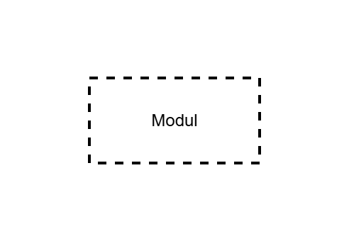
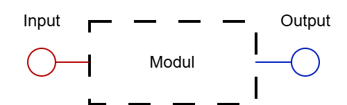
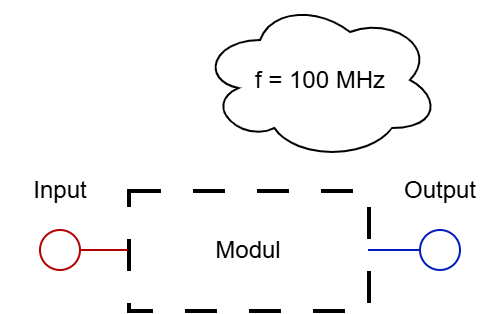
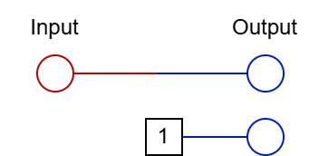
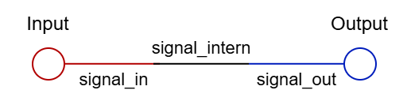
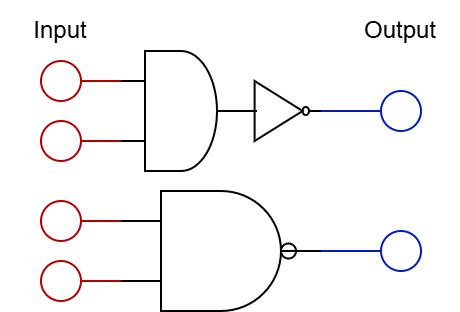

[//]: # (Nächste Theorie ID: 61 <-- Beginnt bei 0)
[//]: # (Nächste Prxis ID: 117 <-- Beginnt bei 100)

<!--
lesson_id: 0
lesson_title: "Vorwort"
difficulty: "intro"
duration_min: 5
type: "theory"
-->


# Ultimativer Spektakulärer (System)Verilog Guide <!-- omit in toc -->
## Vorwort <!-- omit in toc -->
Zuerst ein **Hallo und Willkommen!**
In diesem Guide werden wir lernen wie **Verilog funktioniert** und es zu einem **mächtigen Tool** für uns machen.
Zum Start ein kurzer Hintergrund: **Verilog** wurde 1983/84 von Phil Moorby entworfen, wobei man heutzutage fast ausschließlich die **synonym** verwendete **SystemVerilog** Extension aus 2009 nutzt. Dieses Tutorial wird auch dauerhaft Verilog schreiben und Systemverilog meinen.

---

<!--
lesson_id: 1
lesson_title: "Inhaltsverzeichnis"
difficulty: "intro"
duration_min: 0
type: "theory" 
-->

- [0. Grundlagen für das Hardware Verständnis](#0-grundlagen-für-das-hardware-verständnis)
  - [Was ist Verilog?](#was-ist-verilog)
  - [Zustände: Die "Highs and Lows" des Computers](#zustände-die-highs-and-lows-des-computers)
  - [Der Index \[7:0\]](#der-index-70)
  - [Binär und Hexadezimal](#binär-und-hexadezimal)
  - [Zahlensysteme](#zahlensysteme)
  - [Truth Table](#truth-table)
  - [Sequentiell Kombinatorisch, was ist das?](#sequentiell-kombinatorisch-was-ist-das)
  - [FPGA: Was, Warum, Wie?](#fpga-was-warum-wie)
  - [Was macht das Synthesetool und warum muss ich dauerhaft drauf achten, dass er mich nicht missversteht?](#was-macht-das-synthesetool-und-warum-muss-ich-dauerhaft-drauf-achten-dass-er-mich-nicht-missversteht)
  - [Das Testen mit unserer Website 1/0](#das-testen-mit-unserer-website-10)
- [1. Aufbau eines Moduls](#1-aufbau-eines-moduls)
  - [Modul: Der Rahmen des Codes](#modul-der-rahmen-des-codes)
  - [Portliste: Anschluss der Außenwelt](#portliste-anschluss-der-außenwelt)
  - [Kommentare: Überblick trotz Chaos](#kommentare-überblick-trotz-chaos)
- [2. Signale](#2-signale)
  - [Einfache Zuweisungen: Was soll wo hin?](#einfache-zuweisungen-was-soll-wo-hin)
  - [Leitungen: Verbindungen im Code](#leitungen-verbindungen-im-code)
  - [Always @ (posedge signal) : Sequentiell](#always--posedge-signal--sequentiell)
  - [Always @ (\*): Kombinatorisch](#always---kombinatorisch)
  - [Always\_comb](#always_comb)
  - [Blocking und Non-Blocking](#blocking-und-non-blocking)
  - [Begin End](#begin-end)
  - [Logic](#logic)
  - [Always\_latch](#always_latch)
- [3. Erweiterte Signale](#3-erweiterte-signale)
  - [Breite von Signalen](#breite-von-signalen)
  - [Vorzeichen](#vorzeichen)
  - [Bitselektion aus Leitungen](#bitselektion-aus-leitungen)
  - [Anpassen der Signalbreite](#anpassen-der-signalbreite)
  - [Arrays](#arrays)
  - [Packed vs Unpacked Arrays](#packed-vs-unpacked-arrays)
- [4. Logische Operationen](#4-logische-operationen)
  - [Grundoperationen: AND, NOT](#grundoperationen-and-not)
  - [Weitere Grundoperationen: OR, XOR](#weitere-grundoperationen-or-xor)
  - [Boolean: Wahrheitswerte](#boolean-wahrheitswerte)
  - [If: Wenn x, dann y](#if-wenn-x-dann-y)
  - [Case: If nur anders](#case-if-nur-anders)
  - [Bedingte Zuweisung](#bedingte-zuweisung)
- [5. Arithmetische Operationen](#5-arithmetische-operationen)
  - [Bit-Shifts](#bit-shifts)
  - [Arithmetische Operationen: Addition und Subtraktion](#arithmetische-operationen-addition-und-subtraktion)
  - [Arithmetische Operationen: Multiplikation](#arithmetische-operationen-multiplikation)
  - [Arithmetische Operationen: Division und Rest](#arithmetische-operationen-division-und-rest)
- [6. Startbedingungen und Moduling](#6-startbedingungen-und-moduling)
  - [Anfangswerte](#anfangswerte)
  - [Moduling](#moduling)
  - [Parameter](#parameter)
- [7. Zustände z und x](#7-zustände-z-und-x)
  - [Synthese von z und x](#synthese-von-z-und-x)
  - [casez und casex](#casez-und-casex)
- [8. Finite State Machine](#8-finite-state-machine)
  - [Automaten](#automaten)
  - [Moore](#moore)
  - [Mealy](#mealy)
- [9. Das Gesamtsystem](#9-das-gesamtsystem)
  - [Codestruktur](#codestruktur)
  - [Physische Größe (FPGA): Warum nicht alles riesig?](#physische-größe-fpga-warum-nicht-alles-riesig)
  - [Warum und wann sollte man Speichern?](#warum-und-wann-sollte-man-speichern)
  - [Zusammenfassung 1/0](#zusammenfassung-10)
- [Praktische Übungen](#praktische-übungen)
  - [Grundoperation: NAND](#grundoperation-nand)
  - [Grundoperation: OR](#grundoperation-or)
  - [Grundoperationen: NOR \& XOR](#grundoperationen-nor--xor)
  - [Wechselschaltung](#wechselschaltung)
  - [Wechselschaltung mit Knöpfen](#wechselschaltung-mit-knöpfen)
  - [Halbaddierer](#halbaddierer)
  - [Volladdierer](#volladdierer)
  - [Boolean: Wahrheitswerte](#boolean-wahrheitswerte-1)
  - [2 zu 4 Binärer Dekodierer](#2-zu-4-binärer-dekodierer)
  - [Erweitern auf 3 zu 8 Binärer Dekodierer](#erweitern-auf-3-zu-8-binärer-dekodierer)
  - [Priority If](#priority-if)
  - [Ampel](#ampel)
  - [7-Segment Display](#7-segment-display)
  - [Timer](#timer)
  - [Uhr](#uhr)
  - [Vollständige Uhr](#vollständige-uhr)
- [Anmerkungen 1/0](#anmerkungen-10)
  - [Bilder hinzufügen, von den Truth Tables und Logikgattern](#bilder-hinzufügen-von-den-truth-tables-und-logikgattern)
  - [Fixedcomma/Float? in Aufgaben 1/0](#fixedcommafloat-in-aufgaben-10)
  - [Coder auf FPGA](#coder-auf-fpga)
- [Zurückgestellt](#zurückgestellt)
- [2. Testbenches 1/0](#2-testbenches-10)
  - [Was waren Testbenchen nochmal?](#was-waren-testbenchen-nochmal)
  - [Aufrufen](#aufrufen)
  - [Anfangseinstellungen](#anfangseinstellungen)
  - [Gutes Testen](#gutes-testen)
  - [Systemverilog Testen \<-- Alles mal durchprobieren automatisch auch bei riesigen Modulen](#systemverilog-testen----alles-mal-durchprobieren-automatisch-auch-bei-riesigen-modulen)
- [3. System Extension 1/0](#3-system-extension-10)
  - [Packages: Globale Parameter Familien](#packages-globale-parameter-familien)
  - [unique](#unique)
- [4. Extras (gerade noch außer vor, Integration in Website überdenken und daraufhin anpassen) 1/0](#4-extras-gerade-noch-außer-vor-integration-in-website-überdenken-und-daraufhin-anpassen-10)
  - [Latches](#latches)
  - [Data-Flip-Flop](#data-flip-flop)
  - [Vorgefertigte Datentypen 1/0](#vorgefertigte-datentypen-10)
  - [7-Segment-System](#7-segment-system)

---

<!--
lesson_id: 2
lesson_title: "0. Grundlagen für das Hardware Verständnis"
difficulty: "intro"
duration_min: 1
type: "theory"
-->

## 0. Grundlagen für das Hardware Verständnis
- Im ersten Kapitel dieses Tutorials wollen wir alle nötigen Grundkenntnisse auffrischen, sodass Sie gut vorbereitet in Verilog starten können.

---

<!--
lesson_id: 3
lesson_title: "Grundlagen: Was ist Verilog?"
difficulty: "intro"
duration_min: 5
type: "theory"
-->

### Was ist Verilog?
- Die erste Frage, welche wir klären sollten, bevor wir anfangen ist, was denn eigentlich Verilog ist?
- Verilog ist eine **Hardware Description Language (HDL)**, das bedeutet wir programmieren keine fertige CPU. Wir sagen den Bausteinen eines Systems, wie genau sie sich verbinden sollen.
- Einem HDL Entwickler ist es möglich Berechnungsaufgaben schneller, platzsparender und effizienter zu lösen, als es mit Programmiersprachen möglich ist, was allerdings meist längere Entwicklungszeiten und spezialisiertere Systeme mit sich bringt.

---

<!--
lesson_id: 4
lesson_title: "Zustände: Die "Highs and Lows" des Computers"
difficulty: "intro"
duration_min: 5
type: "theory" 
-->

### Zustände: Die "Highs and Lows" des Computers
- High und Low bezeichnen hierbei den Zustand eines Kabel und damit den Wert des Zustandes, mit **High als 1** und **Low als 0**. In Verilog gibt es außerdem **z als hochohmig** (nicht verbunden) und **x als undefiniert**, also für Verilog unbekannt oder "egal".

---

<!--
lesson_id: 5
lesson_title: "Der Index [7:0]"
difficulty: "intro"
duration_min: 5
type: "theory" 
-->

### Der Index [7:0]
- Anders als man es vielleicht gewöhnt ist, fängt man in der Informatik in der Regel an bei der 0 zu zählen.
- Somit ist das erste Kapitel nicht Kapitel 1, sondern Kapitel 0. Dies betrifft insbesondere das Zählen von Bitpositionen.
- Hierbei ist das **Least Significant Bit (LSB)** immer Bit 0 und das **Most Significant Bit (MSB)** immer Bit **n-1** mit **n** als **Anzahl binärer Stellen**.
- Somit ist eine Leitung, welche [7:0] Leitungen hat, also Leitung 0 bis Leitung 7, 8 Bit groß.

---

<!--
lesson_id: 6
lesson_title: "Binär und Hexadezimal"
difficulty: "intro"
duration_min: 10
type: "theory"
-->

### Binär und Hexadezimal
- Bevor wir anfangen können Computer zu beschreiben müssen wir verstehen wie sie Zahlen darstellen.
- Unser Zahlensystem ist für Computer nicht direkt nutzbar, da das System auf welchem sie basieren nur zwei Zahlen nutzen kann.
- Diese sind 0 und 1 und werden durch verschiedene Spannungen repräsentiert.
- Um größere Zahlen darzustellen kann man nun mehrere Leitungen nebeneinander verlegen. Dies ist gleichzusetzen mit dem danebenschreiben einer weiteren Zahl, um eine zweistellige Zahl im Zehnersystem zu erhalten.
- Hierbei hat die **x-te Stelle den Wert: Ziffer * 2<sup> (x)</sup>**
- Denken Sie daran, dass x bei 0 beginnt.
- Es ist weiterhin zu beachten, dass diese Stelle natürlich nur den Wert repräsentiert, wenn an ihr auch eine 1 steht.
- Wenn man mehrstellige Zahlen hat muss man die Werte der einzelnen Stellen mit 1 nun nur noch addieren und man bekommt seine Zahl.
- Da 32 Bit Zahlen relativ schnell anstrengend zu schreiben werden, hat man das Hexadezimalsystem eingeführt.
- Dieses fasst immer 4 Positionen, angefangen beim LSB, zusammen, wobei es von 0 bis F reicht.
- Hierbei wird zum Beispiel die 0000 zu 0, 0010 zu 2, 1010 zu A und 1111 zu F.
- Somit berechnet sich der **Wert an Stelle x: Ziffer * 16<sup> (x)</sup>**
- In Verilog werden diese Zahlen mit ihrer Bitlänge und die Art der Repräsentation angegeben. Somit ist eine **8 Bit 15 schreibbar als 8'b00001111 für Binär, 8'h0F für Hexadezimal oder 8'd15 für Dezimal.**
>**ACHTUNG:** Dies ist eine der wenigen Ausnahmen, wobei nicht der Index genommen wird.

---

<!--
lesson_id: 7
lesson_title: "Zahlensysteme"
difficulty: "intro"
duration_min: 10
type: "theory"
-->

### Zahlensysteme
- In Mathematik beginnt man von natürlichen Zahlen und arbeitet sich zu komplexen Zahlen hoch, indem man, wenn man an ein Limit stößt, neue Systeme einführt.
- Zum Beispiel das Minus als Indikator für negative Zahlen oder das Komma für Dezimalbrüche.
- An elektrische Leitungen kann man allerdings nicht einfach ein Minus oder Komma setzen, wodurch man sich behelfen muss.
- Bei Ganzzahlen hat sich das Zweierkomplement durchgesetzt, welches eine negative Zahl durch die Invertierung der positiven Zahl plus 1 repräsentiert.
- Dies hat den Vorteil, dass die mathematische Rechnung mit dem Zweierkomplement direkt die richtigen Ergebnisse zur Folge hat, später mehr dazu.
- Mit dem Komma funktioniert es ähnlich. Am einfachsten sind die Fixkommazahlen, bei welchen sich der Entwickler das Komma zwischen zwei Binären Stellen denkt und sonst einfach normal rechnet. Hierbei bekommt man auch direkt das richtige Ergebnis, man muss jedoch aufpassen, da bei zum Beispiel Multiplikationen die Kommastelle der einen Zahl plus die der zweiten Zahl, die Stelle des Ergebnisses ist.
- Gleitkommazahlen sind etwas schwieriger umzusetzen, werden allerdings später in ihrem eigenen Teil erklärt.

---

<!--
lesson_id: 8
lesson_title: "Truth Table"
difficulty: "intro"
duration_min: 5
type: "theory"
-->

### Truth Table
- Truth Table (übersetzt Wahrheitstabellen) sind Anreihungen aller möglichen Inputs und den zugehörigen Outputs.
- Es ist anfangs sehr empfehlenswert sich die Truth-Table zu erstellen, da sie direkt Eingang mit Ausgang verknüpfen, ohne sich Gedanken über das "Wie?" zu machen.

<div style="display: flex; gap: 400px;">

<div>

**NAND-Gatter**
| A | B | Out |
|---|---|---|
| 0 | 0 | 1 |
| 1 | 0 | 1 |
| 0 | 1 | 1 |
| 1 | 1 | 0 |

</div>

<div>

**Halbaddierer**
| A | B | Summe | Carry |
|---|---|---|---|
| 0 | 0 | 0 | 0 |
| 1 | 0 | 1 | 0 |
| 0 | 1 | 1 | 0 |
| 1 | 1 | 0 | 1 |

</div>

</div>

---

<!--
lesson_id: 9
lesson_title: "Sequentiell Kombinatorisch, was ist das?"
difficulty: "intro"
duration_min: 10
type: "theory"
-->

### Sequentiell Kombinatorisch, was ist das?
- Diese Begriffe mögen vielleicht am Anfang etwas komisch wirken, allerdings beschreiben sie einfach nur zwei Arten von Operationen.
- Sequentiell bedeutet nacheinander, was hierbei auf die zeitliche Abfolge von Operationen in Takten bezogen ist, später dazu mehr. Es beschreibt hierbei nur das Abspeichern von Werten, sodass sie sicher vorliegen, auch wenn der Rechenapparat hinter ihnen weiter benutzt wird.
- Dieser Rechenapparat ist hierbei der kombinatorische Teil, wobei man Logische Gatter kombiniert, um arithmetische Operationen und mehr zu verwirklichen.
- Es ist gern gesehen seinen Code strikt in diese Teile zu trennen, da er so viel übersichtlicher und einfacher zu warten ist.

---

<!--
lesson_id: 10
lesson_title: "FPGA: Was, Warum, Wie?"
difficulty: "intro"
duration_min: 10
type: "theory"
-->

### FPGA: Was, Warum, Wie?
- Beginnen wir mit was denn überhaupt so ein FPGA ist.
- FPGA steht für Field Programmable Gate Array und es ist genau das was der Name beschreibt.
- Sie sind programmierbare Ansammlungen von Gattern, welche fast beliebig verbunden werden können.
- Früher musste man immer einen ganzen Chip fertigen lassen, welcher seine Gatter enthielt, um prüfen zu können, ob das Design auch praktisch funktioniert.
- FPGAs ermöglichen es heutzutage seinen Code direkt zu testen und anzupassen und verkürzen somit Entwicklungsdauer und auch Entwicklungskosten neuer Chipsdesigns.
- Aber wie macht er das eigentlich?
- FPGAs haben eine feste Anzahl konfigurierbarer Logikblöcke (CLB). Auf diesen sitzen sogenannte Slices, welche LUT, DSP, MUX und FF beherbergen.
- LUT sind hierbei Look Up Tables, welche speichern, welcher Wert bei welchen Eingangssignalen ausgegeben wird.
- DSP sind hierbei das Herzstück, warum FPGAs überhaupt so schnell sein können. Sie sind starr für eine einzige Aufgabe ausgelegt: (A*B) + C zu rechnen und das machen sie sehr schnell.
- MUX sind hierbei die Multiplexer, welche die richtigen Signale an die richtigen Stellen leiten.
- Außerdem sind natürlich Flip-Flops, also Register verbaut um Daten speichern zu können.
- Es ist außerdem ein riesiges Verbindungsnetz verbaut, um Daten von einem Teil des FPGAs zu weiter entfernten Stellen leiten zu können.
- Bei großen zusammenhängenden Berechnungen werden außerdem Carry Chains verwendet, um direkt von einem Slice zu einem anderen Daten zu übertragen, ohne das allgemeine Routing Netz nutzen zu müssen, wodurch dies sehr viel schneller ist.

---

<!--
lesson_id: 11
lesson_title: "Was macht das Synthesetool und warum muss ich dauerhaft drauf achten, dass er mich nicht missversteht?"
difficulty: "intro"
duration_min: 10
type: "theory"
-->

### Was macht das Synthesetool und warum muss ich dauerhaft drauf achten, dass er mich nicht missversteht?
- Statt Verilog Code zu schreiben könnte man auch jedes Gatter von Hand setzen. Dies würde aber bei heutigen Chips so viel Zeit beanspruchen, dass es sich nicht lohnt und fast unmöglich ist zu optimieren.
- Hierbei vertraut man einem Synthesetool den Verilog Code so umzuformen, sodass er ansatzweise optimal auf einem FPGA laufen kann.
- Das Synthesetool kann allerdings auch nur den Code so gut umsetzen, wie er geschrieben ist, weshalb man immer strenge Designvorschriften einhalten muss, sodass der Code vom Synthesetool nicht missinterpretiert werden kann.
- Worauf man achten muss, damit der Code nicht missinterpretiert werden kann wird in jedem Kapitel erwähnt.

---

<!--
lesson_id: 12
lesson_title: "Das Testen mit unserer Website"
difficulty: "intro"
duration_min: ∞
type: "theory"
-->

### Das Testen mit unserer Website 1/0

---

<!--
lesson_id: 13
lesson_title: "1. Aufbau eines Moduls"
difficulty: "beginner"
duration_min: 1
type: "theory"
-->

## 1. Aufbau eines Moduls
- Im Folgenden Kapitel lernen Sie, wie ein Modul, der Rahmen für den verilog Code aufgebaut ist.

---

<!--
lesson_id: 14
lesson_title: "Modul: Der Rahmen des Codes"
difficulty: "beginner"
duration_min: 5
type: "theory"
-->

### Modul: Der Rahmen des Codes
- Verilog ist in seiner Syntax sehr ähnlich zur Sprache **C**. 
- Am Anfang muss man sein Modul definieren und ihm einen Namen geben, sowie den Endpunkt des Moduls definieren. Warum auch der Endpunkt nützlich ist, neben dem dass er eine Voraussetzung ist, schauen wir uns später an.
- Hierbei ist darauf zu achten, dass so wie in C hinter **jeder Zuweisung** im Code, zwischen **module** und **endmodule**, ein **Semikolon** eingefügt werden muss.
```verilog
module module_name;

endmodule
```



---

<!--
lesson_id: 15
lesson_title: "Portliste: Anschluss der Außenwelt"
difficulty: "beginner"
duration_min: 5
type: "theory"
-->

### Portliste: Anschluss der Außenwelt
- Weiterhin ist wichtig anzumerken, dass man ein System baut, mit welchem man nur durch vordefinierte Schnittstellen (Ports) kommunizieren kann.
- Hierbei gibt es drei Portarten
  - input name_des_ports:   Zum Hineinführen von Signalen
  - output name_des_ports:  Zum Herausführen von Signalen
  - inout name_des_ports:   Falls der Port als Ein- & Ausgabe genutzt werden soll
- Normalerweise werden nur input und output verwendet, wodurch nur kurz gegen Ende ein Beispiel für inout besprochen wird.
- Die Ports werden hierbei in normalen Klammer hinter dem Modulnamen angegeben. Sie müssen mit Kommas getrennt werden.
- Es ist außerdem sehr ratsam seine Ports mit der zugehörigen Art zu kennzeichnen, um später besseren Überblick zu behalten.
```verilog
module module_ports(
    input signal_in,
    output signal_out
);

endmodule
```



---

<!--
lesson_id: 16
lesson_title: "Kommentare: Überblick trotz Chaos"
difficulty: "beginner"
duration_min: 5
type: "theory"
-->

### Kommentare: Überblick trotz Chaos
- Um in großen Codes nicht zu vergessen, was da überhaupt vor einem ist, ist es sehr oft hilfreich es einfach daneben zu schreiben. Kommentare sind hierbei nur für den Betrachter sichtbar und werden später beim Ausführen gänzlich ignoriert.
- Man schreibt ihn mit doppelten Schrägstrich **// Kommentar**, allerdings ist damit alles dahinter auskommentiert und wird ignoriert.
- Es ist auch möglich einen mehrzeiligen Kommentar zu schreiben, hierfür nutzt man /* Kommentar */.
- Er ist besonders für das auskommentieren von Codeblöcken nützlich.

```verilog
module module_comment(
    input signal_in,
    output signal_out
);

// Das wird von der Maschine ignoriert.

endmodule
```



---

<!--
lesson_id: 17
lesson_title: "Einfache Zuweisungen: Was soll wo hin?"
difficulty: "beginner"
duration_min: 5
type: "theory"
-->

## 2. Signale

### Einfache Zuweisungen: Was soll wo hin?
- Momentan macht unser Modul noch gar nichts. Es existiert zwar ein input, dieser wird allerdings nicht verwertet und der output ist undefiniert.
- Um eine einfache Zuweisung von unserem Eingang auf den Ausgang zu schaffen gibt es das **assign**. Die Anordnung ist wie folgt: **assign Name_Ziel = Name_Herkunft**
- Die assign Zuweisung ist **kein Speicher** für Werte. Sie legt Kabel von einer Stelle an eine andere.
- Im Beispiel werden jetzt einfach nur Kabel vom Eingang an den Ausgang gelegt. Ändert sich der Eingang, ändert sich direkt der Ausgang.
- Hierbei darf man das Semikolon nicht vergessen.

```verilog
module module_assign(
    input signal_in,
    output signal_out,
    output signal_high_out
);

assign signal_out = signal_in;
assign signal_high_out = 1'b1;

endmodule
```



---

<!--
lesson_id: 18
lesson_title: "Leitungen: Verbindungen im Code"
difficulty: "beginner"
duration_min: 5
type: "theory"
-->

### Leitungen: Verbindungen im Code
- In Verilog gibt es keine Variablen wie in C. Jedes Signal braucht hierbei seine eigene Leitung, welche eine **feste Größe** hat und **während der Laufzeit nicht angepasst oder neu angelegt** werden kann.
- Um eine Verbindung zu deklarieren nutzt man das Kennwort **wire**.
- Sollte man in den Ports nichts anderes angeben wird immer angenommen, dass diese wires sind.

```verilog
module module_cable(
    input signal_in,
    output signal_out
);

wire signal_intern;

assign signal_intern = signal_in;
assign signal_out = signal_intern;

endmodule
```



---

<!--
lesson_id: 19
lesson_title: "Always @ (posedge signal) : Sequentiell"
difficulty: "beginner"
duration_min: 15
type: "theory"
-->

### Always @ (posedge signal) : Sequentiell
- Zum Speichern von Daten verwendet man Register.
- Damit das System weiß, wann gespeichert werden soll, nutzt man **always @ (posedge sig)** oder **always @ (negedge sig)**.
- Hierbei werden alle Daten zur positiven (posedge) oder negativen (negedge) Flanke vom Signal sig übernommen.
- Eine Flanke ist hierbei die Änderung von Low zu High (positiv) oder von High zu Low (negativ).
- Meistens ist dieses Signal eine Clock, ein periodisches Signal mit hoher Frequenz (meist ab hohem MHz Bereich).
- Man kann es auch von nicht periodischen Signalen abhängig machen, allerdings wird dies eher vermieden, da es auch in den periodischen Blöcken umgesetzt werden kann.
- Das **Keyword des Registers** ist hierbei **reg** und muss mit **reg signal_name;** deklariert werden.
- Innerhalb des always Blocks müssen alle Register mittels Non-Blocking Assignment **<=** definiert werden.
- Die Definition kann hierbei mittels Signalen von Ergebnissen von Operationen oder direkt durch Operationen in der Zeile stattfinden.
- Tipp: Es ist außerdem gern gesehen, wenn man seine Ausgänge ganz unten im Modul via assign Zuweisungen zuweist, sodass man schnell finden kann, wie genau das Modul funktioniert. Sollte man jedoch in einem always Block einen output definieren, dann muss man nach dem output den Datentyp reg ergänzen.
> **Achtung:** Es bietet sich immer an, strikt in Sequentiell und Kombinatorisch zu teilen und im sequentiellen Block nur die Ergebnisse des Kombinatorischen zu speichern.

> **WICHTIG:** Sie dürfen niemals dasselbe Signal in zwei verschiedenen always Blöcken definieren. Dies führt zu Fehlern, da ein Signal mehrere Ursprünge (Multiple Drivers) hat.

```verilog
module module_sequ(
    input signal_in,
    input clk,
    output signal_out
);

reg signal_saved;

always @ (posedge clk) signal_saved <= signal_in;

assign signal_out = signal_saved;

endmodule
```

---

<!--
lesson_id: 20
lesson_title: "Always @ (*): Kombinatorisch"
difficulty: "beginner"
duration_min: 15
type: "theory"
-->

### Always @ (*): Kombinatorisch
- Um in Kombinatorisch und Sequentiell teilen zu können fehlt uns nun noch der kombinatorische Block.
- Dieser funktioniert im allgemeinen ähnlich, wie die assign Zuweisung.
- Er ist nicht zum Speichern von Werten, sondern rein für logische und arithmetische Operationen vorgesehen.
- Man kann ihn verstehen als Block, welcher bei Änderung von * (eines beliebigen Eingangssignals) alle Ausgänge aktualisiert.
- Man kann alles auch nur von bestimmten Signalen abhängig machen, welche dann durch Kommas innerhalb der Klammer getrennt sind (always @ (sig_a, sig_b)), hiervon wird aber stark abgeraten, da sich hier das Verhalten von Simulation und Synthese unterscheidet und somit die Fehlersuche sehr erschwert wird.
- In der Synthese funktionieren always @ (*), always @ (sig_a) und always @ (sig_a, sig_b) gleich, nur in der Simulation ist das Verhalten unterschiedlich.
- Hierbei kann man Signale mittels Blocking Assignment **=** definieren.
- Das definierte Signal muss hierbei wieder als reg deklariert sein.
- Tipp: Es ist außerdem gern gesehen, wenn man seine Ausgänge ganz unten im Modul via assign Zuweisungen zuweist, sodass man schnell finden kann, wie genau das Modul funktioniert. Sollte man jedoch in einem always Block einen output definieren, dann muss man nach dem output den Datentyp reg ergänzen.

> **Achtung:**  Sie können in einem always-Block mehrfach dasselbe Signal definieren. Hierbei ist es wichtig, welche Art Zuweisung Sie verwenden. Es ist ein riesiger Unterschied zwischen <= und =. Wenn Sie eine Kette von Operationen ausführen möchten, nutzen Sie unbedingt '=', da bei '<=' ungewollte Speicher entstehen können.
>               Des Weiteren ist wichtig zu beachten, dass bei der Simulation Ihres Moduls der Block erst nach Änderung der Eingangssignale ausgeführt wird, sodass es sein kann, dass die berechneten Signale zu Beginn der Simulation nicht definiert sind.

> **EXTREM WICHTIG:** Wenn Sie in einem kombinatorischem Block ein Signal zuweisen und dieses Signal erst darunter definieren, dann wird Ihnen das Synthesetool einen ungewollten Speicher bauen und Sie werden mit alten, falschen Werten rechnen. **Achten Sie deshalb darauf, zuerst die Zwischenschritte zu berechnen und dann zusammen zu führen.**

```verilog
module module_comb(
    input signal_in,
    output signal_out
);

reg signal_direct;

always @ (*) signal_direct = signal_in;

assign signal_out = signal_direct;

endmodule
```

---

<!--
lesson_id: 21
lesson_title: "Always_comb"
difficulty: "beginner"
duration_min: 10
type: "theory"
-->

### Always_comb
- Statt always @ (*) zu verwenden, kann man auch always_comb nutzen.
- Beide funktionieren fast gleich, nur verbietet always_comb das Bauen von Latches, wodurch er sehr nützlich ist. Hierbei wirft es einen Fehler, sobald in der Synthese ein Latch entdeckt wird.
- Sobald das Synthesetool einen Speicher innerhalb des always_comb Blocks bauen müsste, hält es an und wirft einen Fehler, wodurch das debugging sehr stark vereinfacht wird.
- Es reagiert hierbei auf jede Änderung der Eingangssignale und es wird zum Start der Simulation immer ein Mal ausgeführt, egal ob sich die Eingangswerte ändern oder nicht.

```verilog
module module_always_comb(
    input signal_in,
    output signal_out
);

reg signal_direct;

always_comb signal_direct = signal_in;

assign signal_out = signal_direct;

endmodule
```


---

<!--
lesson_id: 22
lesson_title: "Blocking und Non-Blocking"
difficulty: "beginner"
duration_min: 10
type: "theory"
-->


### Blocking und Non-Blocking
- Im letzten Teil hatten wir die Bedingung aufgestellt, dass ein Signal nie in zwei unterschiedlichen always Blöcken definiert sein darf.
- Im selben Block darf es allerdings definiert werden, was zu vielen Vorteilen führt.
- Non-Blocking: Hierbei werden beim Auswerten alle Eingangssignale eingefroren und alle Zuweisungen gleichzeitig ausgeführt. Sollte ein Signal mehrfach definiert sein gewinnt das unterste.
- Blocking: Hierbei wird jede Zeile nacheinander betrachtet. Es ist möglich Verkettungen von Operationen zu bauen und demselben Signal sich selbst als input zu geben, sollte es davor schon definiert sein. Hierbei baut das Synthesetool nun eine Verkettung, welche zuerst die obere Operation, dann die Untere ausführt und dieses Signal ausgibt.
- Es ist möglich <= innerhalb von kombinatorischen Blöcken zu nutzen, kann bei falscher Benutzung aber schnell zu Fehlern (Endlosschleifen) führen, wodurch davon **strengstens abgeraten** wird.
- Es ist möglich = innerhalb von sequentiellen Blöcken zu nutzen, kann aber bei falscher Benutzung aber schnell zu Fehlern (race-conditions) führen, wodurch davon **strengstens abgeraten** wird.

---

<!--
lesson_id: 23
lesson_title: "Begin End"
difficulty: "beginner"
duration_min: 5
type: "theory"
-->

### Begin End
- Meist braucht man allerdings mehr als nur eine Zeile. Dafür gibt es auch einen Befehl, sodass alles nachfolgende noch auf den vorhergehenden Block reagiert.
- **begin *Code* end** sagt dem Synthesetool, dass die nachfolgenden Zeilen **bis zum end** noch auf den Block reagieren.
- Hierbei muss man beachten, dass hinter begin und end **kein Semikolon** gehört.

```verilog
module module_saveData_2(
    input signal_in,
    input clk,
    output signal_out
);

reg signal_a;
reg signal_b;
reg signal_combined;

always @ (posedge clk) begin
    signal_a <= signal_in;
    signal_b <= signal_in;
end

always @ (*) begin
    signal_combined = signal_a & signal_b;
end

assign signal_out = signal_combined;

endmodule
```

---

<!--
lesson_id: 24
lesson_title: "Logic"
difficulty: "beginner"
duration_min: 5
type: "theory"
-->

### Logic
- Statt Wires und Register zu definieren, kann man diese auch als **Logic** definieren. Das ist insofern einfacher, da man nicht mehr strikt zwischen Wires und Registers unterscheiden muss, sondern einfach **Logic für beides** nehmen kann.
- Es ist außerdem möglich Signale mit gleicher Bitlänge, per Komma, hintereinander zu deklarieren.

```verilog
module module_logic(
    input logic signal_in,
    input logic clk,
    output logic signal_out,
    output logic one_out
);

logic signal_a, signal_b, signal_combined, signal_one;

always @ (posedge clk) begin
    signal_a <= signal_in;
    signal_b <= signal_in;
end

always @ (*) begin
    signal_combined = signal_a & signal_b;
end

assign signal_one = 1'b1;
assign one_out = signal_one;
assign signal_out = signal_combined;

endmodule
```

---

<!--
lesson_id: 25
lesson_title: "Always_latch"
difficulty: "intermediate"
duration_min: 15
type: "theory"
-->

### Always_latch
- Falls man eigene Speicher bauen möchte, müssen diese in always_latch Blöcken stehen. 
- Hierbei blockiert das Synthesetool nicht das Bilden von speichern, wodurch man selber Latches bauen kann und diese zu Flip-Flops und Registernetzwerken zusammenbauen kann
- Always_latch funktioniert wie always @ (*).

```verilog
module module_always_latch(
    input clk,
    input signal_in,
    output signal_out
);

logic signal_save_master, signal_save_slave;

always_latch if (clk) signal_save_master = signal_in;

always_latch if (~clk) signal_save_slave = signal_save_master;

assign signal_out = signal_save_slave;

endmodule
```

---

<!--
lesson_id: 23
lesson_title: "3. Erweiterte Signale"
difficulty: "beginner"
duration_min: 5
type: "theory"
-->

## 3. Erweiterte Signale
- Im folgenden Kapitel wollen wir uns etwas tiefer mit den Signalen in Verilog beschäftigen.

---

<!--
lesson_id: 26
lesson_title: "Breite von Signalen"
difficulty: "beginner"
duration_min: 10
type: "theory"
-->

### Breite von Signalen
- Bis jetzt haben wir immer nur Signale betrachtet, welche ein Bit breit sind, also nur High (1) oder Low (0) sein können.
- Damit ist zwar schon möglich alles zu bauen, was es gibt, allerdings ist es manchmal schön, vor allem bei Zahlen, wenn die zugehörigen Bits direkt beieinander sind.
- Damit man seine Signale nun bündeln kann, muss man hinter den Typ des Signals die **Bitbreite n** in eckigen Klammern [n-1:0] angeben.
- Somit können wir nun vorzeichenlose Zahlen direkt vergleichen oder Grundoperationen auf diese anwenden.
- Hierbei können wir nun auch Werte, wie "9" mittels 4'd9, zuweisen.
> **Achtung: Das Synthesetool ist erbarmungslos! Wenn die Bitbreiten nicht passen, dann wird radikal abgeschnitten oder mit Nullen gefüllt. Meist gibt es eine Warnung, aber es ist immer gut vorsichtig zu sein, sodass das gewollte Verhalten entsteht.**

```verilog
module module_bitwidth(
    input [3:0] signal_a_in,
    input [3:0] signal_b_in,
    output signal_a_equals_b_out,
    output signal_a_less_b_out,
    output [3:0] signal_c_out,
    output [3:0] nine_out
);

logic [3:0] signal_c;

always @ (*) begin
    if (signal_a_in == 4'b0011) begin
        signal_c = 4'd3;
    end
    else begin
        signal_c = 4'h0;
    end
end

assign signal_a_equals_b_out = (signal_a_in == signal_b_in);
assign signal_a_less_b_out = (signal_a_in < signal_b_in);
assign signal_c_out = signal_c;
assign nine_out = 4'd9;

endmodule
```

---

<!--
lesson_id: 27
lesson_title: "Vorzeichen"
difficulty: "beginner"
duration_min: 10
type: "theory"
-->

### Vorzeichen
- Im letzten Teil haben wir Bitbreiten eingeführt, um einfacher Zahlen darstellen zu können, allerdings haben wir noch keinen Weg einfach das Vorzeichen darzustellen, sodass ein Vergleich im Zweierkomplement einer negativen Zahl und einer positiven Zahl, zum Beispiel -1 > 1, wahr zurückgeben würde, da z.B. in 8 Bit 8'hFF > 8'h01 unsigned gilt.
- Unsigned bedeutet, dass diese Zahl keine Vorzeichen hat und immer als positive Zahl gesehen wird.
- Um dies zu ändern nutzt man **signed** bei der Einführung des Signals direkt hinter input/output oder logic. Verilog verwendet dann **automatisch** das **Zweierkomplement**.
- Hierbei muss man den Typ der Zahl, von unsigned Dezimal ('d) / Binär ('b) / Hex ('h), zu signed Dezimal ('sd) / Binär ('sb) / Hex ('sh) geändert werden.
-  Dies ist so wichtig, da das Minus - vor einer Zahl immer nur anzeigt, dass das Zweierkomplement genommen wird. Wird nun eine Zahl -4'd1 in ein 8 Bit großes Register gespeichert, wird zuerst das Zweierkomplement gebildet und dann auf 8 Bit erweitert. Da die Zahl unsigned ist wird das Vorzeichen nicht erweitert und es wird eine falsche Zahl abgespeichert, auch wenn das Register richtig als signed deklariert ist. Bei -4'sd1 würde das Vorzeichen erweitert werden.
> **WICHTIG: Wenn nur ein Wert in einer Abfolge von Operationen unsigned ist, dann wird die komplette Abfolge in der Regel als unsigned betrachtet. Dies gilt auch für Zuweisungen von negativen Zahlen. Hierbei müssen diese als zum Beispiel -4'sd1 definiert werden für -1.**

```verilog
module module_signed(
    input signed [3:0] signal_a_in,
    input signed [3:0] signal_b_in,
    output signal_a_equals_b_out,
    output signal_a_less_b_out,
    output signed [3:0] minus_one_out
);

logic signal_a_equals_b;
logic signal_a_less_b;

assign signal_a_equals_b_out = (signal_a_in == signal_b_in);
assign signal_a_less_b = (signal_a_in < signal_b_in);

assign signal_a_equals_b_out = signal_a_equals_b;
assign signal_a_less_b_out = signal_a_less_b;
assign minus_one_out = -4'sd1;

endmodule
```

---

<!--
lesson_id: 28
lesson_title: "Bitselektion aus Leitungen"
difficulty: "beginner"
duration_min: 10
type: "theory"
-->

### Bitselektion aus Leitungen
- Manchmal tragen Leitungen mehr als nur eine Information. Um an diese zu gelangen, aber trotzdem den Vorteil zu behalten nur ein Kabel durch das Modul schleusen zu müssen, kann man einzelne Bits selektieren und neue Leitungen daraus formen.
- Hierbei kann man entweder direkt den Teil den Kabels mit Bitbreite auswählen oder mittels **geschweiften Klammern {}** zusammensetzen. Dies funktioniert hier nicht wie bei der Bitbreiteeinstellung der Leitung, sondern wird nach dem Namen gesetzt.
- Falls man Vorzeichen kopieren oder kompakter schreiben möchte, kann man den Kopieroperator nutzen. Dieser wird durch { Anzahl_Kopien { Signal [Stelle]}} angezeigt.
- Es ist außerdem möglich mit **\$signed** und **\$unsigned** eine Sign Extension durchzuführen, indem man die Bitbreite angibt und danach signed oder unsiged definiert.
- Man sollte immer versuchen explizit hinzuschreiben, was passieren soll, auch wenn nur mit Nullen aufgefüllt wird, da für die nächste Person, sowie das Synthesetool, es verständlicher ist.

```verilog
module module_bitselektion(
    input [15:0] signal_a_in,
    output [15:0] signal_a_out,
    output [7:0] signal_a_message_out,
    output [15:0] signal_a_message_middle_out,
    output [31:0] signal_a_extended_copy_out,
    output [31:0] signal_a_extended_signed_out
);

// Message ist in Bits 4 bis 11 versteckt. 8 Bit

assign signal_a_out = signal_a_in;
assign signal_a_message_out = signal_a_in [11:4];
assign signal_a_message_middle_out = {4'h0, signal_a_in [11:4], 4'h0};
assign signal_a_extended_copy_out = {{16{signal_a_in [15]}}, signal_a_in};
assign signal_a_extended_signed_out = $signed(signal_a_in); // Wird automatisch sign extended, da links größer rechts UND rechts signed; Der Wert wird hierbei nicht geändert

endmodule
```

---

<!--
lesson_id: 29
lesson_title: "Anpassen der Signalbreite"
difficulty: "intermediate"
duration_min: 10
type: "theory"
-->

### Anpassen der Signalbreite
- Manchmal möchte man die Größe von Signalen anpassen, ohne direkt neue Leitungen zu deklarieren.
- Hierbei nutzt man n'(Signal) mit n als Bitbreite.
- Hierbei wird eine sign-extention ausgeführt, wenn das Signal als signed definiert ist, sonst wird mit Nullen aufgefüllt und danach die Operation verarbeitet.
- Sollte allerdings das Zielregister wieder kleiner sein, wird der überstehende Teil abgeschnitten.
- Dies ist insbesondere bei der Arithmetik nützlich, worauf später noch eingegangen wird.

```verilog
module module_change_bitwidth(
    input [7:0] signal_a_in,            // Wird nicht Vorzeichenerweitert
    input signed [7:0] signal_b_in,     // Wird Vorzeichenerweitert
    output [15:0] signal_length_out
);

assign signal_length_out = 16'(signal_a_in) ^ 16'(signal_b_in);

endmodule
```

---

<!--
lesson_id: 30
lesson_title: "Arrays"
difficulty: "intermediate"
duration_min: 10
type: "theory"
-->

### Arrays
- An manchen Stellen, wie zum Beispiel bei Koordinaten, braucht man mehrere Wires mit denselben Bitbreiten. Hier kann es nützlich sein, wenn man diese zu einem Array zusammführt.
- Dafür muss nur nach dem Signalnamen, wie bei der Bitbreite, die Breite des Arrays als Index angegeben werden [n-1:0]. Dies funktioniert für alle Datentypen, wie Logic, Wires und Registers.
- Es ist außerdem möglich mehrdimensinale Arrays anzulegen, indem man weitere rechteckige Klammern hintereinander schreibt. (z.b. logic [1:0] register [1:0] [1:0];)
- Um auf ein einzelnes Bit in einem Array zuzugrifen, muss man die Bitposition nach der Arraysposition in eckigen Klammern angeben.

```verilog
module module_array(
    input clk,
    input signal_a_in [1:0],
    input signal_b_in [1:0],
    output [1:0] signal_out [1:0]
);

logic signal_a [1:0];
logic signal_b [1:0];
logic [1:0] signal_combined [1:0];

always @ (posedge clk) begin
    signal_a [0] <= signal_a_in [0];
    signal_a [1] <= signal_a_in [1];
    signal_b [0] <= signal_b_in [0];
    signal_b [1] <= signal_b_in [1];
end

always @ (*) begin
    signal_combined [0] [0] = signal_a [0] & signal_b [0];
    signal_combined [0] [1] = signal_a [0] | signal_b [0];
    signal_combined [1] [0] = signal_a [1] & signal_b [1];
    signal_combined [1] [1] = signal_a [1] | signal_b [1];
end

assign signal_out = signal_combined;


endmodule
```

---

<!--
lesson_id: 59
lesson_title: "Packed vs Unpacked Arrays"
difficulty: "intermediate"
duration_min: 10
type: "theory"
-->

### Packed vs Unpacked Arrays
- Es gibt einen großen Unterschied zwischen packed und unpacked Arrays.
- Packed Arrays werden vom Synthesetool oder Simulation als eine zusammenhängende Bitkette betrachtet. Man kann mit ihr logische oder arithmetische Operationen ausführen.
- Bei unpacked Arrays gilt dies nicht. Sie sind eine Sammlung von eigenständigen Elementen, zum Beispiel packed Arrays, auf welche man erst zugreifen muss, um sie auswerten zu können.

```verilog
module module_packedunpacked;

logic unpacked_array [1:0];
logic [1:0] packed_array;
logic [1:0] unpacked_packed_array [1:0];

endmodule
```

---

<!--
lesson_id: 31
lesson_title: "4. Logische Operationen"
difficulty: "beginner"
duration_min: 1
type: "theory"
-->

## 4. Logische Operationen
- Nun wollen wir uns endlichen einigen Funktionen widmen, welche unsere Signale ändern. Hierbei beschäftigen wir uns zuerst mit logischen Operationen.

---

<!--
lesson_id: 60
lesson_title: "Grundoperationen: AND, NOT"
difficulty: "beginner"
duration_min: 10
type: "theory"
-->

### Grundoperationen: AND, NOT
- Wie in der Vorlesung besprochen wurde kann **jede Funktion** in Verilog **rein aus NAND-Gattern** gebaut werden.
- Ein reines NAND Zeichen gibt es in Verilog nicht, allerdings sind die Synthese-Tools genau auf solche Optimierungen ausgelegt, sodass in der Regel kein Nachteil durch Zusammensetzung entsteht.
- Ein **AND** wird hierbei mit **&** geschrieben und ein **NOT** mit **~** (Tastatur: Alt Gr + *).
- **AND** ist hierbei nur **High**, wenn **beide inputs High** sind und **NOT invertiert** den eingegebenen Wert.
- Sie können direkt in always Blöcken oder assign Zuweisungen verwendet werden. Es ist immer besser, für Lesbarkeit und bessere Synthese, jede Zeile nur mit einem Operator zu verknüpfen.
- Dies wollen wir in den folgenden Modulen auch nochmal nachvollziehen und werden dafür uns alle Grundoperationen erarbeiten.

```verilog
module module_and_not(
    input signal_a_in,
    input signal_b_in,
    output signal_not_a_out,
    output signal_a_and_b_out
);

assign signal_not_a_out = ~signal_a_in;
assign signal_a_and_b_out = signal_a_in & signal_b_in;

endmodule
```



---

<!--
lesson_id: 32
lesson_title: "Weitere Grundoperationen: OR, XOR, NOR"
difficulty: "beginner"
duration_min: 10
type: "theory"
-->

### Weitere Grundoperationen: OR, XOR
- Man kann jedes OR oder XOR aus Gattern bauen, allerdings ist das auf Dauer etwas nervig, weshalb Befehle für OR und XOR bereits hinterlegt sind.
- **OR** ist hierbei **|** (Tastatur: Alt Gr + <) und **XOR** ist **^**.
- Das **NOR** müsste man sich wieder selbst zusammen bauen.

```verilog
module module_or_xor(
    input signal_a_in,
    input signal_b_in,
    output signal_a_or_b_out,
    output signal_a_xor_b_out
);

assign signal_a_or_b_out = signal_a_in | signal_b_in;
assign signal_a_xor_b_out = signal_a_in ^ signal_b_in;

endmodule
```

---

<!--
lesson_id: 33
lesson_title: "Boolean: Wahrheitswerte"
difficulty: "beginner"
duration_min: 10
type: "theory"
-->

### Boolean: Wahrheitswerte
- Genau wie bei den Gattern ist es möglich Vergleiche direkt als Zeichen in Verilog zu schreiben.
- Hierfür werden die Standardzeichen **<** High, wenn **a kleiner b**,  **>** High, wenn a größer b, **==** für High wenn gleich und **!=** für High wenn ungleich verwendet.
- Das logische Nicht wird hierbei als ! geschrieben und invertiert den 1 Bit Wahrheitswert
- Hierbei verwendet man nicht das ~, da dies gesamte Bitketten invertiert und so logische Fehler unbemerkt bleiben können.
- Hierbei steht die Rückgabe **1 für true (Wahr) und 0 für false (Falsch)**.
- Für die Verknüpfung von Wahrheitswerten, können && (logisches Und), || (logisches Oder) oder ! (logisches Nicht) verwendet werden.

> Tipp: Möchten Sie eine logische Operation auf alle Bits eines Signals anwenden, dann können Sie auch die Operation vor das Signal schreiben. Hierbei wird ein 1 Bit Wahrheitswert entsprechend der Operation ausgegeben.

```verilog
module module_truth(
    input signal_a_in,
    input signal_b_in,
    input [3:0] signal_c,
    output signal_a_equal_b_out,
    output signal_a_unequal_b_out,
    output signal_a_less_b_out,
    output always_low,
    output signal_c_or_out,
    output signal_c_and_out,
    output signal_c_xor_out
);

assign signal_a_equal_b_out = (signal_a_in == signal_b_in);
assign signal_a_unequal_b_out = (signal_a_in != signal_b_in);
assign signal_a_less_b_out = (signal_a_in < signal_b_in);

assign always_low = (signal_a_in == 1'b0) && (signal_a_in == 1'b1);

assign signal_c_or_out = |signal_c_in;
assign signal_c_and_out = &signal_c_in;
assign signal_c_xor_out = ^signal_c_in;

endmodule
```

---

<!--
lesson_id: 34
lesson_title: "If: Wenn x, dann y"
difficulty: "beginner"
duration_min: 10
type: "theory"
-->

### If: Wenn x, dann y
- Momentan führt unser Code jede Anweisung einfach stumpf aus, allerdings wollen wir manchmal Code nur unter bestimmten Umständen ausführen.
- Hierfür gibt es, wie in High Level Sprachen, das **if**, **else if** und **else**.
- Hierbei hat immer das **erste if Priorität** und es wird aus einem if Block nur eine Anweisung ausgeführt.
> Es sollte **immer** ein **else** angegeben sein, da sonst unklar ist, was das Synthesetool macht, wenn keiner der Fälle eintritt. Hierbei kann ein ungewollter Latch entstehen, welcher falsche Daten speichert.
> Außerdem ist zu beachten, dass man auch nur auf eine Variable prüfen kann. Hierbei ist True, wenn "signal != 0" und False bei "signal == 0".

> **WICHTIG:** If-Statements müssen immer innerhalb von always Blöcken stehen.

```verilog
module module_if(
    input signal_a_in,
    input signal_b_in,
    output signal_1_out,
    output signal_2_out,
    output signal_3_out
);
logic signal_1;
logic signal_2;
logic signal_3;

always @ (*) begin
     if (signal_a_in == signal_b_in) begin
        signal_1 = 1'b1;
        signal_2 = 1'b0;
        signal_3 = 1'b0;
     end
     else if ((signal_a_in == 1'b1) && !(signal_b_in == 1'b1)) begin
        signal_1 = 1'b0;
        signal_2 = 1'b1;
        signal_3 = 1'b0;
     end
     else begin
        signal_1 = 1'b0;
        signal_2 = 1'b0;
        signal_3 = 1'b1;
     end
end

assign signal_1_out = signal_1;
assign signal_2_out = signal_2;
assign signal_3_out = signal_3;

endmodule
```

---

<!--
lesson_id: 35
lesson_title: "Case: If nur anders"
difficulty: "beginner"
duration_min: 10
type: "theory"
-->

### Case: If nur anders
- Hat man einen **langen if-Block**, welcher **eine Variable** auf **verschiedene Zustände** prüft, ist es meist ratsam einen **case-Block** zur Übersichtlichkeit zu nutzen.
- Hierbei prüft case, ob der Wert vor den Doppelpunkten mit dem des Signals im Kopf der Funktion übereinstimmt.
- Man sollte immer einen default-case angeben, sodass falls keines der cases zutrifft, das Synthesetool weiß, was zu tun ist. Dieser default kann mehrere Zwecke haben, von einem "Error-Anzeiger" bis zu einem "Don't care" Wert.
- Falls mehrere cases auf den gleichen Wert prüfen wird immer der oberste ausgeführt.
> **WICHTIG:** Case-Statements müssen immer innerhalb von always Blöcken stehen.

```verilog
module module_case(
    input [3:0] signal_a_in,
    input signal_b_in,
    output signal_out
);

always @ (*) begin
    case (signal_a_in)
        4'd1: signal_out = 1'b1;
        4'd7: signal_out = 1'b1;
        default: begin
            signal_out = 1'b0;
        end
    endcase
end

endmodule
```

---

<!--
lesson_id: 36
lesson_title: "Bedingte Zuweisung"
difficulty: "beginner"
duration_min: 10
type: "theory"
-->

### Bedingte Zuweisung
- Wenn man nur a oder b Zuweisen möchte, kann man auch die bedingte Zuweisung verwenden.
- Hierbei wird das hintere Signal bei False und das vordere bei True zugewiesen.
> Bedingte Zuweisungen, anders als If oder Case, können auch ausserhalb von always Blöcken mittels assign stehen.

```verilog
module module_conditional(
    input signal_a_in,
    input signal_b_in,
    output signal_out
);

assign signal_out = signal_a_in ? signal_b_in : 1'b0;

endmodule
```

---

<!--
lesson_id: 37
lesson_title: "5. Arithmetische Operationen"
difficulty: "beginner"
duration_min: 1
type: "theory"
-->

## 5. Arithmetische Operationen
- Nach den logischen Operationen wenden wir uns nun den eingebauten arithmetischen Funktionen zu.

---

<!--
lesson_id: 38
lesson_title: "Bit-Shifts"
difficulty: "beginner"
duration_min: 10
type: "theory"
-->

### Bit-Shifts
- Manchmal möchte man innerhalb einer Leitung Bits verschieben, sodass alle Bits zum Beispiel um eins nach links verschoben sind und das letzte Bit mit 0 gefüllt wird.
- Dies geht mittels Bitshifts. Ein **Linksshift** wird hierbei durch **<<** ausgedrückt.
- Bei den Rechtsshift muss man unterscheiden, da es einen Unterschied zwischen dem arithmetischen und logischen Rechtsshift gibt.
- **Logischer Rechtsshift**: Füllt immer das MSB mit 0 auf und wird mit **>>** geschrieben.
- **Arithmetischer Rechtsshift**: Füllt das **MSB** mit dem **Alten MSB** (Vorzeichen) auf, solange die **Leitung signed** ist, **sonst** mit **0**. Er wird mit **>>>** geschrieben.
- Die Shifts funktionieren wie jede andere Zusweisung, nur dass man nach dem Operator die Anzahl zu shiftender Stellen angibt.
- Hierbei sollte man auf die Größe der Shifts acht geben, da jeder **Shift** um n Stellen mit einer **Multiplikation mit oder Division durch 2<sup> n</sup> gleichzusetzen** ist.

>**ACHTUNG:** Man kann nicht um negative Zahlen shiften. Diese werden direkt in riesige positive Zahlen umgewandelt.

- An sich gibt es einen Logischen Linksshift << und arithmetischen Linksshift <<<, allerdings funktionieren beide genau gleich.

```verilog
module module_shift(
    input signed [7:0] signal_in,
    input [3:0] shift_amount_in,
    output [7:0] signal_leftShifted_out,
    output [7:0] signal_logicRightShifted_out,
    output [7:0] signal_arithmeticRightShifted_out
);

assign signal_leftShifted_out = signal_in << shift_amount_in;
assign signal_logicRightShifted_out = signal_in >> shift_amount_in;
assign signal_arithmeticRightShifted_out = signal_in >>> shift_amount_in;

endmodule
```

---

<!--
lesson_id: 39
lesson_title: "Arithmetische Operationen: Addition und Subtraktion"
difficulty: "beginner"
duration_min: 10
type: "theory"
-->

### Arithmetische Operationen: Addition und Subtraktion
- Man kann zwar aus Grundgattern Addierer bauen, wie Sie auch später selbst ausprobieren sollen, allerdings ist dies bei großen Projekten eher nervig als eine wirkliche Herausforderung.
- Hierfür gibt es direkt eingebaute Befehle, welche selbst das Zweierkomplement automatisch umsetzen.
- Diese sind so einfach, wie in der Mathematik Plus **+ für Addition** und **- für Subtraktion**.

> **Achtung:** Bei der **Addition** zweier Zahlen kann der Carry überlaufen. Um dem entgegenzuwirken, muss man das Ergebnis einer um 1 Bit größeren Leitung zuweisen. Hierbei macht Verilog eine Vergrößerung der Signalbreite (Kap. 3 Anpassen der Signalbreite), um den Verlust zu verhindern. Dasselbe gilt für die **Subtraktion** von zwei **signed-Signalen**.

> **Besonders Wichtig:** Bei vorzeichenloser Subtraktion würde bei der Berechnung von 2'b00 minus 2'b01 das Ergebnis 2'b11 resultieren. Da allerdings das Signal vorzeichenlos ist, wird dies als positive falsche Zahl gedeutet, ein **Wrap-around** entsteht. Hierbei gilt höchste Vorsicht: Wenn nur ein Signal in der Berechnung unsigned ist, wird die komplette Rechnung unsigned ausgeführt. Hierbei würde die Erweiterung der Signalbreite nicht helfen.

```verilog
module module_plus_minus(
    input signed [7:0] signal_a_in,
    input signed [7:0] signal_b_in,
    output signed [8:0] signal_a_plus_b_out,
    output signed [8:0] signal_a_minus_b_out
);

assign signal_a_plus_b_out = signal_a_in + signal_b_in;
assign signal_a_minus_b_out = signal_a_in - signal_b_in;

endmodule
```

---

<!--
lesson_id: 40
lesson_title: "Arithmetische Operationen: Multiplikation"
difficulty: "beginner"
duration_min: 10
type: "theory"
-->

### Arithmetische Operationen: Multiplikation
- Für die Multiplikation gilt dasselbe, wie für Addition und Subtraktion, allerdings muss man hierbei beachten, dass diese eine deutlich längere Zeit braucht, um durchgeführt zu werden.
- Auf die Zeit welche einzelne Operationen brauchen wird hierbei nochmal im Teil **"Warum und wann sollte man Speichern?"** eingegangen.
- Die Multiplikation kann, um sie schnell zu schreiben mittels **Stern \*** geschrieben werden.
>**Achtung:** Die **Bitgröße** des **Ergebnisses** **<u>MUSS</u>** mindestens die **Addition** der **Bitgrößen** der beiden **Eingangssignalen** sein, **sonst** werden die überstehenden Bit **gnadenlos abgeschnitten**.

> **WICHTIG:** Es ist nicht möglich alle Zahlen genau darzustellen. Im Gegensatz zum Zehnersystem ist zum Beispiel die 0.1 nicht endlich darstellbar. Somit muss man schauen, welche Genauigkeit überhaupt sinvoll ist und man nicht die Multiplikation mit 1.98569 auf 2 runden kann und somit einen viel schnelleren Bitshift um 1 nutzt. Hierbei ist die Bitbreite ein wichtiges Indiz, da diese entscheidet, ob die Zahl überhaupt verarbeitet werden kann.

```verilog
module module_multiplikation(
    input signed [7:0] signal_a_in,
    input signed [7:0] signal_b_in,
    output signed [15:0] signal_a_times_b_out
);

assign signal_a_times_b_out = signal_a_in * signal_b_in;

endmodule
```

---

<!--
lesson_id: 41
lesson_title: "Arithmetische Operationen: Division und Rest"
difficulty: "beginner"
duration_min: 10
type: "theory"
-->

### Arithmetische Operationen: Division und Rest
- Zur Multiplikation gehört natürlich auch noch ihre Rückoperation die Division.
- Dabei wird diese mit dem **Schrägstrich /** und die **Restildung** mit dem **Prozentsymbol %** geschrieben.
- Hierbei wird immer bei der Benutzung von **/ oder %** das jeweils andere mitgeneriert, da dies gratis mitberechnet wird. Die Synthesetools sind hierfür wieder ausgelegt, dass man beide Befehle nebeneinander schreiben kann, jedoch nur einmal die Hardware verbaut wird, um beides (bei gleichen Inputs) zu bekommen.
> **WICHTIG:** Die Division, vor allem von großen Signalbreiten ist zeit- und ressourcenintensiv. Deshalb sollte man sich immer Fragen, ob eine Division wirklich nötig ist und man nicht einfacher mit dem Inversen multiplizieren könnte oder eine Rundung über einem Bitshift sinnvoller wäre. Mehr dazu in späteren Kapiteln **Bitbreiten: Warum nicht alles riesig?** und **"Warum und wann sollte man Speichern?"**.

```verilog
module module_division_remainder(
    input signed [7:0] signal_a_in,
    input signed [7:0] signal_b_in,
    output signed [7:0] signal_a_div_b_out,
    output signed [7:0] signal_a_rem_b_out
);

assign signal_a_div_b_out = signal_a_in / signal_b_in;
assign signal_a_rem_b_out = signal_a_in % signal_b_in;

endmodule
```

---

<!--
lesson_id: 42
lesson_title: "6. Startbedingungen und Moduling"
difficulty: "intermediate"
duration_min: 1
type: "theory"
-->

## 6. Startbedingungen und Moduling
- Wenn man intern zählen möchte, muss man bei einer Zahl beginnen. Aber woher weiß das Modul, bei welchem Wert es beginnen soll?
- Um dies und weitere Code-Qualität geht es im nächsten Kapitel.

---

<!--
lesson_id: 43
lesson_title: "Anfangswerte"
difficulty: "intermediate"
duration_min: 10
type: "theory"
-->

### Anfangswerte
- Wenn man seinen FPGA hochfährt oder etwas simulieren möchte, weiß man anfangs nicht, welche Werte überhaupt in den Registern gespeichert sind.
- Um deterministisch festzulegen, welche Werte anfangs gespeichert sind, baut man reset-Blöcke ein.
- Hierbei kann man sich aussuchen, ob man active-low oder active-high resetten möchte. Hierbei kann es nützlich sein zu achten, ob der FPGA einen Pullup oder Pulldown am Input hat, da man so beim Kappen der Leitung das Programm automatisch beenden kann.
- Des Weiteren muss man sich entscheiden, ob man unabhängig vom clk Signal den Reset durchführen möchte oder erst mit der positiven Flanke, wodurch ein asynchroner und synchroner Reset existiert.
- Heutzutage wird allerdings meist der synchrone Reset bevorzugt, da dieser physischen Platz spart. Für den Asynchronen müsste das rst Signal in der Empfindlichkeitsliste hinzugefügt werden.
- Die hier gezeigte Schaltung ist active-high mit einem synchronen Reset.
> **Achtung:** Man kann nur in der Simulation Werte mit initial oder direkt in der Signaldeklaration zuweisen, **NICHT** in der Synthese, weshalb dies hier nicht behandelt wird.

```verilog
module module_beginning(
    input signal_in,
    input rst,
    input clk,
    output reg signal_out
);

always @ (posedge clk) begin
    if (rst) begin
        signal_out <= 1'b0;
    end
    else begin
        signal_out <= signal_in;
    end
end

endmodule
```

---

<!--
lesson_id: 44
lesson_title: "Moduling"
difficulty: "intermediate"
duration_min: 10
type: "theory"
-->

### Moduling
- Wenn man große Projekte hat, muss man diese Teilen um besser zu **testen** und **optimieren** zu können.
- Diese Funktion ist auch direkt in Verilog eingebaut, sodass man mehrere Module in der selben Datei oder über mehrere Dateien kombinieren kann.
- Hierbei wird das **Modul in einem Topmodul**, aufgerufen, ihm wird ein Name gegeben und die Pins werden mit Leitungen im Topmodul verbunden.
- Der **Aufruf** funktioniert folgendermaßen: **modul_name modul_instanzname (.PortImModul(LeitungImTop), .NächsterPortImModul(ZugehörigeLeitungImTop))**, der Modulinstanzname ist hierbei wie ein Spitzname, falls man mehrmals dasselbe Modul aufruft.
> **ACHTUNG:** Bei dem Aufruf aus einem anderen Dokument muss der Dokumentname gleich dem Modulnamen sein. Achten Sie auch auf das **Semikolon** nach dem Aufruf.

```verilog
//Topmodul

module module_top(
    input signed [7:0] signal_in,
    output [7:0] signal_leftShifted_out,
    output [7:0] signal_logicRightShifted_out,
    output [7:0] signal_arithmeticRightShifted_out
);

logic [3:0] shift_by_2;

assign shift_by_2 = 4'd2;

module_shift modul_shift_inst (
    .signal_in(signal_in),
    .shift_amount_in(shift_by_2),
    .signal_leftShifted_out(signal_leftShifted_out),
    .signal_logicRightShifted_out(signal_logicRightShifted_out),
    .signal_arithmeticRightShifted_out(signal_arithmeticRightShifted_out)
);

endmodule

// Untermodul

module module_shift(
    input signed [7:0] signal_in,
    input [3:0] shift_amount_in,
    output [7:0] signal_leftShifted_out,
    output [7:0] signal_logicRightShifted_out,
    output [7:0] signal_arithmeticRightShifted_out
);

assign signal_leftShifted_out = signal_in << shift_amount_in;
assign signal_logicRightShifted_out = signal_in >> shift_amount_in;
assign signal_arithmeticRightShifted_out = signal_in >>> shift_amount_in;

endmodule
```

---

<!--
lesson_id: 45
lesson_title: "Parameter"
difficulty: "intermediate"
duration_min: 10
type: "theory"
-->

### Parameter
- Damit man nicht **\*magische\* Zahlen** für Zustände von Systemen, zum Beispiel 0 für Pause und 1 für Arbeiten, nutzen muss, kann man Parameter mit Namen erschaffen.
- Hierbei muss man lokale Parameter, welche fest gesetzt werden und genau so vom Synthesetool eingebaut werden und normale Parameter, welche vom Synthesetool geändert werden können, sollte dies durch ein Top-Modul gefordert werden, unterscheiden.
- Damit Parameter von einem Topmodul übernommen werden, muss man diese **vor dem Instanznamen im Top-Modul** in **runde Klammern** schreiben und mit einer **Raute #** kennzeichnen.
- Man kann sich hierbei auswählen, wo im Untermodul man den Parameter deklariert und gleich definiert und es ist auch hier möglich ihn nach dem Modulnamen zu deklarieren und definieren, wobei mehrere, wie die Portdeklaration, mit Kommas getrennt werden und der Letzte keins besitzt.
- Lokale Parameter: **localparam signed? [n-1:0] parameter_name = parameter_wert;**
- Parameter: **parameter signed? [n-1:0] parameter_name = parameter_wert;**
> **WICHTIG:** Sollte kein Wert von einem Topmodul gegeben werden, wird der Wert hinter der Deklaration des Parameters genommen. Es ist Standard **Parameternamen in caps-lock** zu schreiben, sodass man sie einfach von Leitungen trennen kann.

> **ACHTUNG:** Die Parameter können nicht während der Laufzeit geändert werden, sondern immer nur während der Synthese. Sie sind außerdem **standardmäßig unsigned**.

[//]: # (**Extra**:Es gibt bereits vorgefertigte Datentypen, welche vor allem für Parameter eingesetzt werden. Diese werden in einem extra Teil erläutert.)

```verilog
//Topmodul

module module_top(
    input signed [7:0] signal_in,
    output [7:0] signal_leftShifted_out,
    output [7:0] signal_logicRightShifted_out,
    output [7:0] signal_arithmeticRightShifted_out
);

localparam [3:0] SHIFT_AMOUNT = 4'd2;

module_shift #(
    .SHIFT_AMOUNT(SHIFT_AMOUNT)
) modul_shift_inst (
    .signal_in(signal_in),
    .signal_leftShifted_out(signal_leftShifted_out),
    .signal_logicRightShifted_out(signal_logicRightShifted_out),
    .signal_arithmeticRightShifted_out(signal_arithmeticRightShifted_out)
);

endmodule

// Untermodul

module module_shift #(
    parameter [3:0] SHIFT_AMOUNT = 4'd0
)(
    input signed [7:0] signal_in,
    output [7:0] signal_leftShifted_out,
    output [7:0] signal_logicRightShifted_out,
    output [7:0] signal_arithmeticRightShifted_out
);

//parameter [3:0] SHIFT_AMOUNT = 4'd0; <-- Eins von beidem

assign signal_leftShifted_out = signal_in << SHIFT_AMOUNT;
assign signal_logicRightShifted_out = signal_in >> SHIFT_AMOUNT;
assign signal_arithmeticRightShifted_out = signal_in >>> SHIFT_AMOUNT;

endmodule
```

---

<!--
lesson_id: 46
lesson_title: "7. Zustände z und x"
difficulty: "advanced"
duration_min: 1
type: "theory"
-->

## 7. Zustände z und x
- Manchmal bietet es sich an "don't care" (x) Werte oder "not connected" (z) zu verwenden. Diese werden im nächsten Kapitel thematisiert.

---

<!--
lesson_id: 47
lesson_title: "Synthese von z und x"
difficulty: "advanced"
duration_min: 10
type: "theory"
-->

### Synthese von z und x

- Im Kapitel 0. Zustände: Die Highs und Lows des Computers wurden die vier Zustände einer Leitung angesprochen: 0, 1, hochohmig (z) und unbekannt (x).
- z stellt hierbei eine getrennte Verbindung dar und wird meist in Verbindungen mit bidirektionalen Leitungen verwendet.
- Hierbei wird die Zuweisung auf signal_inout gekappt, sobald Daten von der anderen Seite kommen sollen (input_enable_in).
> **ACHTUNG:** Man muss einen inout Port immer in assign Zuweisungen bestimmen, da inputs immer wires sein müssen, allerdings innerhalb always Blöcke links immer Register stehen müssen, logic funktioniert hier nicht.
- x hat hierbei eine ganz andere Aufgabe. In der Simulation steht es für einen unbekannten Zustand, welcher also noch nicht initialisiert wurde. In der Synthese steht er dafür, dass uns dieser Fall egal ist und das Synthesetool machen kann was es möchte, um das Programm zu optimieren.
- Meist wird dies in if oder case Zuweisungen verwendet, wenn man alle Fälle abgedeckt hat, die eintreten können und noch Fälle über sind. (Recap zu if: Für das Synthesetool sollte es immer ein else geben!)
- z und x werden bei zu kleiner Bitbreite mit jeweils z oder x aufgefüllt. Dies funktioniert auch bei Kombinationen aus 0, 1, x und z, wobei hier das MSB in der Zuweisung priorität hat. (8'bxz01 => 8'bxxxxxz01)


```verilog
module module_z_x(
    input [3:0] signal_in,
    input input_enable_in,
    inout [3:0] signal_inout,
    output logic [3:0] signal_z_out,
    output logic [1:0] signal_x_out
);

logic [1:0] signal_x;

always @ (*) begin
    case (signal_in)
        4'b0000: signal_x = 2'b00;
        4'b0001: signal_x = 2'b01;
        4'b1010: signal_x = 2'b11;
        default: signal_x = 2'bxx;
    endcase

    if (input_enable_in) begin
        signal_z_out = signal_inout;
    end
    else begin
        signal_z_out = 4'b0000;       
    end
end

assign signal_x_out = signal_x;
assign signal_inout = (input_enable_in) ? 4'bzzzz : signal_in;

endmodule
```

---

<!--
lesson_id: 48
lesson_title: "casez und casex"
difficulty: "advanced"
duration_min: 10
type: "theory"
-->

### casez und casex
- Neben dem normalen Case statement gibt es außerdem casez und casex.
- Das casez wird eingesetzt, falls man zum Beispiel auf ein 4 Bit Signal prüft, allerdings weiß, sobald das MSB High ist, ist das Ausgangssignal immer gleich.
- Somit kann man dem Synthesetool sagen, dass bestimmte Werte vernachlässigt werden sollen und somit die Optimierung vereinfachen.
- Dies funktioniert mit dem z oder ?, an der zugehörigen Stelle in der Bitfolge. (z.B.4'b1?1z)
- Das casex funktioniert fast gleich, nur maskiert es in der Testbench x mit einem Joker, also einen gültigen Signal, welches keine Fehler wirft.
- Dies ist sehr gefährlich, da man so beim Testen Fehler übersehen kann, wird dadurch nicht verwendet und hier nicht vorgeführt.
- Sobald das Signal, auf welches geprüft wird, x als Wert hat wird dies ignoriert und das erste mögliche case ausgeführt.

```verilog
module module_casez(
    input [3:0] signal_in,
    output [1:0] signal_out
);

logic [1:0] signal;

always @ (*) begin
    casez (signal_in)
        4'b1???: signal = 2'b11;
        4'b01??: signal = 2'b10;
        4'b001?: signal = 2'b01;
        4'b0001: signal = 2'b00;
        default: signal = 2'bxx;
    endcase
end

assign signal_out = signal;

endmodule
```

---

<!--
lesson_id: 49
lesson_title: "8. Finite State Machine"
difficulty: "advanced"
duration_min: 2
type: "theory"
-->

## 8. Finite State Machine
- Um effektiv Probleme zu bearbeiten, verwendet man Finite State Machines, welche eine endliche Abfolge von Schritten nach einem bestimmten Algorithmus abarbeiten. Im nächsten Kapitel sollen Sie lernen, wie Sie eigene FSM in Verilog schreiben.

---

<!--
lesson_id: 50
lesson_title: "Automaten"
difficulty: "advanced"
duration_min: 10
type: "theory"
-->

### Automaten
- Meist muss man einen Schritt nach dem anderen abarbeiten, hierbei ist es nützlich sich Automaten zu schreiben, welche eine endliche Anzahl Zustände (FSM) besitzt.
- Diese können Abhängig von ihren Eingangswerten und Berechnungen nach einem vorher geschriebenen Algorithmus entscheiden, in welchen Zustand gewechselt wird oder auch, ob der Zustand gehalten wird.
- Hierbei sind zwei Automatentypen zu unterscheiden.

---

<!--
lesson_id: 51
lesson_title: "Moore"
difficulty: "advanced"
duration_min: 10
type: "theory"
-->

### Moore
- Beim Moore Automaten sind die Ausgangssignale alleinig vom aktuellen Zustand abhängig.
- Die Eingangssignale beeinflussen hierbei nur in welchen Zustand als nächstes gewechselt wird und ändern nicht die Ausgabe.

[//]: # (Möglich hier zu Fragen, warum man manchmal "nicht den default braucht")

```verilog
module module_moore(
    input clk,
    input rst,
    input signal_in,
    output logic signal_out
);

localparam [0:0] LOW = 1'b0;
localparam [0:0] HIGH = 1'b1;

logic signal, state, next_state;

always @ (posedge clk) begin
    if (rst) begin
        state <= LOW;
    end
    else begin
        state <= next_state;
    end
end

always @ (*) begin
    next_state = state;
    case (state)
        LOW: if (signal_in == 1'b1) next_state = HIGH;
        HIGH: if (signal_in == 1'b0) next_state = LOW;
    endcase
end

always @ (*) begin
    signal = 1'b0;
    case (state)
        LOW: signal = 1'b0;
        HIGH: signal = 1'b1;
    endcase
end

assign signal_out = signal;

endmodule
```

---

<!--
lesson_id: 52
lesson_title: "Mealy"
difficulty: "advanced"
duration_min: 10
type: "theory"
-->

### Mealy
- Der Mealy Automat berechnet seine Ausgabe hierbei basierend auf seinem Zustand, aber auch abhängig von seinen Eingangssignalen.

```verilog
module module_mealy(
    input clk,
    input rst,
    input signal_in,
    output logic signal_out
);

localparam [0:0] LOW = 1'b0;
localparam [0:0] HIGH = 1'b1;

logic signal, state, next_state;

always @ (posedge clk) begin
    if (rst) begin
        state <= LOW;
    end
    else begin
        state <= next_state;
    end
end

always @ (*) begin
    next_state = state;
    case (state)
        LOW: if (signal_in == 1'b1) next_state = HIGH;
        HIGH: if (signal_in == 1'b0) next_state = LOW;
    endcase
end

always @ (*) begin
    signal = 1'b0;
    case (state)
        LOW: begin
            if (state == signal_in) signal = 1'b1;
        end
        HIGH: begin
            if (state == signal_in) signal = 1'b1;
        end
    endcase
end

assign signal_out = signal;

endmodule
```

---

<!--
lesson_id: 53
lesson_title: "9. Das Gesamtsystem"
difficulty: "intermediate"
duration_min: 10
type: "theory"
-->

## 9. Das Gesamtsystem
- Nun da wir mit dem grundlegendem Syntax durch sind, wollen wir uns noch einigen Fragen und Praktiken widmen, sodass Sie Ihren Code später, ohne schlechtes Gewissen auf echter Hardware wiederverwenden können.

---

<!--
lesson_id: 54
lesson_title: "Codestruktur"
difficulty: "intermediate"
duration_min: 10
type: "theory"
-->

### Codestruktur
- Damit Code einfacher zu debuggen ist, sollte man seinen Code strukturieren.
- Somit hat man eine klare Abfolge im Code, welche einfacher zu durchschauen ist, vor allem wenn man den Code nicht selbst geschrieben hat.
- Eine weit verbreitete Abfolge ist diese, wobei die Parameter an einer der beiden Stellen deklariert werden.
- Abfolge:
  - Instanziierung
  - (Parameterdeklaration)
  - Portdeklaration
  - (Parameterdeklaration)
  - Leitung-/Registerdeklaration
  - Seqeuentielle Logik
  - Kombinatorische Logik
  - Assign des Outputs
  - Ende Modul

**Hier Beispiel einfügen** <-- I guess kann komplexer sein... Vllt eine kleine Alu als Ausblick 1/0

---

<!--
lesson_id: 55
lesson_title: "Physische Größe (FPGA): Warum nicht alles riesig?"
difficulty: "intermediate"
duration_min: 10
type: "theory"
-->

### Physische Größe (FPGA): Warum nicht alles riesig?
- In der Simulation ist es einfach Bitbreiten riesig zu setzen, vor allem wenn Module kleiner sind. Dies führt allerdings in der Praxis mit der Verwendung von FPGAs zu riesigen Problemen, da hier der pyhsische Platz und Routing-Ressourcen ein stark limitierender Faktor ist.
- Um dem entgegen zu wirken muss man sich immer fragen, ob die Größe, welche man nutzen möchte wirklich Sinn ergibt: Brauche ich die extra Genauigkeit wirklich die mir 32 Bit geben, wenn ich in der Einheit Meter rechnen möchte und maximal 10 Meter eingebe?
- Meist kann man hierbei die Bitbreite drastisch reduzieren oder auch auf andere Methoden zurückgreifen, um Programme zu simplifizieren.
- Zum Beispiel ist der Bitshift eine beliebte Alternative zur Multiplikation und Division, da er praktisch kostenlos und fast unmittelbar ist.
- Andere Möglichkeiten zum einsparen von Platz wäre die Multiplikation mit der Inversen statt der Division oder die Multiplikation mit der gewünschten Zahl mal einen vordefinierten Bitshift, wobei man danach den Bitshift auf das Ergebnis anwendet.
- Beim mehrfachen aufrufen desselben Moduls kann man sich auch überlegen, ob man nicht doch Zeit zwischen Operationen hat, um eine Pipeline aus Inputs zu bauen, sodass man taktet, welches Ergebnis berechnet wird.
- Dies geht zum Beispiel bei der Generierung von Steuerbefehlen von Modellautos gut, da diese Befehle im Kilohertz benötigen, FPGAs allerdings mit Megahertz operieren und somit lange Zeiten entstehen, in welchen der FPGA praktisch nichts macht.
- Des Weiteren kann es passieren, dass bei riesigen Rechnungen Logic Units (LUTs) plötzlich nur noch für das Routing genutzt werden, sodass sie effektiv zur Berechnung fehlen und der Code viel mehr Platz einnimmt als nötig.

---

<!--
lesson_id: 56
lesson_title: "Warum und wann sollte man Speichern?"
difficulty: "beginner"
duration_min: 10
type: "theory"
-->

### Warum und wann sollte man Speichern?
- Wissen wann man richtig speichern muss ist die Eigenschaft, welche entscheidend ist, damit der Code am Ende ressourcen- und zeitoptimiert funktioniert.
- Synthesetools sind hierbei darauf ausgelegt den Code weitestgehend zu optimieren, sodass Signale auch lokal beieinander sind. Dies ist dementsprechend wichtig, da bei, zum Beispiel einer 100 MHz Clock eine Aneinanderreihung von Multiplikation, Division, Addition und Invertierung sehr wahrscheinlich NICHT innerhalb eines Taktes beendet ist.
- Diese Weg nennt man den Kritischen Pfad und es wird versucht ihn so weit wie möglich zu reduzieren.
- Sollte das Signal es nicht schaffen den Kritischen Pfad in der Zeit abzulaufen und man nun versucht das Ergebnis am Ende des Taktes zu speichern, kann alles Anliegen von nur Nullen bis nur Einsen. Diese unvorhersehbaren Zwischenzustände nennt man Glitches.
- Um dem entgegen zu wirken muss man jedes Ergebnis einzeln speichern. Das tolle daran: Es klingt nach großer Verschwendung, dass man so oft abspeichert, aber die Synthesetools sind genau darauf optimiert, da sichere, richtige Daten immer wichtiger sind als schnelle.
- Hierbei ist das Keyword Pipelining, sobald diese einen Durchlauf absolviert hat, gibt sie jeden Zyklus ein Ergebnis mit richtigen Werten aus.
- **TIPP:** Vor allem am Anfang kann es schwierig sein einzuschätzen, wie viel in einem Takt gleichzeitig bearbeitet werden kann. Darum bietet sich immer an einfach alles sequentiell zu speichern.

---

<!--
lesson_id: 57
lesson_title: "Zusammenfassung"
difficulty: "intro"
duration_min: 10
type: "theory"
-->

### Zusammenfassung 1/0

// Alles Aufgereiht und mit nummern versehen. Einfacher an Schreibtisch...

```verilog
module top (    // Modulisierung ()

);

endmodule

module zusammenfassung (

);

endmodule
```

Alles nochmal direkt aufgelistet als Cheat-Sheet

---

<!--
lesson_id: 100
lesson_title: "Praktische Übungen"
difficulty: "beginner"
duration_min: 10
type: "theory"
-->

## Praktische Übungen
- Hier sind die Praktischen Übungen aufgelistet. Im laufe des Developments werden sie warscheinlich in die einzelnen Kapitel wandern.

---

<!--
lesson_id: 101
lesson_title: "Grundoperation: NAND"
difficulty: "beginner"
duration_min: 10
type: "exercise"
-->

### Grundoperation: NAND
- Jetzt sollen Sie einmal selbst probieren Code zu schreiben. Der Rahmen ist hierbei vorgefertigt und Sie sollen beide Werte mittels **NAND** verknüpfen und diesen Wert ausgeben.
- Tipp: Bei solchen Aufgaben ist es ratsam sich nochmal den Truth-Table des gewünschten Ergebnisses oder die einzelnen benötigten Gatter zu zeichnen.

**EXERCISE_START**
```verilog
module module_nand(
    input signal_a_in,
    input signal_b_in,
    output signal_a_nand_b_out
);

logic signal_a_and_b;
logic signal_not_a_and_b;

// Hier Code hinzufügen

endmodule
```
**EXERCISE_END**

**SOLUTION_START**
```verilog
module module_nand(
    input signal_a_in,
    input signal_b_in,
    output signal_a_nand_b_out
);

logic signal_a_and_b;

always @ (*) begin
    signal_a_and_b = signal_a_in & signal_b_in;
end

assign signal_a_nand_b_out = ~(signal_a_and_b);

endmodule
```
**SOLUTION_END**

**TESTBENCH_START**
```verilog
module tb_module_nand (
    output logic [TEST_LENGTH-1:0] test_array [TEST_WIDTH-1:0],
    output logic [TEST_LENGTH-1:0] test_solved
);

parameter integer TEST_LENGTH = 4;
parameter integer TEST_WIDTH = 3;
parameter integer TEST_BITWIDTH_LENGTH = $clog2(TEST_LENGTH);

logic signal_a, signal_b, signal_out;
logic expected;

int length;

module_nand dut (
    .signal_a_in(signal_a),
    .signal_b_in(signal_b),
    .signal_a_nand_b_out(signal_out)
);

initial begin
    for (length = 0; length < TEST_LENGTH; length = length + 1) begin
        signal_a = length[0];
        signal_b = length[1];

        #1;

        test_array[0][length] = signal_a;
        test_array[1][length] = signal_b;
        test_array[2][length] = signal_out;
        expected = ~(signal_a & signal_b);
        test_solved[length] = (signal_out == expected);

        #1;
    end
    $finish;
end
endmodule
```
**TESTBENCH_END**

---

<!--
lesson_id: 102
lesson_title: "Grundoperation: OR"
difficulty: "beginner"
duration_min: 10
type: "exercise"
-->

### Grundoperation: OR
- Da wir nun etwas mit dem Syntax vertraut sind, wollen wir uns an etwas schwierigeres wagen.
- Die **OR** Operation verknüpft wieder zwei Werte und gibt High aus, solange mindestens ein Signal High ist, sonst Low.
- Versuchen Sie nun selbst nur aus den Grundgattern **AND** und **NOT** ein **OR** Gatter zu erschaffen.
- Tipp:
  - Falls Sie noch etwas schwierigkeiten haben das Problem zu lösen, versuchen sie sich daran die Truth-Tables einiger Kombinationen von Gattern aufzustellen.
  - Bedenken Sie außerdem, für das Synthesetool ist es immer gut, wenn nur eine Operation pro Zeile ausgeführt wird. Nutzen Sie bei mehreren Zuweisungen infolge Leitungen.

**EXERCISE_START**
```verilog
module module_or(
    input signal_a_in,
    input signal_b_in,
    output signal_a_or_b_out
);

// Hier Code einfügen

endmodule
```
**EXERCISE_END**

**SOLUTION_START**
```verilog
module module_or(
    input signal_a_in,
    input signal_b_in,
    output signal_a_or_b_out
);

logic signal_not_a;
logic signal_not_b;
logic signal_not_a_and_not_b;

always @ (*) begin
    signal_not_a = ~(signal_a_in);
    signal_not_b = ~(signal_b_in);
    signal_not_a_and_not_b = signal_not_a & signal_not_b;
end

assign signal_a_or_b_out = ~(signal_not_a_and_not_b);

endmodule
```
**SOLUTION_END**

**TESTBENCH_START**
```verilog
module tb_module_or (
    output logic [TEST_LENGTH-1:0] test_array [TEST_WIDTH-1:0],
    output logic [TEST_LENGTH-1:0] test_solved
);

parameter integer TEST_LENGTH = 4;
parameter integer TEST_WIDTH = 3;

logic signal_a, signal_b, signal_out, expected;
int length;

module_or dut (
    .signal_a_in(signal_a),
    .signal_b_in(signal_b),
    .signal_a_or_b_out(signal_out)
);

initial begin
    for (length = 0; length < TEST_LENGTH; length = length + 1) begin
        signal_a = length[0];
        signal_b = length[1];

        #1;

        test_array[0][length] = signal_a;
        test_array[1][length] = signal_b;
        test_array[2][length] = signal_out;
        expected = signal_a | signal_b;
        test_solved[length] = (signal_out == expected);

        #1;
    end
    $finish;
end
endmodule
```
**TESTBENCH_END**

---

<!--
lesson_id: 104
lesson_title: "Grundoperationen: NOR & XOR"
difficulty: "beginner"
duration_min: 10
type: "exercise"
-->

### Grundoperationen: NOR & XOR
- Um die letzen zwei Gatter abzuhaken, sollen sie jetzt versuchen das **XOR** und **NOR** zu bauen. 
- Nutzen Sie wieder nur **AND** und **NOT** und vergessen Sie nicht, falls sie etwas schwierigkeiten habe, sich den Truth-Table zu zeichnen.

**EXERCISE_START**
```verilog
module module_xor_nor(
    input signal_a_in,
    input signal_b_in,
    output signal_a_nor_b_out,
    output signal_a_xor_b_out
);

// Hier Code einfügen

endmodule
```
**EXERCISE_END**

**SOLUTION_START**
```verilog
module module_xor_nor(
    input signal_a_in,
    input signal_b_in,
    output signal_a_nor_b_out,
    output signal_a_xor_b_out
);

logic signal_not_a;
logic signal_not_b;
logic signal_not_a_and_not_b;
logic signal_a_or_b;
logic signal_a_and_b;
logic signal_a_nand_b;

always @ (*) begin
    signal_not_a = ~(signal_a_in);
    signal_not_b = ~(signal_b_in);
    signal_not_a_and_not_b = signal_not_a & signal_not_b;
    signal_a_or_b = ~(signal_not_a_and_not_b);
    signal_a_and_b = signal_a_in & signal_b_in;
    signal_a_nand_b = ~(signal_a_and_b);
end

assign signal_a_nor_b_out = ~(signal_a_or_b);
assign signal_a_xor_b_out = signal_a_nand_b & signal_a_or_b;

endmodule
```
**SOLUTION_END**

**TESTBENCH_START**
```verilog
module tb_module_xor_nor (
    output logic [TEST_LENGTH-1:0] test_array [TEST_WIDTH-1:0],
    output logic [TEST_LENGTH-1:0] test_solved
);

parameter integer TEST_LENGTH = 4;
parameter integer TEST_WIDTH = 4;

logic signal_a, signal_b, signal_xor_out, signal_nor_out, expected_xor, expected_nor;
int length;

module_xor_nor dut (
    .signal_a_in(signal_a),
    .signal_b_in(signal_b),
    .signal_a_nor_b_out(signal_nor_out),
    .signal_a_xor_b_out(signal_xor_out)
);

initial begin
    for (length = 0; length < TEST_LENGTH; length = length + 1) begin
        signal_a = length[0];
        signal_b = length[1];

        #1;

        test_array[0][length] = signal_a;
        test_array[1][length] = signal_b;
        test_array[2][length] = signal_xor_out;
        test_array[3][length] = signal_nor_out;
        expected_nor = ~(signal_a | signal_b);
        expected_xor = signal_a ^ signal_b;
        test_solved[length] = (signal_nor_out == expected_nor) && (signal_xor_out == expected_xor);

        #1;
    end
    $finish;
end
endmodule
```
**TESTBENCH_END**

---

<!--
lesson_id: 105
lesson_title: "Wechselschaltung"
difficulty: "intermediate"
duration_min: 10
type: "exercise"
-->

### Wechselschaltung
- Ihnen sind zwei Schalter gegeben, welche eine Lampe steuern.
- Entwickeln Sie eine Schaltung.

**EXERCISE_START**
```verilog
module module_switch(
    input switch_a,
    input switch_b,
    output lamp
);

// Hier Code einfügen

endmodule
```
**EXERCISE_END**

**SOLUTION_START**
```verilog
module module_switch(
    input switch_a,
    input switch_b,
    output lamp
);

assign lamp = switch_a ^ switch_b;

endmodule
```
**SOLUTION_END**

**TESTBENCH_START**
```verilog
module tb_module_switch (
    output logic [TEST_LENGTH-1:0] test_array [TEST_WIDTH-1:0],
    output logic [TEST_LENGTH-1:0] test_solved
);

parameter integer TEST_LENGTH = 4;
parameter integer TEST_WIDTH = 3;

logic signal_a, signal_b, signal_out, expected_xor;
int length;

module_switch dut (
    .switch_a(signal_a),
    .switch_b(signal_b),
    .lamp(signal_out)
);

initial begin
    for (length = 0; length < TEST_LENGTH; length = length + 1) begin
        signal_a = length[0];
        signal_b = length[1];

        #1;

        test_array[0][length] = signal_a;
        test_array[1][length] = signal_b;
        test_array[2][length] = signal_out;
        expected_xor = signal_a ^ signal_b;
        test_solved[length] = (signal_out == expected_xor);

        #1;
    end
    $finish;
end
endmodule
```
**TESTBENCH_END**

---

<!--
lesson_id: 106
lesson_title: "Wechselschaltung mit Knöpfen"
difficulty: "advanced"
duration_min: 10
type: "exercise"
-->

### Wechselschaltung mit Knöpfen
- Jetzt werden die Schalter durch Knöpfe ausgetauscht. Passen Sie Ihre Schaltung an.

**EXERCISE_START**
```verilog
module module_switch_button(
    input button_a,
    input button_b,
    input clk,
    output lamp
);

// Hier Code einfügen

endmodule
```
**EXERCISE_END**

**SOLUTION_START**
```verilog
module module_switch_button(
    input logic button_a,
    input logic button_b,
    input logic clk,
    output logic lamp
);

logic button_a_old, button_b_old, state = 1'b0;

always @ (posedge clk) begin
    button_a_old <= button_a;
    button_b_old <= button_b;
    state <= lamp;
end

always @ (*) begin
    if ((button_a & !button_a_old) | (button_b & !button_b_old)) begin
        lamp = ~state;
    end
    else begin
        lamp = state;
    end
end

endmodule
```
**SOLUTION_END**

**TESTBENCH_START**
```verilog
module tb_module_switch_button (
    output logic [TEST_LENGTH-1:0] test_array [TEST_WIDTH-1:0],
    output logic [TEST_LENGTH-1:0] test_solved
);

parameter integer TEST_LENGTH = 7;
parameter integer TEST_WIDTH = 3;

logic signal_a, signal_b, signal_out;
logic [3:0] vec_signal_a = {1,1,0,0,1,0,0,1};
logic [3:0] vec_signal_b = {0,0,1,1,0,1,1,0};
logic [3:0] vec_result;
logic [3:0] vec_expected = {1,0,1,0,1,0,1,0}
int length;

module_switch_button dut (
    .button_a(signal_a),
    .button_b(signal_b),
    .lamp(signal_out)
);

initial begin
    clk = 0;
    forever #5 clk = ~clk;
end

initial begin
    for (length = 0; length < TEST_LENGTH; length = length + 1) begin
        @ (negedge clk)
        signal_a = vec_signal_a[length];
        signal_b = vec_signal_b[length];
        clk = 1;

        @ (negedge clk)
        signal_a = 0;
        signal_b = 0;
        test_array[0][length] = signal_a;
        test_array[1][length] = signal_b;
        test_array[2][length] = signal_out;
        vec_result[length] = signal_out;
        clk = 0;
    end
    test_solved = (vec_result == vec_expected);
    $finish;
end
endmodule
```
**TESTBENCH_END**

---

<!--
lesson_id: 107
lesson_title: "Halbaddierer"
difficulty: "beginner"
duration_min: 10
type: "exercise"
-->

### Halbaddierer
- Nun sollen Sie ihr können beweisen.
- Verwenden Sie alle bekannten Gatter (kein +) um einen Halbaddierer zu bauen.
- Ein Halbaddierer hat zwei Signale als Input und gibt die Summe und den Carry (Übertrag) aus.
- **Tipp:** Betrachten Sie die beiden Outputs separat und zeichnen Sie sich wieder für beide den Truth Table.
- Nutzen Sie alle bisher behandelten Gatter, inklusive or und xor.

**EXERCISE_START**
```verilog
module module_halfadder(
    input a_in,
    input b_in,
    output sum_out,
    output carry_out
);

// Hier Code einfügen

endmodule
```
**EXERCISE_END**

**SOLUTION_START**
```verilog
module module_halfadder(
    input a_in,
    input b_in,
    output sum_out,
    output carry_out
);

assign sum_out = a_in ^ b_in;
assign carry_out = a_in & b_in;

endmodule
```
**SOLUTION_END**

**TESTBENCH_START**
```verilog
module tb_module_halfadder (
    output logic [TEST_LENGTH-1:0] test_array [TEST_WIDTH-1:0],
    output logic [TEST_LENGTH-1:0] test_solved
);

parameter integer TEST_LENGTH = 4;
parameter integer TEST_WIDTH = 4;

logic signal_a, signal_b, carry_out, sum_out, expected_sum, expected_carry;
int length;

module_halfadder dut (
    .a_in(signal_a),
    .b_in(signal_b),
    .sum_out(sum_out),
    .carry_out(carry_out)
);

initial begin
    for (length = 0; length < TEST_LENGTH; length = length + 1) begin
        signal_a = length[0];
        signal_b = length[1];

        #1;

        test_array[0][length] = signal_a;
        test_array[1][length] = signal_b;
        test_array[2][length] = sum_out;
        test_array[3][length] = carry_out;
        expected_sum = signal_a ^ signal_b;
        expected_carry = signal_a & signal_b;
        test_solved[length] = (sum_out == expected_sum) && (carry_out == expected_carry);

        #1;
    end
    $finish;
end
endmodule
```
**TESTBENCH_END**

---

<!--
lesson_id: 108
lesson_title: "Volladdierer"
difficulty: "intermediate"
duration_min: 10
type: "exercise"
-->

### Volladdierer
- Da wir nun einen funktionierenden Halbaddierer haben ist Ihnen wahrscheinlich schon aufgefallen, dass wir noch keinen Eingang für den Carry, also den Übertrag haben.
- Dies unterscheidet den Halb- zum Volladdierer.
- Versuchen Sie nun Ihr Design zum Halbaddierer abzuwandeln, sodass er drei Inputs und zwei Outputs hat.
- Nutzen Sie alle bisher behandelten Gatter, inklusive or und xor.

[//]: # (Frage an Studis: Warum baut man den Carry in echten Chips mit ^, anstatt mit |? Sind beide nicht gleich? ...)

**EXERCISE_START**
```verilog
module module_fulladder(
    input a_in,
    input b_in,
    input carry_in,
    output sum_out,
    output carry_out
);

// Hier Code einfügen

endmodule
```
**EXERCISE_END**

**SOLUTION_START**
```verilog
module module_fulladder(
    input a_in,
    input b_in,
    input carry_in,
    output sum_out,
    output carry_out
);

logic a_and_b;
logic a_xor_b;
logic c_and_xor;

assign sum_out = a_in ^ b_in ^ carry_in;
assign a_and_b = a_in & b_in;
assign a_xor_b = a_in ^ b_in;
assign c_and_xor = carry_in & a_xor_b;
assign carry_out = a_and_b | c_and_xor;

endmodule
```
**SOLUTION_END**

**TESTBENCH_START**
```verilog
module tb_module_fulladder (
    output logic [TEST_LENGTH-1:0] test_array [TEST_WIDTH-1:0],
    output logic [TEST_LENGTH-1:0] test_solved
);

parameter integer TEST_LENGTH = 8;
parameter integer TEST_WIDTH = 5;

logic signal_a, signal_b, carry_out, sum_out, expected_sum, expected_carry, carry_in;
int length;

module_fulladder dut (
    .a_in(signal_a),
    .b_in(signal_b),
    .carry_in(carry_in),
    .sum_out(sum_out),
    .carry_out(carry_out)
);

initial begin
    for (length = 0; length < TEST_LENGTH; length = length + 1) begin
        signal_a = length[0];
        signal_b = length[1];
        carry_in = length[2];

        #1;

        test_array[0][length] = signal_a;
        test_array[1][length] = signal_b;
        test_array[2][length] = carry_in;
        test_array[3][length] = sum_out;
        test_array[4][length] = carry_out;
        expected_sum = signal_a ^ signal_b ^ carry_in;
        expected_carry = (signal_a & signal_b) | (carry_in & (signal_a ^ signal_b));
        test_solved[length] = (sum_out == expected_sum) && (carry_out == expected_carry);

        #1;
    end
    $finish;
end
endmodule
```
**TESTBENCH_END**

---

<!--
lesson_id: 109
lesson_title: "Boolean: Wahrheitswerte"
difficulty: "intermediate"
duration_min: 10
type: "exercise"
-->

### Boolean: Wahrheitswerte
- Wahrheitswerte sind etwas verwirrend am Anfang, weshalb es sehr sinnvoll ist, sie selbst nachzubauen und genau dies ist Ihre nächste Aufgabe.
- Nutzen Sie alle bisher Behandelten, inklusive or und xor.

**EXERCISE_START**
```verilog
module module_truth_gates(
    input signal_a_in,
    input signal_b_in,
    output signal_a_equals_b_out,
    output signal_a_less_b_out,
    signal_a_greater_b_out
);

// Code hier einfügen

endmodule
```
**EXERCISE_END**

**SOLUTION_START**
```verilog
module module_truth_gates(
    input signal_a_in,
    input signal_b_in,
    output signal_a_equals_b_out,
    output signal_a_less_b_out,
    output signal_a_greater_b_out
);

logic signal_a_xor_b;
logic signal_not_a;
logic signal_not_b;

always @ (*) begin
    signal_a_xor_b = signal_a_in ^ signal_b_in;
    signal_not_a = ~signal_a_in;
    signal_not_b = ~signal_b_in;
end

assign signal_a_equals_b_out = ~signal_a_xor_b;
assign signal_a_less_b_out = signal_not_a & signal_b_in;
assign signal_a_greater_b_out = signal_not_b & signal_a_in;

endmodule
```
**SOLUTION_END**

**TESTBENCH_START**
```verilog
module tb_module_truth_gates (
    output logic [TEST_LENGTH-1:0] test_array [TEST_WIDTH-1:0],
    output logic [TEST_LENGTH-1:0] test_solved
);

parameter integer TEST_LENGTH = 4;
parameter integer TEST_WIDTH = 5;

logic signal_a, signal_b, expected_aeqb, expected_alessb, expected_agreaterb, signal_a_equals_b, signal_a_less_b, signal_a_greater_b;
int length;

module_truth_gates dut (
    .signal_a_in(signal_a),
    .signal_b_in(signal_b),
    .signal_a_equals_b_out(signal_a_equals_b),
    .signal_a_less_b_out(signal_a_less_b),
    .signal_a_greater_b_out(signal_a_greater_b)
);

initial begin
    for (length = 0; length < TEST_LENGTH; length = length + 1) begin
        signal_a = length[0];
        signal_b = length[1];

        #1;

        test_array[0][length] = signal_a;
        test_array[1][length] = signal_b;
        test_array[2][length] = signal_a_equals_b;
        test_array[3][length] = signal_a_less_b;
        test_array[4][length] = signal_a_greater_b;
        expected_aeqb = (signal_a == signal_b);
        expected_alessb = (signal_a < signal_b);
        expected_agreaterb = (signal_a > signal_b);
        test_solved[length] = ((signal_a_equals_b == expected_aeqb) && (signal_a_less_b == expected_alessb) && (signal_a_greater_b == expected_agreaterb));

        #1;
    end
    $finish;
end
endmodule
```
**TESTBENCH_END**

---

<!--
lesson_id: 110
lesson_title: "2 zu 4 Binärer Dekodierer"
difficulty: "beginner"
duration_min: 10
type: "exercise"
-->

### 2 zu 4 Binärer Dekodierer
- In dieser Aufgabe sollen Sie einen Dekodierer bauen, welcher aus einer 2 Bit Zahl, den zugehörigen Ausgang mit High füttert.

**EXERCISE_START**
```verilog
module module_2_bit_decoder(
    input [1:0] a_in,
    output [3:0] a_out
);

// Code hier einfügen

endmodule
```
**EXERCISE_END**

**SOLUTION_START**
```verilog
module module_2_bit_decoder(
    input [1:0] a_in,
    output [3:0] a_out
);

assign a_out = 4'b0001 << a_in;

endmodule
```
**SOLUTION_END**

**TESTBENCH_START**
```verilog
module tb_module_2_bit_decoder (
    output logic [TEST_LENGTH-1:0] test_array [TEST_WIDTH-1:0],
    output logic [TEST_LENGTH-1:0] test_solved
);

parameter integer TEST_LENGTH = 4;
parameter integer TEST_WIDTH = 5;

logic [1:0]  signal_a;
logic [3:0] expected, signal_out;
int length;

module_2_bit_decoder dut (
    .a_in(signal_a),
    .a_out(signal_out)
);

initial begin
    for (length = 0; length < TEST_LENGTH; length = length + 1) begin
        signal_a = length;

        #1;

        test_array[0][length] = signal_a;
        test_array[4:1][(length) : length] = signal_out;
        expected = 4'b0001 << length;
        test_solved[length] = (signal_out == expected);

        #1;
    end
    $finish;
end
endmodule
```
**TESTBENCH_END**

---

<!--
lesson_id: 111
lesson_title: "Erweitern auf 3 zu 8 Binärer Dekodierer"
difficulty: "beginner"
duration_min: 10
type: "exercise"
-->

### Erweitern auf 3 zu 8 Binärer Dekodierer
- Erweitern Sie nun ihren Dekodierer auf 3-8.

**EXERCISE_START**
```verilog
module module_3_bit_decoder(
    input a_in,
    output a_out
);

// Code hier einfügen

endmodule
```
**EXERCISE_END**

**SOLUTION_START**
```verilog
module module_3_bit_decoder(
    input [2:0] a_in,
    output [7:0] a_out
);

assign a_out = 1'b1 << a_in;

endmodule
```
**SOLUTION_END**

**TESTBENCH_START**
```verilog
module tb_module_3_bit_decoder (
    output logic [TEST_LENGTH-1:0] test_array [TEST_WIDTH-1:0],
    output logic [TEST_LENGTH-1:0] test_solved
);

parameter integer TEST_LENGTH = 8;
parameter integer TEST_WIDTH = 2;

logic [2:0]  signal_a;
logic [7:0] expected, signal_out;
int length;

module_3_bit_decoder dut (
    .a_in(signal_a),
    .a_out(signal_out)
);

initial begin
    for (length = 0; length < TEST_LENGTH; length = length + 1) begin
        signal_a = length;

        #1;

        test_array[0][length] = signal_a;
        test_array[1][length] = signal_out;
        expected = 1'b1 << length;
        test_solved[length] = (signal_out == expected);

        #1;
    end
    $finish;
end
endmodule
```
**TESTBENCH_END**

---

<!--
lesson_id: 112
lesson_title: "Priority If"
difficulty: "advanced"
duration_min: 10
type: "exercise"
-->

### Priority If
- Nun sollen Sie versuchen, die if Funktion nachzubauen. Hierbei ist Ihnen der "normale" Code in Verilog gegeben und Sie sollen diesen ohne "if" realisieren.

**Vorgabe:**
```verilog
module module_if(
    input signed [3:0] a_in,
    input signed [3:0] b_in,
    input [3:0] m_unsigned_in,
    input [3:0] n_unsigned_in,
    output reg signed [3:0] signal_out
);

always @ (*) begin
    if (m == n) begin
        signal_out = a_in + 4'sb1;
    end
    else if (m > n) begin
        signal_out = a_in + b_in;
    end
    else begin
        signal_out = 4'sb1100;
    end
end

endmodule
```

**EXERCISE_START**
```verilog
module module_if(
// Ports hier einfügen
);

// Code hier einfügen

endmodule
```
**EXERCISE_END**

**SOLUTION_START**
```verilog
module module_if(
    input signed [3:0] a_in,
    input signed [3:0] b_in,
    input [3:0] m_unsigned_in,
    input [3:0] n_unsigned_in,
    output reg signed [3:0] signal_out
);

logic [3:0] signal_intermediate;
logic eq_true, gr_true;

always @ (*) begin
    eq_true = m_unsigned_in == n_unsigned_in;
    gr_true = m_unsigned_in > n_unsigned_in;
    signal_intermediate = ((a_in + b_in) & ({4{gr_true}})) |  ((4'sb1100) & ({4{~gr_true}}));
    signal_out = ((a_in + 4'sb1) & ({4{eq_true}})) |  ((signal_intermediate) & ({4{~eq_true}}));
end

endmodule
```
**SOLUTION_END**

**TESTBENCH_START**
```verilog
module tb_module_if (
    output logic [TEST_LENGTH-1:0] test_array [TEST_WIDTH-1:0],
    output logic [TEST_LENGTH-1:0] test_solved
);

parameter integer TEST_LENGTH = 3;
parameter integer TEST_WIDTH = 5;
 
logic signed [3:0]  signal_a, signal_b;
logic [3:0] signal_out, m_unsigned, n_unsigned;
logic [3:0] signal_list_a [2:0] = {4'sd3, -4'sd2, -4'sd1};
logic [3:0] signal_list_b [2:0] = {4'sd4, 4'sd2, -4'sd2};
logic [3:0] signal_list_m [2:0] = {4'd0, 4'd15, 4'd7};
logic [3:0] signal_list_n [2:0] = {4'd0, 4'd0, 4'd8};
logic [3:0] expected_list [2:0] = {4'sd4, 4'sd0, 4'sb1100};
int length;

module_if dut (
    .a_in(signal_a),
    .b_in(signal_b),
    .m_unsigned_in(m_unsigned),
    .n_unsigned_in(n_unsigned),
    .signal_out(signal_out)
);

initial begin
    for (length = 0; length < TEST_LENGTH; length = length + 1) begin
        signal_a = signal_list_a[length];
        signal_b = signal_list_b[length];
        m_unsigned = signal_list_m[length];
        n_unsigned = signal_list_n[length];

        #1;

        test_array[0][length] = signal_a;
        test_array[1][length] = signal_b;
        test_array[2][length] = m_unsigned;
        test_array[3][length] = n_unsigned;
        test_array[4][length] = signal_out;
        test_solved[length] = (signal_out == expected_list[length]);

        #1;
    end
    $finish;
end
endmodule
```
**TESTBENCH_END**

---

<!--
lesson_id: 113
lesson_title: "Ampel"
difficulty: "advanced"
duration_min: 10
type: "exercise"
-->

### Ampel
- Sie sollen nun eine Ampel programmieren.
- Hierbei sind diese Parameter gegeben:
  - Interne Clk: 100MHz
  - Länge Grün: 42s
  - Länge Gelb vor Rot: 3s
  - Länge Rot 44s
  - Länge Gelb nach Rot: 1s
  - Reset-State: Rot (active-high)

**EXERCISE_START**
```verilog
module module_ampel(
    input clk,
    input rst,
    output red,
    output yellow,
    output green
);

// Code hier einfügen

endmodule
```
**EXERCISE_END**

**SOLUTION_START**
```verilog
module module_ampel(
    input clk,
    output logic red,
    output logic yellow,
    output logic green
);

localparam [1:0] GREEN = 2'd0;
localparam [1:0] YELLOW_R = 2'd1;
localparam [1:0] RED = 2'd2;
localparam [1:0] R_YELLOW = 2'd3;

localparam [32:0] GREEN_TIME = 33'd4199999999;
localparam [32:0] YELLOW_R_TIME = 33'd299999999;
localparam [32:0] RED_TIME = 33'd4399999999;
localparam [32:0] R_YELLOW_TIME = 33'd99999999;

logic [32:0] counter = 33'd0;
logic [32:0] counter_intermediate;
logic [1:0] state = 2'd0;
logic [1:0] next_state;

always @ (posedge clk) begin
    if (rst) begin
        state <= RED;
        counter <= 33'd0;
    end
    else begin
        state <= next_state;
        counter <= counter_intermediate;
    end
end

always @ (*) begin
    next_state = state;
    counter_intermediate = counter + 33'd1;
    green = 1'b0;
    yellow = 1'b0;
    red = 1'b0;
    case (state)
        GREEN: begin
            green = 1'b1;
            yellow = 1'b0;
            red = 1'b0;
            if (counter == GREEN_TIME) begin
                next_state = YELLOW_R;
                counter_intermediate = 33'd0;
            end
        end
        YELLOW_R: begin
            green = 1'b0;
            yellow = 1'b1;
            red = 1'b0;
            if (counter == YELLOW_R_TIME) begin
                next_state = RED;
                counter_intermediate = 33'd0;
            end
        end
        RED: begin
            green = 1'b0;
            yellow = 1'b0;
            red = 1'b1;
            if (counter == RED_TIME) begin
                next_state = R_YELLOW;
                counter_intermediate = 33'd0;
            end
        end
        R_YELLOW: begin
            green = 1'b0;
            yellow = 1'b1;
            red = 1'b1;
            if (counter == R_YELLOW_TIME) begin
                next_state = GREEN;
                counter_intermediate = 33'd0;
            end
        end
    endcase
end

endmodule
```
**SOLUTION_END**

**TESTBENCH_START**
```verilog
module tb_module_ampel (
    output logic [TEST_LENGTH-1:0] test_array [TEST_WIDTH-1:0],
    output logic [TEST_LENGTH-1:0] test_solved
);

parameter integer TEST_LENGTH = 5;
parameter integer TEST_WIDTH = 3;
 
logic clk, red, yellow, green;
logic signal_red [4:0] = {1,0,0,0,1};
logic signal_yellow [4:0] = {0,1,0,1,0};
logic signal_green [4:0] = {0,0,1,0,0};
int length;

module_ampel dut (
    .clk(clk),
    .red(red),
    .yellow(yellow),
    .green(green)
);

initial begin
    clk = 0;
    forever #1 clk = ~clk;
end

initial begin
    for (length = 0; length < TEST_LENGTH; length = length + 1) begin
        rst = 1;
        #10;
        rst = 0;
        #4400000000;
        test_array[0][length] = red;
        test_array[1][length] = yellow;
        test_array[2][length] = green;
        test_solved[length] = ((red == signal_red[length]) && (yellow == signal_yellow[length]) && (green == signal_green[length]));
        #100000000;
        test_array[0][length] = red;
        test_array[1][length] = yellow;
        test_array[2][length] = green;
        test_solved[length] = ((red == signal_red[length]) && (yellow == signal_yellow[length]) && (green == signal_green[length]));
        #4200000000;
        test_array[0][length] = red;
        test_array[1][length] = yellow;
        test_array[2][length] = green;
        test_solved[length] = ((red == signal_red[length]) && (yellow == signal_yellow[length]) && (green == signal_green[length]));
        #300000000;
        test_array[0][length] = red;
        test_array[1][length] = yellow;
        test_array[2][length] = green;
        test_solved[length] = ((red == signal_red[length]) && (yellow == signal_yellow[length]) && (green == signal_green[length]));
        #4400000000;
        test_array[0][length] = red;
        test_array[1][length] = yellow;
        test_array[2][length] = green;
        test_solved[length] = ((red == signal_red[length]) && (yellow == signal_yellow[length]) && (green == signal_green[length]));
    end
    $finish;
end
endmodule
```
**TESTBENCH_END**

---

<!--
lesson_id: 114
lesson_title: "7-Segment Display"
difficulty: "intermediate"
duration_min: 10
type: "exercise"
-->

### 7-Segment Display
- Nun sollen Sie eine einstellige Dezimalzahl decodieren und jede Stelle des 7-Segment Displays ansteuern.
- Tipp: Machen Sie sich einen Truth-Table.

**EXERCISE_START**
```verilog
module seven_segment(
    input [3:0] number,
    output top,
    output top_left,
    output top_right,
    output middle,
    output bottom_left,
    output bottom_right,
    output bottom
);

// Code hier einfügen

endmodule
```
**EXERCISE_END**

**SOLUTION_START**
Truth-Table:
| Input | Binär | top | top_left | top_right | middle | bottom_left | bottom_right | bottom | Gatter |
| ---- | ---- | ---- | ---- | ---- | ---- | ---- | ---- | ---- | ---- |
| 0 | 4'b0000 | 1 | 1 | 1 | 0 | 1 | 1 | 1 | !number[0] & !number[1] & !number[2] & !number[3]
| 1 | 4'b0001 | 0 | 0 | 1 | 0 | 0 | 1 | 0 | number[0] & !number[1] & !number[2] & !number[3]
| 2 | 4'b0010 | 1 | 0 | 1 | 1 | 1 | 0 | 1 | !number[0] & number[1] & !number[2] & !number[3]
| 3 | 4'b0011 | 1 | 0 | 1 | 1 | 0 | 1 | 1 | number[0] & number[1] & !number[2] & !number[3]
| 4 | 4'b0100 | 0 | 1 | 1 | 1 | 0 | 1 | 0 | !number[0] & !number[1] & number[2] & !number[3]
| 5 | 4'b0101 | 1 | 1 | 0 | 1 | 0 | 1 | 1 | number[0] & !number[1] & number[2] & !number[3]
| 6 | 4'b0110 | 1 | 1 | 0 | 1 | 1 | 1 | 1 | !number[0] & number[1] & number[2] & !number[3]
| 7 | 4'b0111 | 1 | 0 | 1 | 0 | 0 | 1 | 0 | number[0] & number[1] & number[2] & !number[3]
| 8 | 4'b1000 | 1 | 1 | 1 | 1 | 1 | 1 | 1 | !number[0] & !number[1] & !number[2] & number[3]
| 9 | 4'b1001 | 1 | 1 | 1 | 1 | 0 | 1 | 1 | number[0] & !number[1] & !number[2] & number[3]


```verilog
module seven_segment(
    input logic [3:0] number,
    output logic top,
    output logic top_left,
    output logic top_right,
    output logic middle,
    output logic bottom_left,
    output logic bottom_right,
    output logic bottom
);

always @ (*) begin
    {top, top_left, top_right, middle, bottom_left, bottom_right, bottom} = 7'bxxxxxxx;   
    case(number)
    4'd0: {top, top_left, top_right, middle, bottom_left, bottom_right, bottom} = 7'b1110111;
    4'd1: {top, top_left, top_right, middle, bottom_left, bottom_right, bottom} = 7'b0010010;
        4'd2: {top, top_left, top_right, middle, bottom_left, bottom_right, bottom} = 7'b1011101;
        4'd3: {top, top_left, top_right, middle, bottom_left, bottom_right, bottom} = 7'b1011011;
        4'd4: {top, top_left, top_right, middle, bottom_left, bottom_right, bottom} = 7'b0111010;
        4'd5: {top, top_left, top_right, middle, bottom_left, bottom_right, bottom} = 7'b1101011;
        4'd6: {top, top_left, top_right, middle, bottom_left, bottom_right, bottom} = 7'b1101111;
        4'd7: {top, top_left, top_right, middle, bottom_left, bottom_right, bottom} = 7'b1010010;
        4'd8: {top, top_left, top_right, middle, bottom_left, bottom_right, bottom} = 7'b1111111;
        4'd9: {top, top_left, top_right, middle, bottom_left, bottom_right, bottom} = 7'b1111011;
        default: {top, top_left, top_right, middle, bottom_left, bottom_right, bottom} = 7'bxxxxxxx;
        endcase
end

endmodule
```
**SOLUTION_END**


---

<!--
lesson_id: 115
lesson_title: "Timer"
difficulty: "intermediate"
duration_min: 10
type: "exercise"
-->

### Timer
- In unserem FPGA sind sehr präzise Timer eingebaut. Kristalle, welche periodisch ein Signal ausgeben, welches wir auslesen können.
- Um dieses Signal dreht es sich nun. Man nennt es Clock (clk) und es wird zur Steuerung der Speicherung genutzt.
- Ihnen gegeben ist eine **100 MHz Clock**, verwenden Sie diese, um den Ausgang **signal_out jede Sekunde für genau einen Takt High** zu setzen.
- Bauen Sie direkt auch noch einen Reset ein, um den Timer zu nullen.

**EXERCISE_START**
```verilog
module module_timer(
    input clk,
    input rst,
    output signal_out
);

// Code hier einfügen

endmodule
```
**EXERCISE_END**

**SOLUTION_START**
```verilog
module module_timer (
    parameter int COUNT_MAX = 32'd1000000; 
)
(
    input clk,
    input rst,
    output signal_out
);

logic [31:0] counter_intermediate, counter = 32'd1;

always @ (posedge clk) begin
    if (rst) begin
        counter <= 32'd0;
    end
    else begin
        counter <= counter_intermediate;
    end
end

always @ (*) begin
    if (counter == COUNT_MAX) begin
        counter_intermediate = 32'd1;
        signal = 1'b1;
    end
    else begin
        counter_intermediate = counter + 32'd1;
        signal = 1'b0;
    end
end

assign signal_out = signal;

endmodule
```
**SOLUTION_END**


---

<!--
lesson_id: 115
lesson_title: "Uhr"
difficulty: "advanced"
duration_min: 10
type: "project"
-->

### Uhr
- Erweitern sie nun Ihren Timer, sodass er die Zeit in Sekunden, Minuten und Stunden speichert.
- Zur Eingabe der Zeit sollen Sie hierbei zwei Knöpfe annehmen. Der Erste wechselt zwischen den einzelnen Stellen (Stunden-Tens/Ones, Minuten-Tens/Ones, Sekunden-Tens/Ones) und der Zweite erhöht die ausgewählte Stelle um 1.
- Geben Sie nun die Zeit in Sekungen, Minuten und Stunden aus.

**EXERCISE_START**
```verilog
module module_timer(
    input clk,                      // 100 MHz
    input rst,
    input button_switch,
    input button_increment,
    output [23:0] time_hh_mm_ss_out // MSB 23-20 hours_tens, 19-16 hours_ones, 15-12 minutes_tens, 11-8 minutes_ones, 7-4 seconds_tens, 3-0 seconds_ones
);

// Code hier einfügen

endmodule
```
**EXERCISE_END**

**SOLUTION_START**
```verilog
module module_timer(
    input clk,                      // 100 MHz
    input rst,
    input button_switch,
    input button_increment,
    output [23:0] time_hh_mm_ss_out // MSB 23-20 hours_tens, 19-16 hours_ones, 15-12 minutes_tens, 11-8 minutes_ones, 7-4 seconds_tens, 3-0 seconds_ones
);

localparam [1:0] WAIT = 2'd0;
localparam [1:0] INCREMENT = 2'd1;
localparam [1:0] INPUT = 2'd2;

localparam [2:0] INPUT_SECONDS_ONES = 3'd5;
localparam [2:0] INPUT_SECONDS_TENS = 3'd4;
localparam [2:0] INPUT_MINUTES_ONES = 3'd3;
localparam [2:0] INPUT_MINUTES_TENS = 3'd2;
localparam [2:0] INPUT_HOURS_ONES = 3'd1;
localparam [2:0] INPUT_HOURS_TENS = 3'd0;

localparam [31:0] ZERO = 32'd0;
localparam [31:0] ONE_SECOND = 32'd99999999;

logic [31:0] counter_intermediate, counter = 32'd0;
logic [3:0] seconds_ones, minutes_ones, hours_ones, seconds_intermediate_ones, minutes_intermediate_ones, hours_intermediate_ones, seconds_tens, minutes_tens, hours_tens, seconds_intermediate_tens, minutes_intermediate_tens, hours_intermediate_tens;
logic [1:0] current_state, next_state;
logic [2:0] input_state, next_input_state;
logic button_switch_old, button_increment_old;

always @ (posedge clk) begin
    if (rst) begin
        current_state <= WAIT;
        counter <= 32'd1;
        hours_tens <= 4'd0;
        hours_ones <= 4'd0;
        minutes_tens <= 4'd0;
        minutes_ones <= 4'd0;
        seconds_tens <= 4'd0;
        seconds_ones <= 4'd0;
        button_switch_old <= 1'b0;
        button_increment_old <= 1'b0;
        input_state <= INPUT_SECONDS_ONES;
    end
    else begin
        current_state <= next_state;
        counter <= counter_intermediate;
        hours_ones <= hours_intermediate_ones;
        hours_tens <= hours_intermediate_tens;
        minutes_ones <= minutes_intermediate_ones;
        minutes_tens <= minutes_intermediate_tens;
        seconds_ones <= seconds_intermediate_ones;
        seconds_tens <= seconds_intermediate_tens;
        button_switch_old <= button_switch;
        button_increment_old <= button_increment;
        input_state <= next_input_state;
    end
end

always @ (*) begin
    // Clock State Logic
    next_state = current_state;
    if (button_increment & !button_increment_old) begin
        next_state = INPUT;
    end
    else if (counter == ONE_SECOND) begin
        next_state = INCREMENT;
    end
    else begin
        next_state = WAIT;
    end

    // Input State Logic
    next_input_state = input_state;

    if (button_switch & !button_switch_old) begin
        if (input_state == INPUT_SECONDS_ONES) begin
            next_input_state = INPUT_HOURS_TENS;
        end
        else begin
            next_input_state = input_state + 3'b001;
        end
    end
    else begin
        next_input_state = input_state;
    end
end

always @ (*) begin
    counter_intermediate = counter;
    seconds_intermediate_ones = seconds_ones;
    seconds_intermediate_tens = seconds_tens;
    minutes_intermediate_ones = minutes_ones;
    minutes_intermediate_tens = minutes_tens;
    hours_intermediate_ones = hours_ones;
    hours_intermediate_tens = hours_tens;

    case (current_state)
        WAIT: begin
            counter_intermediate = counter + 32'd1;
        end
        INCREMENT: begin
            counter_intermediate = ZERO;
            if ((seconds_ones == 4'd9) & (seconds_tens == 4'd5) & (minutes_ones == 4'd9) & (minutes_tens == 4'd5) & (hours_ones == 4'd3) & (hours_tens == 4'd2)) begin
                seconds_intermediate_ones = 4'd0;
                seconds_intermediate_tens = 4'd0;
                minutes_intermediate_ones = 4'd0;
                minutes_intermediate_tens = 4'd0;
                hours_intermediate_ones = 4'd0;
                hours_intermediate_tens = 4'd0;
            end
            else if ((seconds_ones == 4'd9) & (seconds_tens == 4'd5) & (minutes_ones == 4'd9) & (minutes_tens == 4'd5) & (hours_ones == 4'd9)) begin
                seconds_intermediate_ones = 4'd0;
                seconds_intermediate_tens = 4'd0;
                minutes_intermediate_ones = 4'd0;
                minutes_intermediate_tens = 4'd0;
                hours_intermediate_ones = 4'd0;
                hours_intermediate_tens = hours_tens + 4'd1;
            end
            else if ((seconds_ones == 4'd9) & (seconds_tens == 4'd5) & (minutes_ones == 4'd9) & (minutes_tens == 4'd5)) begin
                seconds_intermediate_ones = 4'd0;
                seconds_intermediate_tens = 4'd0;
                minutes_intermediate_ones = 4'd0;
                minutes_intermediate_tens = 4'd0;
                hours_intermediate_ones = hours_ones + 4'd1;
            end
            else if ((seconds_ones == 4'd9) & (seconds_tens == 4'd5) & (minutes_ones == 4'd9)) begin
                seconds_intermediate_ones = 4'd0;
                seconds_intermediate_tens = 4'd0;
                minutes_intermediate_ones = 4'd0;
                minutes_intermediate_tens = minutes_tens + 4'd1;
            end
            else if ((seconds_ones == 4'd9) & (seconds_tens == 4'd5)) begin
                seconds_intermediate_ones = 4'd0;
                seconds_intermediate_tens = 4'd0;
                minutes_intermediate_ones = minutes_ones + 4'd1;
            end
            else if (seconds_ones == 4'd9) begin
                seconds_intermediate_ones = 4'd0;
                seconds_intermediate_tens = seconds_tens + 4'd1;
            end
            else begin
                seconds_intermediate_ones = seconds_ones + 4'd1;
            end
        end
        INPUT: begin
            counter_intermediate = counter + 32'd1;
            case (input_state)
                INPUT_SECONDS_ONES: begin
                    if (seconds_ones == 4'd9) begin
                        seconds_intermediate_ones = 4'd0;
                    end
                    else begin
                        seconds_intermediate_ones = seconds_ones + 4'd1;
                    end
                end
                INPUT_SECONDS_TENS: begin
                    if (seconds_tens == 4'd5) begin
                        seconds_intermediate_tens = 4'd0;
                    end
                    else begin
                        seconds_intermediate_tens = seconds_tens + 4'd1;
                    end
                end
                INPUT_MINUTES_ONES: begin
                    if (minutes_ones == 4'd9) begin
                        minutes_intermediate_ones = 4'd0;
                    end
                    else begin
                        minutes_intermediate_ones = minutes_ones + 4'd1;
                    end
                end
                INPUT_MINUTES_TENS: begin
                    if (minutes_tens == 4'd5) begin
                        minutes_intermediate_tens = 4'd0;
                    end
                    else begin
                        minutes_intermediate_tens = minutes_tens + 4'd1;
                    end
                end
                INPUT_HOURS_ONES: begin
                    if ((hours_tens == 4'd2) & (hours_ones == 4'd3)) begin
                        hours_intermediate_ones = 4'd0;
                    end
                    else if (hours_ones == 4'd9) begin
                        hours_intermediate_ones = 4'd0;
                    end
                    else begin
                        hours_intermediate_ones = hours_ones + 4'd1;
                    end
                end
                INPUT_HOURS_TENS: begin
                    if (hours_tens == 4'd2) begin
                        hours_intermediate_tens = 4'd0;
                        hours_intermediate_ones = 4'd0;
                    end
                    else begin
                        hours_intermediate_tens = hours_tens + 4'd1;
                        hours_intermediate_ones = 4'd0;
                    end
                end
                default: begin
                    seconds_intermediate_ones = 4'bxxxx;
                    seconds_intermediate_tens = 4'bxxxx;
                    minutes_intermediate_ones = 4'bxxxx;
                    minutes_intermediate_tens = 4'bxxxx;
                    hours_intermediate_ones = 4'bxxxx;
                    hours_intermediate_tens = 4'bxxxx;
                end
            endcase
        end
        default: begin
            counter_intermediate = counter;
        end
    endcase
end

assign time_hh_mm_ss_out = {hours_tens, hours_ones, minutes_tens, minutes_ones, seconds_tens, seconds_ones};

endmodule
```
**SOLUTION_END**


---

<!--
lesson_id: 116
lesson_title: "Vollständige Uhr"
difficulty: "advanced"
duration_min: 10
type: "project"
-->

### Vollständige Uhr
- Nun sollen Sie ihr 7-Segement System mit Ihrer Uhr zusammensetzen.

**EXERCISE_START**
```verilog
module module_clock(
    input clk,                      // 100 MHz
    input rst,
    input button_switch,
    input button_increment,
    output segment_hours_tens,
    output segment_hours_ones,
    output segment_minutes_tens,
    output segment_minutes_ones,
    output segment_seconds_tens,
    output segment_seconds_ones
);

endmodule
```
**EXERCISE_END**

**SOLUTION_START**
```verilog
module module_clock(
    input logic clk,                      // 100 MHz
    input logic rst,
    input logic button_switch,
    input logic button_increment,
    output logic [6:0] segment_hours_tens,
    output logic [6:0] segment_hours_ones,
    output logic [6:0] segment_minutes_tens,
    output logic [6:0] segment_minutes_ones,
    output logic [6:0] segment_seconds_tens,
    output logic [6:0] segment_seconds_ones
);

logic [23:0] time_hh_mm_ss;
logic [3:0] seconds_ones, seconds_tens, minutes_ones, minutes_tens, hours_ones, hours_tens;
logic [7:0] segments_seconds_ones, segments_seconds_tens, segments_minutes_ones, segments_minutes_tens, segments_hours_ones, segments_hours_tens;

seven_segment seconds_ones_inst (
    .number(seconds_ones),
    .segments(segments_seconds_ones)
);

seven_segment seconds_tens_inst (
    .number(seconds_tens),
    .segments(segments_seconds_tens)
);

seven_segment minutes_ones_inst (
    .number(minutes_ones),
    .segments(segments_minutes_ones)
);

seven_segment minutes_tens_inst (
    .number(minutes_tens),
    .segments(segments_minutes_tens)
);

seven_segment hours_ones_inst (
    .number(hours_ones),
    .segments(segments_hours_ones)
);

seven_segment hours_tens_inst (
    .number(hours_tens),
    .segments(segments_hours_tens)
);

module_timer module_timer_inst (
    .clk(clk),
    .rst(rst),
    .button_switch(button_switch),
    .button_increment(button_increment),
    .time_hh_mm_ss_out(time_hh_mm_ss)
);

always @ (*) begin
    seconds_ones = time_hh_mm_ss[3:0];
    seconds_tens = time_hh_mm_ss[7:4];
    minutes_ones = time_hh_mm_ss[11:8];
    minutes_tens = time_hh_mm_ss[15:12];
    hours_ones = time_hh_mm_ss[19:16];
    hours_tens = time_hh_mm_ss[23:20];
end

endmodule

module seven_segment(
    input logic [3:0] number,
    output logic [6:0] segments
);
always @ (*) begin
    segments = 7'bxxxxxxx;   
    case(number)
    4'd0: segments = 7'b1110111;
    4'd1: segments = 7'b0010010;
        4'd2: segments = 7'b1011101;
        4'd3: segments = 7'b1011011;
        4'd4: segments = 7'b0111010;
        4'd5: segments = 7'b1101011;
        4'd6: segments = 7'b1101111;
        4'd7: segments = 7'b1010010;
        4'd8: segments = 7'b1111111;
        4'd9: segments = 7'b1111011;
        default: segments = 7'bxxxxxxx;
        endcase
end
endmodule

module module_timer(
    input clk,                      // 100 MHz
    input rst,
    input button_switch,
    input button_increment,
    output [23:0] time_hh_mm_ss_out // MSB 23-20 hours_tens, 19-16 hours_ones, 15-12 minutes_tens, 11-8 minutes_ones, 7-4 seconds_tens, 3-0 seconds_ones
);

localparam [1:0] WAIT = 2'd0;
localparam [1:0] INCREMENT = 2'd1;
localparam [1:0] INPUT = 2'd2;

localparam [2:0] INPUT_SECONDS_ONES = 3'd5;
localparam [2:0] INPUT_SECONDS_TENS = 3'd4;
localparam [2:0] INPUT_MINUTES_ONES = 3'd3;
localparam [2:0] INPUT_MINUTES_TENS = 3'd2;
localparam [2:0] INPUT_HOURS_ONES = 3'd1;
localparam [2:0] INPUT_HOURS_TENS = 3'd0;

localparam [31:0] ZERO = 32'd0;
localparam [31:0] ONE_SECOND = 32'd99999999;

logic [31:0] counter_intermediate, counter = 32'd0;
logic [3:0] seconds_ones, minutes_ones, hours_ones, seconds_intermediate_ones, minutes_intermediate_ones, hours_intermediate_ones, seconds_tens, minutes_tens, hours_tens, seconds_intermediate_tens, minutes_intermediate_tens, hours_intermediate_tens;
logic [1:0] current_state, next_state;
logic [2:0] input_state, next_input_state;
logic button_switch_old, button_increment_old;

always @ (posedge clk) begin
    if (rst) begin
        current_state <= WAIT;
        counter <= 32'd1;
        hours_tens <= 4'd0;
        hours_ones <= 4'd0;
        minutes_tens <= 4'd0;
        minutes_ones <= 4'd0;
        seconds_tens <= 4'd0;
        seconds_ones <= 4'd0;
        button_switch_old <= 1'b0;
        button_increment_old <= 1'b0;
        input_state <= INPUT_SECONDS_ONES;
    end
    else begin
        current_state <= next_state;
        counter <= counter_intermediate;
        hours_ones <= hours_intermediate_ones;
        hours_tens <= hours_intermediate_tens;
        minutes_ones <= minutes_intermediate_ones;
        minutes_tens <= minutes_intermediate_tens;
        seconds_ones <= seconds_intermediate_ones;
        seconds_tens <= seconds_intermediate_tens;
        button_switch_old <= button_switch;
        button_increment_old <= button_increment;
        input_state <= next_input_state;
    end
end

always @ (*) begin
    // Clock State Logic
    next_state = current_state;
    if (button_increment & !button_increment_old) begin
        next_state = INPUT;
    end
    else if (counter == ONE_SECOND) begin
        next_state = INCREMENT;
    end
    else begin
        next_state = WAIT;
    end

    // Input State Logic
    next_input_state = input_state;

    if (button_switch & !button_switch_old) begin
        if (input_state == INPUT_SECONDS_ONES) begin
            next_input_state = INPUT_HOURS_TENS;
        end
        else begin
            next_input_state = input_state + 3'b001;
        end
    end
    else begin
        next_input_state = input_state;
    end
end

always @ (*) begin
    counter_intermediate = counter;
    seconds_intermediate_ones = seconds_ones;
    seconds_intermediate_tens = seconds_tens;
    minutes_intermediate_ones = minutes_ones;
    minutes_intermediate_tens = minutes_tens;
    hours_intermediate_ones = hours_ones;
    hours_intermediate_tens = hours_tens;

    case (current_state)
        WAIT: begin
            counter_intermediate = counter + 32'd1;
        end
        INCREMENT: begin
            counter_intermediate = ZERO;
            if ((seconds_ones == 4'd9) & (seconds_tens == 4'd5) & (minutes_ones == 4'd9) & (minutes_tens == 4'd5) & (hours_ones == 4'd3) & (hours_tens == 4'd2)) begin
                seconds_intermediate_ones = 4'd0;
                seconds_intermediate_tens = 4'd0;
                minutes_intermediate_ones = 4'd0;
                minutes_intermediate_tens = 4'd0;
                hours_intermediate_ones = 4'd0;
                hours_intermediate_tens = 4'd0;
            end
            else if ((seconds_ones == 4'd9) & (seconds_tens == 4'd5) & (minutes_ones == 4'd9) & (minutes_tens == 4'd5) & (hours_ones == 4'd9)) begin
                seconds_intermediate_ones = 4'd0;
                seconds_intermediate_tens = 4'd0;
                minutes_intermediate_ones = 4'd0;
                minutes_intermediate_tens = 4'd0;
                hours_intermediate_ones = 4'd0;
                hours_intermediate_tens = hours_tens + 4'd1;
            end
            else if ((seconds_ones == 4'd9) & (seconds_tens == 4'd5) & (minutes_ones == 4'd9) & (minutes_tens == 4'd5)) begin
                seconds_intermediate_ones = 4'd0;
                seconds_intermediate_tens = 4'd0;
                minutes_intermediate_ones = 4'd0;
                minutes_intermediate_tens = 4'd0;
                hours_intermediate_ones = hours_ones + 4'd1;
            end
            else if ((seconds_ones == 4'd9) & (seconds_tens == 4'd5) & (minutes_ones == 4'd9)) begin
                seconds_intermediate_ones = 4'd0;
                seconds_intermediate_tens = 4'd0;
                minutes_intermediate_ones = 4'd0;
                minutes_intermediate_tens = minutes_tens + 4'd1;
            end
            else if ((seconds_ones == 4'd9) & (seconds_tens == 4'd5)) begin
                seconds_intermediate_ones = 4'd0;
                seconds_intermediate_tens = 4'd0;
                minutes_intermediate_ones = minutes_ones + 4'd1;
            end
            else if (seconds_ones == 4'd9) begin
                seconds_intermediate_ones = 4'd0;
                seconds_intermediate_tens = seconds_tens + 4'd1;
            end
            else begin
                seconds_intermediate_ones = seconds_ones + 4'd1;
            end
        end
        INPUT: begin
            counter_intermediate = counter + 32'd1;
            case (input_state)
                INPUT_SECONDS_ONES: begin
                    if (seconds_ones == 4'd9) begin
                        seconds_intermediate_ones = 4'd0;
                    end
                    else begin
                        seconds_intermediate_ones = seconds_ones + 4'd1;
                    end
                end
                INPUT_SECONDS_TENS: begin
                    if (seconds_tens == 4'd5) begin
                        seconds_intermediate_tens = 4'd0;
                    end
                    else begin
                        seconds_intermediate_tens = seconds_tens + 4'd1;
                    end
                end
                INPUT_MINUTES_ONES: begin
                    if (minutes_ones == 4'd9) begin
                        minutes_intermediate_ones = 4'd0;
                    end
                    else begin
                        minutes_intermediate_ones = minutes_ones + 4'd1;
                    end
                end
                INPUT_MINUTES_TENS: begin
                    if (minutes_tens == 4'd5) begin
                        minutes_intermediate_tens = 4'd0;
                    end
                    else begin
                        minutes_intermediate_tens = minutes_tens + 4'd1;
                    end
                end
                INPUT_HOURS_ONES: begin
                    if ((hours_tens == 4'd2) & (hours_ones == 4'd3)) begin
                        hours_intermediate_ones = 4'd0;
                    end
                    else if (hours_ones == 4'd9) begin
                        hours_intermediate_ones = 4'd0;
                    end
                    else begin
                        hours_intermediate_ones = hours_ones + 4'd1;
                    end
                end
                INPUT_HOURS_TENS: begin
                    if (hours_tens == 4'd2) begin
                        hours_intermediate_tens = 4'd0;
                        hours_intermediate_ones = 4'd0;
                    end
                    else begin
                        hours_intermediate_tens = hours_tens + 4'd1;
                        hours_intermediate_ones = 4'd0;
                    end
                end
                default: begin
                    seconds_intermediate_ones = 4'bxxxx;
                    seconds_intermediate_tens = 4'bxxxx;
                    minutes_intermediate_ones = 4'bxxxx;
                    minutes_intermediate_tens = 4'bxxxx;
                    hours_intermediate_ones = 4'bxxxx;
                    hours_intermediate_tens = 4'bxxxx;
                end
            endcase
        end
        default: begin
            counter_intermediate = counter;
        end
    endcase
end

assign time_hh_mm_ss_out = {hours_tens, hours_ones, minutes_tens, minutes_ones, seconds_tens, seconds_ones};

endmodule
```
**SOLUTION_END**


---

$
$
$
$
$
$
$
$
$
$
$
$
$
$
$
$
$
$
$
$
$
$
$
$
$
$
$
$
$
$
$
$
$
$
$
$
$
$
$
$


## Anmerkungen 1/0
### Bilder hinzufügen, von den Truth Tables und Logikgattern
### Fixedcomma/Float? in Aufgaben 1/0
### Coder auf FPGA

## Zurückgestellt

## 2. Testbenches 1/0
### Was waren Testbenchen nochmal?
- Eine Testbench ist ein in Verilog eingebautes Werkzeug, mit welchem man seinen Code, ohne FPGA, überprüfen kann.
- Hierbei gibt man die Ausgangsbedingungen, sowie die zeitlichen Änderungen der Eingänge an und kann Rückmeldungen, sowie Ausgangssignaländerungen beobachten.
- Die Testbenches muss man hierbei selbst schreiben, worüber sich dieses Kapitel dreht.
- Verilog stellt hierbei einige Operanden, um sicher und einfach testen zu können.
### Aufrufen
- 
### Anfangseinstellungen
### Gutes Testen
- Damit man wirklich sicher ist, dass sein System funktioniert, sollte man alle verschiedenen Kombinationen von Inputs testen.
- Da dies bei größeren Modulen und Bitbreiten der Eingänge sehr schnell sehr nervig wird, gibt es hierfür Hilfestellungen durch Systemverilog.
- 
### Systemverilog Testen <-- Alles mal durchprobieren automatisch auch bei riesigen Modulen

## 3. System Extension 1/0
### Packages: Globale Parameter Familien

### unique
- Möchte man physischen Platz auf dem FPGA sparen, lohnt es sich manchmal das Kennwort **unique** vor Operanden, wie if oder case, zu schreiben.
- Unique garantiert hierbei dem Synthesetool, dass nie zwei Zustände gleichzeitig eintreten können und entfernt somit die Priorität **UND** garantiert, dass immer ein Fall zutrifft.
- Somit ist es hier strengstens zu raten immer ein else oder default einzubauen.
- Dies führt dazu, dass bei großen if- oder case-Blöcken einige Gatter gespart werden können.

```verilog
module module_unique(
    input [1:0] signal_a_in,
    input [1:0] signal_b_in,
    output [1:0] signal_out
);

reg [1:0] signal;

always @ (*) begin
    case (signal_a_in)
        2'b00: signal = signal_b_in;
        2'b10: signal = 2'b10;
        default: signal = 2'b00;
    endcase
end

assign signal_out = signal;

endmodule
```

## 4. Extras (gerade noch außer vor, Integration in Website überdenken und daraufhin anpassen) 1/0

### Latches

### Data-Flip-Flop

### Vorgefertigte Datentypen 1/0
- In Verilog sind bereits vorgefertigte Datentypen eingebaut.
- Diese werden fast ausschließlich für Testbenches und Parameter verwendet und sind in Bitbreite, Zuständen, sowie Vorzeichen festgelegt.
  
| Datentyp | Bitbreite | Zustände | Signed? |
| -------- | --------- | -------- | ------- |
| bit      |         1 |      0,1 |    Nein |
| byte     |         8 |      0,1 |      Ja |
| shortint |        16 |      0,1 |      Ja |
| int      |        32 |      0,1 |      Ja |
| longint  |        64 |      0,1 |      Ja |
| integer  |        32 |  0,1,z,x |      Ja |
| real     |        64 |    float |      Ja |
| time     |        64 |  0,1,z,x |    Nein |


### 7-Segment-System
- Jetzt wo wir ein einzelnes 7-Segment Display ansprechen können, wäre es gut, wenn wir dies auf mehrere in Reihe fortsetzen können.
- Dazu sollen sie Ihr System auf zweistellige Zahlen erweitern.
- Sie können hierzu annehmen, dass ein Input Ihnen die Zehnerstelle und ein anderer die Einerstelle gibt, allerdings können Sie auch schwierigere Algorithmen anwenden.

```verilog
module top (
    input logic [6:0] number,
    output logic [6:0] segments_tens,
    output logic [6:0] segments_ones
);

integer i;

logic [14:0] shifting;
logic [3:0] tens, ones;

seven_segment seven_segment_tens (
    .number(tens),
    .segments(segments_tens)
);

seven_segment seven_segment_ones (
    .number(ones),
    .segments(segments_ones)
);

always @ (*) begin
    shifting = 15'd0;
    shifting[6:0] = number;

    for (i= 0; i < 7; i = i + 1) begin
        if (shifting[14:11] >= 5) shifting[14:11] = shifting[14:11] + 4'd3;
        if (shifting[10:7] >= 5) shifting[10:7] = shifting[10:7] + 4'd3;
        shifting = shifting << 1;
    end

    ones = shifting[10:7];
    tens = shifting[14:11];
end

endmodule

module seven_segment(
    input logic [3:0] number,
    output logic [6:0] segments
);

always @ (*) begin
    segments = 7'bxxxxxxx;
    case(number)
    4'd0: segments = 7'b1110111;
    4'd1: segments = 7'b0010010;
        4'd2: segments = 7'b1011101;
        4'd3: segments = 7'b1011011;
        4'd4: segments = 7'b0111010;
        4'd5: segments = 7'b1101011;
        4'd6: segments = 7'b1101111;
        4'd7: segments = 7'b1010010;
        4'd8: segments = 7'b1111111;
        4'd9: segments = 7'b1111011;
        default: segments = 7'bxxxxxxx;
        endcase
end

endmodule
```


1/0 <-- noch in Planung
