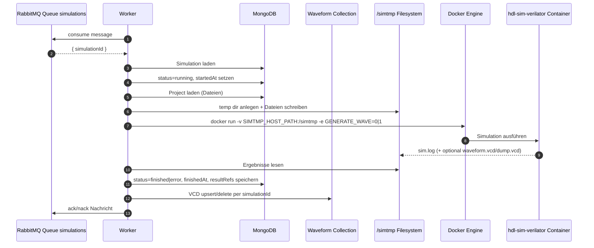
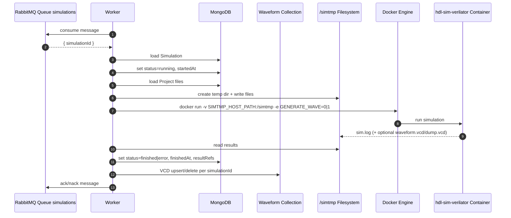

# HDLab Worker Dokumentation

Diese README dokumentiert den Worker im Ordner `apps/worker` im aktuellen Ist-Zustand.

## 1. Zweck des Workers

Der Worker ist der asynchrone Ausführungsdienst für Simulationen. Er übernimmt:

- Konsumieren von Simulationsjobs aus RabbitMQ
- Laden der benötigten Simulationsdaten aus MongoDB
- Vorbereitung temporärer Dateien im `simtmp`-Bereich
- Starten des Verilator-Simulationscontainers via Docker CLI
- Zurückschreiben von Status und Ergebnissen in MongoDB

Der Worker stellt selbst keine HTTP-API bereit.

## 2. Tech-Stack

### Sprachen

- JavaScript (Node.js, ES Modules)

### Libraries

- `amqplib` für RabbitMQ-Kommunikation
- `mongoose` für MongoDB-Zugriffe
- `dotenv` für Umgebungsvariablen

### Externe Runtime-Abhängigkeiten

- Docker Engine / Docker CLI (im Container via `docker.io` installiert)
- Simulationsimage `hdl-sim-verilator`
- Gemounteter Shared-Ordner für temporäre Simulationsdaten (`/simtmp`)

## 3. Laufzeitarchitektur

### UML-Sequenzdiagramm (Worker-Flow)



### Kernmodule

- `src/index.js`: Queue-Consumer, Job-Orchestrierung, DB-Statusupdates
- `src/dockerRunner.js`: Dateivorbereitung, Docker-Run, Einsammeln von Logs/Waveform
- `src/models/Simulation.js`, `src/models/Project.js`: benötigte Mongoose-Modelle

## 4. Job-Verarbeitung im Detail

Ein Job enthält aktuell mindestens:

```json
{ "simulationId": "<mongo-object-id>" }
```

Ablauf in `processSimulation(simulationId)`:

1. Simulation laden
2. Status auf `running` setzen
3. Projekt laden und relevante Dateien filtern (`.sv`, optional `.py` für Cocotb, sowie optional `sim_main.cpp`)
4. Top-Modul bestimmen:
	- aus `sim.settings.topModule`, falls gesetzt
	- sonst bei vorhandener `tb.sv` -> Top-Modul `tb`
	- sonst Default `main`
5. Verilator-Run ausführen (`runVerilatorSimulation`)
6. Bei Erfolg:
	- `status: finished`
	- `resultRefs.log`
	- `resultRefs.hasWaveform`
	- Waveform-Persistenz in der `Waveform`-Collection (VCD-Buffer, keyed by `simulationId`)
7. Bei Fehler:
	- `status: error`
	- Versuch, vorhandenes `sim.log` dennoch in `resultRefs.log` zu speichern

## 5. Docker-Ausführung und Dateisystem

In `runVerilatorSimulation()`:

- Temp-Verzeichnis wird unter `/simtmp/hdl-sim-*` erzeugt
- Quelldateien werden dort abgelegt
- Falls kein `sim_main.cpp` vorhanden ist, wird es dynamisch generiert
- Docker-Start mit Mount:
  - `-v ${SIMTMP_HOST_PATH}:/simtmp`
- Docker-Start mit zusätzlichen Container-Variablen:
	- `TOPMODULE=<...>`
	- `COCOTB_TEST_MODULES=<...>`
	- `GENERATE_WAVE=0|1`
- Arbeitsverzeichnis im Container entspricht dem temporären Simulationsordner
- Nach Lauf:
  - `sim.log` wird gelesen
	- optionale VCD-Datei wird gelesen (u. a. `waveform.vcd`, `dump.vcd`)
  - Temp-Verzeichnis wird wieder entfernt

Für Python-Testbenches (`tb.py`) nutzt der Simulationscontainer den Cocotb-Flow (generiertes Makefile mit Verilator/Cocotb).

## 6. Konfiguration und Umgebungsvariablen

Pflichtvariablen für den Worker:

- `MONGO_URL`
- `RABBITMQ_URL`
- `SIMTMP_HOST_PATH`

Beispielwerte liegen im Root in `.env.example`.

Wichtig:

- `SIMTMP_HOST_PATH` muss ein absoluter Host-Pfad zum Projektordner `simtmp` sein
- Der Pfad muss mit dem Compose-Mount konsistent sein, damit Container und Worker dieselben Dateien sehen

## 7. Ports

Der Worker exponiert keinen HTTP-Port.

Genutzte Netzwerkverbindungen:

- Outbound zu MongoDB (`mongo:27017`)
- Outbound zu RabbitMQ (`rabbitmq:5672`)
- Lokaler Zugriff auf Docker Socket (via Compose Mount `/var/run/docker.sock`)

## 8. Start und Entwicklung

Im Worker-Ordner:

```bash
cd apps/worker
npm install
npm start
```

Entwicklung mit Auto-Reload:

```bash
npm run dev
```

## 9. Datenmodelle im Worker-Kontext

Der Worker verwendet:

- `Project` für Quelldateien (`files[]`)
- `Simulation` für Status und Ergebnisreferenzen (`resultRefs`)
- `Waveform` für persistente VCD-Daten (`simulationId`, `vcdData`)

Typische Statusübergänge:

- `pending` -> `running` -> `finished`
- `pending` -> `running` -> `error`

## 10. Fehlertoleranz und Robustheit

- RabbitMQ-Connect mit Retry-Strategie beim Start
- `channel.nack(msg, false, false)` bei nicht verarbeitbaren Nachrichten (Verwerfen der fehlerhaften Nachricht)
- Best-Effort-Auslesen von Logs auch bei Simulationsfehlern

## 11. Bekannte Grenzen (aktueller Stand)

- Kein paralleles Worker-Pool-Management im selben Prozess dokumentiert
- Kein dediziertes Retry/Dead-Letter-Konzept auf Applikationsebene
- Ergebnispersistenz erfolgt direkt in `Simulation.resultRefs`; separate `Result` Collection wird hier nicht genutzt
- Laufzeit hängt von korrekt verfügbarer Docker Engine und vorhandenem `hdl-sim-verilator` Image ab

## 12. Relevante Dateien

- `src/index.js` - Startup, Queue-Verarbeitung, Statusupdates
- `src/dockerRunner.js` - Docker-Ausführung, Temp-Dateien, Log/Waveform-Sammlung
- `src/models/Project.js` - Projektdaten
- `src/models/Simulation.js` - Simulationsstatus und Ergebnisse
- `Dockerfile` - Worker-Container mit Docker CLI

## 13. Neuerungen (April 2026)

- Unterstützung für Python-Testbenches (`tb.py`) in der Dateifilterung
- Übergabe von `TOPMODULE` und `COCOTB_TEST_MODULES` per `docker run -e ...` an den Simulationscontainer
- Übergabe von `GENERATE_WAVE` an den Simulationscontainer zur steuerbaren VCD-Erzeugung
- Stabilere Cocotb-Ausführung mit vollständiger Ergebnisrückgabe in `resultRefs.log`
- Persistente Speicherung/Löschung von Waveforms in der `Waveform`-Collection je Simulation

---

# English Documentation

This README documents the worker in `apps/worker` as it currently exists.

## 1. Worker Purpose

The worker is the asynchronous execution service for simulations. It handles:

- Consuming simulation jobs from RabbitMQ
- Loading required simulation data from MongoDB
- Preparing temporary files in `simtmp`
- Starting the Verilator simulation container via Docker CLI
- Writing status and results back to MongoDB

The worker itself does not expose an HTTP API.

## 2. Tech Stack

### Languages

- JavaScript (Node.js, ES Modules)

### Libraries

- `amqplib` for RabbitMQ communication
- `mongoose` for MongoDB access
- `dotenv` for environment variables

### External Runtime Dependencies

- Docker engine / Docker CLI (`docker.io` installed in container)
- Simulation image `hdl-sim-verilator`
- Mounted shared folder for temporary simulation data (`/simtmp`)

## 3. Runtime Architecture

### UML Sequence Diagram (Worker Flow)



### Core Modules

- `src/index.js`: queue consumer, job orchestration, DB status updates
- `src/dockerRunner.js`: file prep, Docker run, log/waveform collection
- `src/models/Simulation.js`, `src/models/Project.js`: required Mongoose models

## 4. Job Processing Details

A job currently contains at least:

```json
{ "simulationId": "<mongo-object-id>" }
```

`processSimulation(simulationId)` flow:

1. Load simulation
2. Set status to `running`
3. Load project and filter relevant files (`.sv`, optional `.py` for Cocotb, optional `sim_main.cpp`)
4. Determine top module:
	 - from `sim.settings.topModule` if set
	 - else with `tb.sv` present: top module `tb`
	 - otherwise default `main`
5. Run Verilator (`runVerilatorSimulation`)
6. On success:
	 - `status: finished`
	 - `resultRefs.log`
	 - `resultRefs.hasWaveform`
	 - waveform persistence in `Waveform` collection (VCD buffer, keyed by `simulationId`)
7. On failure:
	 - `status: error`
	 - best effort to still store existing `sim.log` in `resultRefs.log`

## 5. Docker Execution and Filesystem

In `runVerilatorSimulation()`:

- Temp directory is created under `/simtmp/hdl-sim-*`
- Source files are written there
- If `sim_main.cpp` is missing, it is generated dynamically
- Docker run with mount:
	- `-v ${SIMTMP_HOST_PATH}:/simtmp`
- Additional container env vars:
	- `TOPMODULE=<...>`
	- `COCOTB_TEST_MODULES=<...>`
	- `GENERATE_WAVE=0|1`
- Container working dir is the temp simulation directory
- After execution:
	- `sim.log` is read
	- optional VCD file is read (including `waveform.vcd`, `dump.vcd`)
	- temp directory is removed

For Python testbenches (`tb.py`), the sim container uses the Cocotb path (generated Makefile with Verilator/Cocotb).

## 6. Configuration and Environment Variables

Required worker variables:

- `MONGO_URL`
- `RABBITMQ_URL`
- `SIMTMP_HOST_PATH`

Example values are in root `.env.example`.

Important:

- `SIMTMP_HOST_PATH` must be an absolute host path to project `simtmp`
- Path must match compose mount so worker and sim container see same files

## 7. Ports

Worker does not expose an HTTP port.

Used network connections:

- Outbound to MongoDB (`mongo:27017`)
- Outbound to RabbitMQ (`rabbitmq:5672`)
- Local access to Docker socket (compose mount `/var/run/docker.sock`)

## 8. Start and Development

In worker folder:

```bash
cd apps/worker
npm install
npm start
```

Development with auto-reload:

```bash
npm run dev
```

## 9. Data Models in Worker Context

Worker uses:

- `Project` for source files (`files[]`)
- `Simulation` for status and result references (`resultRefs`)
- `Waveform` for persisted VCD data (`simulationId`, `vcdData`)

Typical status transitions:

- `pending` -> `running` -> `finished`
- `pending` -> `running` -> `error`

## 10. Fault Tolerance and Robustness

- RabbitMQ connect retry strategy at startup
- `channel.nack(msg, false, false)` for non-processable messages (drop bad message)
- Best-effort log extraction even on simulation failure

## 11. Known Limitations (Current)

- No documented parallel worker pool management in same process
- No dedicated app-level retry/dead-letter concept
- Result persistence primarily in `Simulation.resultRefs`; separate `Result` collection not used here
- Runtime depends on available Docker engine and existing `hdl-sim-verilator` image

## 12. Relevant Files

- `src/index.js` - startup, queue processing, status updates
- `src/dockerRunner.js` - Docker execution, temp files, log/waveform collection
- `src/models/Project.js` - project data
- `src/models/Simulation.js` - simulation status and results
- `Dockerfile` - worker container with Docker CLI

## 13. Updates (April 2026)

- Python testbench support (`tb.py`) in file filtering
- Passing `TOPMODULE` and `COCOTB_TEST_MODULES` via `docker run -e ...` to sim container
- Passing `GENERATE_WAVE` to sim container for controllable VCD generation
- More robust Cocotb execution with complete result logging in `resultRefs.log`
- Persistent waveform store/delete in `Waveform` collection per simulation
