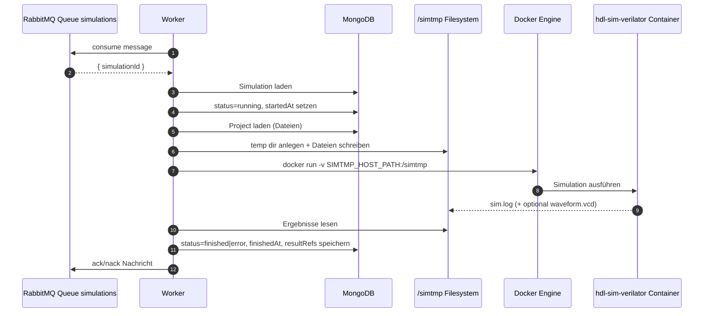

# HDLab Worker Dokumentation

Diese README dokumentiert den Worker im Ordner `apps/worker` im aktuellen Ist-Zustand.

## 1. Zweck des Workers

Der Worker ist der asynchrone Ausführungsdienst für Simulationen. Er übernimmt:

- Konsumieren von Simulationsjobs aus RabbitMQ
- Laden der benötigten Simulationsdaten aus MongoDB
- Vorbereitung temporärer Dateien im `simtmp`-Bereich
- Starten des Verilator-Simulationscontainers via Docker CLI
- Zurückschreiben von Status und Ergebnissen in MongoDB

Der Worker stellt selbst keine HTTP-API bereit.

## 2. Tech-Stack

### Sprachen

- JavaScript (Node.js, ES Modules)

### Libraries

- `amqplib` für RabbitMQ-Kommunikation
- `mongoose` für MongoDB-Zugriffe
- `dotenv` für Umgebungsvariablen

### Externe Runtime-Abhängigkeiten

- Docker Engine / Docker CLI (im Container via `docker.io` installiert)
- Simulationsimage `hdl-sim-verilator`
- Gemounteter Shared-Ordner für temporäre Simulationsdaten (`/simtmp`)

## 3. Laufzeitarchitektur

### UML-Sequenzdiagramm (Worker-Flow)



### Kernmodule

- `src/index.js`: Queue-Consumer, Job-Orchestrierung, DB-Statusupdates
- `src/dockerRunner.js`: Dateivorbereitung, Docker-Run, Einsammeln von Logs/Waveform
- `src/models/Simulation.js`, `src/models/Project.js`: benötigte Mongoose-Modelle

## 4. Job-Verarbeitung im Detail

Ein Job enthält aktuell mindestens:

```json
{ "simulationId": "<mongo-object-id>" }
```

Ablauf in `processSimulation(simulationId)`:

1. Simulation laden
2. Status auf `running` setzen
3. Projekt laden und relevante Dateien filtern (`.sv` und optional `sim_main.cpp`)
4. Top-Modul bestimmen:
	- aus `sim.settings.topModule`, falls gesetzt
	- sonst bei vorhandener `tb.sv` -> Top-Modul `tb`
	- sonst Default `main`
5. Verilator-Run ausführen (`runVerilatorSimulation`)
6. Bei Erfolg:
	- `status: finished`
	- `resultRefs.log`
	- `resultRefs.hasWaveform`
7. Bei Fehler:
	- `status: error`
	- Versuch, vorhandenes `sim.log` dennoch in `resultRefs.log` zu speichern

## 5. Docker-Ausführung und Dateisystem

In `runVerilatorSimulation()`:

- Temp-Verzeichnis wird unter `/simtmp/hdl-sim-*` erzeugt
- Quelldateien werden dort abgelegt
- Falls kein `sim_main.cpp` vorhanden ist, wird es dynamisch generiert
- Docker-Start mit Mount:
  - `-v ${SIMTMP_HOST_PATH}:/simtmp`
- Arbeitsverzeichnis im Container entspricht dem temporären Simulationsordner
- Nach Lauf:
  - `sim.log` wird gelesen
  - optional `waveform.vcd` wird gelesen
  - Temp-Verzeichnis wird wieder entfernt

## 6. Konfiguration und Umgebungsvariablen

Pflichtvariablen für den Worker:

- `MONGO_URL`
- `RABBITMQ_URL`
- `SIMTMP_HOST_PATH`

Beispielwerte liegen im Root in `.env.example`.

Wichtig:

- `SIMTMP_HOST_PATH` muss ein absoluter Host-Pfad zum Projektordner `simtmp` sein
- Der Pfad muss mit dem Compose-Mount konsistent sein, damit Container und Worker dieselben Dateien sehen

## 7. Ports

Der Worker exponiert keinen HTTP-Port.

Genutzte Netzwerkverbindungen:

- Outbound zu MongoDB (`mongo:27017`)
- Outbound zu RabbitMQ (`rabbitmq:5672`)
- Lokaler Zugriff auf Docker Socket (via Compose Mount `/var/run/docker.sock`)

## 8. Start und Entwicklung

Im Worker-Ordner:

```bash
cd apps/worker
npm install
npm start
```

Entwicklung mit Auto-Reload:

```bash
npm run dev
```

## 9. Datenmodelle im Worker-Kontext

Der Worker verwendet:

- `Project` für Quelldateien (`files[]`)
- `Simulation` für Status und Ergebnisreferenzen (`resultRefs`)

Typische Statusübergänge:

- `pending` -> `running` -> `finished`
- `pending` -> `running` -> `error`

## 10. Fehlertoleranz und Robustheit

- RabbitMQ-Connect mit Retry-Strategie beim Start
- `channel.nack(msg, false, false)` bei nicht verarbeitbaren Nachrichten (Verwerfen der fehlerhaften Nachricht)
- Best-Effort-Auslesen von Logs auch bei Simulationsfehlern

## 11. Bekannte Grenzen (aktueller Stand)

- Kein paralleles Worker-Pool-Management im selben Prozess dokumentiert
- Kein dediziertes Retry/Dead-Letter-Konzept auf Applikationsebene
- Ergebnispersistenz erfolgt direkt in `Simulation.resultRefs`; separate `Result` Collection wird hier nicht genutzt
- Laufzeit hängt von korrekt verfügbarer Docker Engine und vorhandenem `hdl-sim-verilator` Image ab

## 12. Relevante Dateien

- `src/index.js` - Startup, Queue-Verarbeitung, Statusupdates
- `src/dockerRunner.js` - Docker-Ausführung, Temp-Dateien, Log/Waveform-Sammlung
- `src/models/Project.js` - Projektdaten
- `src/models/Simulation.js` - Simulationsstatus und Ergebnisse
- `Dockerfile` - Worker-Container mit Docker CLI
